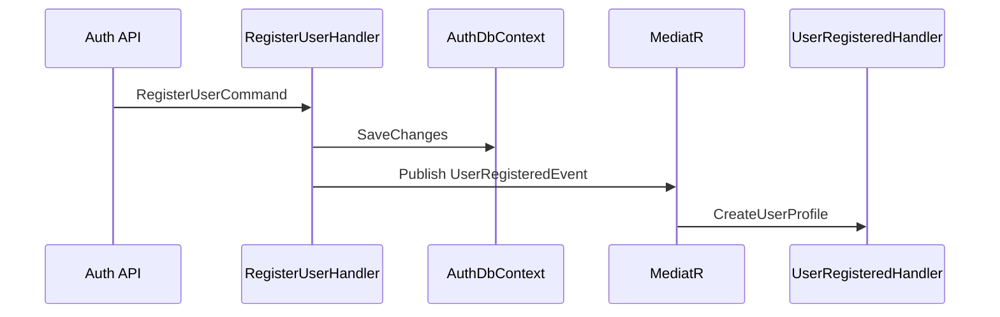

# Eventing

Ashraak uses **in-process eventing** via MediatR. RabbitMQ is provisioned in Docker but **not connected** to the API.

---

## Event types

| Type | Base | Transport today | Location |
|------|------|-----------------|----------|
| Domain event | `DomainEvent` : `IDomainEvent` | MediatR after `SaveChanges` or explicit publish | Module Domain |
| Contract event | `DomainEvent` in Contracts | MediatR `IPublisher.Publish` | `SharedKernel.Contracts` |
| Integration event | `IntegrationEvent` | `IEventBus` (stub) | `BuildingBlocks.EventBus` |

---

## Domain events (intra-module)

Raised on aggregates via `RaiseDomainEvent()`:

```csharp
plan.RaiseDomainEvent(new PlanCreatedEvent(plan.Id, plan.Name));
```

Dispatched by module’s `IDomainEventPublisher` implementation (`DomainEventPublisher` in Auth) or EF save pipeline when outbox is wired.

**Examples:**

- `UserLoggedInDomainEvent` (Auth) → consumed by Audit `DomainEventAuditHandler`
- `TenantCreatedDomainEvent` (Tenant)
- `UserProfileCreatedDomainEvent` (Users)

---

## Contract events (cross-module)

Defined in `Ashraak.SharedKernel.Contracts` for stable integration:

| Event | Publisher (actual) | Consumer(s) |
|-------|-------------------|---------------|
| `UserRegisteredEvent` | `RegisterUserCommandHandler` (sync MediatR) | `UserRegisteredEventHandler` (Users) |
| `UserLoggedInEvent` | Documented; login uses domain event path | Audit via `IDomainEvent` handler |
| `TenantDeletedEvent` | **No publisher** | `TenantDeletedEventHandler` (Users) — handler exists |
| `TenantProvisionedEvent` | **No publisher** | Documented for future Notification |
| `UserInvitedEvent` | **No publisher** | Documented for future Notification |

---

## Audit as universal domain event observer

`DomainEventAuditHandler` in Audit.Application:

```csharp
INotificationHandler<IDomainEvent>
```

Maps any domain event to `AuditEntryDto` and enqueues via `IAuditService`.

---

## InProcessEventBus (stub)

`Ashraak.BuildingBlocks.EventBus.InProcessEventBus`:

- Implements `IEventBus`
- Logs publish calls only
- **Not registered** in DI

Future: MassTransit + RabbitMQ for integration events without changing module boundaries.

---

## Registration flow (working today)



This is **synchronous** — not outbox-backed.

---

## Webhook dispatch (planned)

Outbound HTTP webhooks are **not implemented** (W0). Future flow:

1. Module publishes domain/contract event → outbox
2. Webhook bridge maps catalog event types (`domain.entity.action`) to tenant subscriptions
3. Async delivery with HMAC signing and audit

See [modules/webhooks/](../modules/webhooks/README.md) · [event-catalog.md](../modules/webhooks/event-catalog.md) · [ADR-Webhook-0001](../adr/ADR-Webhook-0001-webhook-platform-architecture.md).

---

## Related

- [Outbox](./outbox.md)
- [ADR-0003 Observer modules](../adr/ADR-0003-observer-modules.md)
- [modules/auth/events.md](../modules/auth/events.md)
- [modules/webhooks/event-catalog.md](../modules/webhooks/event-catalog.md)
