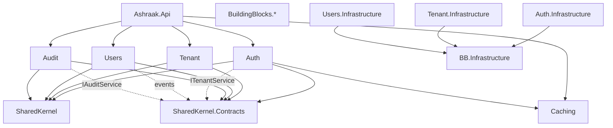

# Module Map

## Backend modules

| Module | Projects | Storage | HTTP routes | Contract surface |
|--------|----------|---------|-------------|------------------|
| **Host** | `Ashraak.Api` | — | Health, versioning wrapper | `ICurrentUser`, `ITenantContext` |
| **SharedKernel** | `Ashraak.SharedKernel` | — | — | DDD primitives, `Result`, outbox types |
| **Contracts** | `Ashraak.SharedKernel.Contracts` | — | — | `ITenantService`, `IUserService`, `IAuditService`, events |
| **BuildingBlocks** | Application, EventBus, Infrastructure, Data.* | — | — | Base classes, behaviors (partially used) |
| **Caching** | Abstractions, Redis | Redis + memory | None | `ICacheService`, locks, sessions |
| **Auth** | Domain, Application, Infrastructure, Api | PostgreSQL `auth` | `/api/v1/auth/*`, `/connect/token`, `/api/auth/sso/*` | `IAuthPermissionChecker` |
| **Tenant** | Domain, Application, Infrastructure, Api | PostgreSQL `tenant` | `/api/v1/tenants/*` | `ITenantService` |
| **Users** | Domain, Application, Infrastructure, Api | PostgreSQL `users` | `/api/v1/users/*` | `IUserService` |
| **Audit** | Domain, Application, Infrastructure, Api | MongoDB `audit_entries` | `/api/v1/audit-logs` (stub GET) | `IAuditService` |
| **Notifications** | Domain, Application, Infrastructure, Api | — | `/api/v1/notifications/health` | `INotificationService` |
| **Files** | Domain, Application, Infrastructure, Api | PostgreSQL `files` | `/api/v1/files` | `IFileStorage` |
| **Webhooks** | Domain, Application, Infrastructure, Api | PostgreSQL `webhooks` | `/api/v1/webhooks/*` | `IWebhookPublisher`, `IWebhookSubscriptionRepository` |
| **CCTV — Lead** | Domain, Application, Infrastructure, Api | PostgreSQL `cctv_lead` | `/api/v1/cctv/leads/*` (Sprint 0: group only) | Sprint 0 skeleton |
| **CCTV — Customer** | Domain, Application, Infrastructure, Api | PostgreSQL `cctv_customer` | `/api/v1/cctv/customers/*` | Sprint 0 skeleton |
| **CCTV — AMC** | Domain, Application, Infrastructure, Api | PostgreSQL `cctv_amc` | `/api/v1/cctv/amc/*` | Sprint 0 skeleton |
| **CCTV — Service** | Domain, Application, Infrastructure, Api | PostgreSQL `cctv_service` | `/api/v1/cctv/service/*` | Sprint 0 skeleton |
| **CCTV — Ticket** | Domain, Application, Infrastructure, Api | PostgreSQL `cctv_ticket` | `/api/v1/cctv/tickets/*` | Sprint 0 skeleton |
| **CCTV — Engineer** | Domain, Application, Infrastructure, Api | PostgreSQL `cctv_engineer` | `/api/v1/cctv/engineers/*` | Sprint 0 skeleton |
| **CCTV — Invoice** | Domain, Application, Infrastructure, Api | PostgreSQL `cctv_invoice` | `/api/v1/cctv/invoices/*` | Sprint 0 skeleton |
| **CCTV — Reporting** | Domain, Application, Infrastructure, Api | (read-only) | `/api/v1/cctv/reports/*` | Sprint 0 skeleton |
| **CCTV — Integration** | Application, Infrastructure | N/A | `/api/v1/cctv/health` | `ISmsProvider`, `IPdfGenerationService`, RBAC seed |

> **CCTV detail:** [project/cctv-module-map.md](../project/cctv-module-map.md) · [project/cctv-module-naming-freeze.md](../project/cctv-module-naming-freeze.md)

## Platform capabilities (not vertical modules)

| Capability | Docs | Backend | Web | Mobile | Status |
|------------|------|---------|-----|--------|--------|
| **Outbox** | [platform/outbox](../platform/outbox/README.md) | Scaffold | N/A | N/A | Partial |
| **Webhooks** | [modules/webhooks](../modules/webhooks/README.md) | **Done (W1)** | Planned | Planned (read-only W5) | Subscriptions + catalog; delivery W2 |

Webhooks are a **reusable platform capability** — any module may publish catalog events; external systems subscribe. See [ADR-Webhook-0001](../adr/ADR-Webhook-0001-webhook-platform-architecture.md).

## Dependency graph (allowed references)

Solid arrows: project references. Dotted: runtime via contracts/DI only.

## Frontend feature map

| Folder | Pages | Backend APIs |
|--------|-------|--------------|
| `modules/auth` | Login, Register | `/connect/token`, `/api/v1/auth/register` |
| `modules/dashboard` | Dashboard | — |
| `modules/tenant` | Profile, Settings (stub) | `/api/v1/tenants/current` |
| `modules/users` | List, Profile | `/api/v1/users/*` |
| `modules/audit` | Audit log | `/api/v1/audit-logs` |

## Docker services

| Service | Used by |
|---------|---------|
| postgres | Auth, Tenant, Users |
| redis | Caching |
| mongodb | Audit |
| seq | Serilog |
| rabbitmq | **Not connected to API** (future) |

## Documentation index

| Module | Docs path |
|--------|-----------|
| SharedKernel | [modules/shared-kernel](../modules/shared-kernel/README.md) |
| BuildingBlocks | [modules/building-blocks](../modules/building-blocks/README.md) |
| Host | [modules/host](../modules/host/README.md) |
| Auth | [modules/auth](../modules/auth/README.md) |
| Tenant | [modules/tenant](../modules/tenant/README.md) |
| Users | [modules/users](../modules/users/README.md) |
| Audit | [modules/audit](../modules/audit/README.md) |
| Caching | [modules/caching](../modules/caching/README.md) |
| Webhooks (platform) | [modules/webhooks](../modules/webhooks/README.md) |
