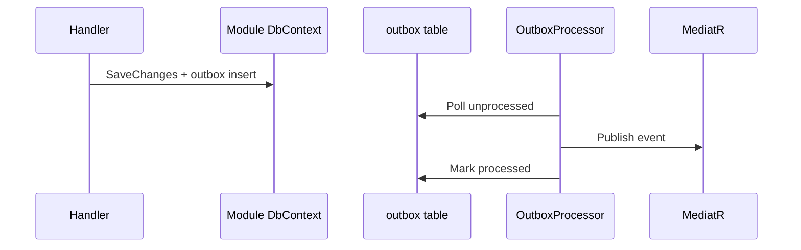

# Outbox Pattern

## Intended design

The outbox pattern ensures **reliable delivery** of domain events:

1. Aggregate changes and outbox rows commit in **one database transaction**
2. Background processor reads unprocessed rows
3. Processor dispatches to MediatR handlers
4. Marks rows processed (or records error for retry)

**ADR:** [ADR-0002](../adr/ADR-0002-outbox-pattern.md)

---

## What exists in code (scaffold)

| Component | Path | Status |
|-----------|------|--------|
| `IOutboxMessage` / `OutboxMessage` | `SharedKernel/Outbox/` | Implemented |
| `BaseDbContext.SerializeDomainEventsToOutbox()` | `BuildingBlocks.Infrastructure/Persistence/BaseDbContext.cs` | Implemented |
| `OutboxProcessorBase<TDbContext>` | `BuildingBlocks.Infrastructure/Outbox/` | **Abstract only** |
| `OutboxMessages` DbSet | Auth/Tenant/Users DbContext | DbSet declared |
| Quartz packages | Module Infrastructure csproj | Referenced, **not configured** |

---

## Runtime (Phase 2A — implemented)

| Component | Status |
|-----------|--------|
| `OutboxDomainEventSerializer` | Writes aggregate domain events on SaveChanges |
| `OutboxProcessorHostedService<T>` | Polls Auth, Tenant, Users DbContexts |
| `BaseDbContext` | Used by Tenant and Users |
| Auth `AuthDbContext` | Manual serializer in `SaveChangesAsync` override |
| Contract bridges | Auth/Tenant/Users Application handlers promote to contract events |

See [platform/outbox/](../platform/outbox/README.md).

---

## Module DbContext note

`AuthDbContext`, `TenantDbContext`, `UsersDbContext` each expose:

```csharp
public DbSet<OutboxMessage> OutboxMessages { get; set; }
```

Without `BaseDbContext` inheritance and migrations, this is preparatory.

---

## Operational guidance

Do not assume outbox delivery for cross-module consistency until processor is wired.

For new modules:

- Either inherit `BaseDbContext` **and** register a processor (future standard)
- Or document synchronous MediatR publish as explicit choice

See [operations/outbox-troubleshooting.md](../operations/outbox-troubleshooting.md).

---

## Target flow (future)



---

## Related

- [Eventing](./eventing.md)
- [Building blocks module](../modules/building-blocks/README.md)
