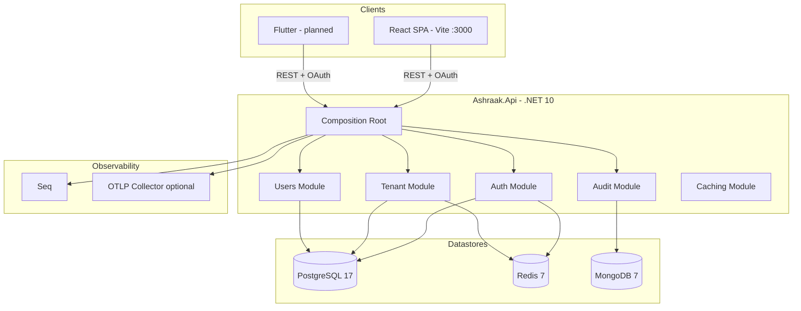

# System Overview

Ashraak is a **multi-tenant SaaS starter template** delivered as a modular monolith with a React SPA and a **release-ready Flutter** mobile client (`FrontEnd.Mobile/` — [mobile/release/](../mobile/release/README.md)).

---

## Runtime components



---

## Repository layout

```
Ashraak/
├── BackEnd/                 # .NET solution (Ashraak.slnx)
│   ├── src/Host/Ashraak.Api # Composition root
│   ├── src/Shared/          # SharedKernel + Contracts
│   ├── src/BuildingBlocks/  # Application, EventBus, Infrastructure, Data.*
│   ├── src/Modules/         # Auth, Tenant, Users, Audit, Caching
│   └── docker-compose.yml
├── FrontEnd/                # pnpm monorepo
│   └── apps/web/            # React 19 SPA (@ashraak/web)
└── docs/                    # Canonical documentation (this tree)
```

---

## Technology versions (verified)

| Layer | Technology | Version |
|-------|------------|---------|
| Backend runtime | .NET SDK | 10.0.103 (`global.json`) |
| API host | ASP.NET Core | 10.0.0 packages |
| ORM | EF Core + Npgsql | 9.0.4 |
| Identity / OAuth | OpenIddict + ASP.NET Identity | 7.x / 10.x |
| Frontend | React | 19.x |
| Build | Vite | 6.x |
| Database | PostgreSQL | 17 (Docker) |
| Cache | Redis | 7 |
| Audit store | MongoDB | 7 |

---

## Cross-cutting capabilities (implemented)

| Capability | Implementation |
|------------|----------------|
| Authentication | OpenIddict password grant + JWT; Google/Microsoft SSO challenge |
| Multi-tenancy | JWT `tenant_id` claim + `TenantResolutionMiddleware` + EF filters |
| Authorization | RBAC roles + ABAC permission claims in JWT |
| Audit | API middleware + EF interceptor + domain event handler → MongoDB |
| Caching | L1 memory + L2 Redis; permission and tenant config caching |
| Logging | Serilog → Console + Seq |
| Tracing / metrics | OpenTelemetry → OTLP exporter (default endpoint) |
| Health | `/health/live`, `/health/ready` (postgres, redis, mongodb) |
| API docs | OpenAPI + Scalar (development only) |

---

## Scaffold / not yet runtime-complete

| Capability | Status |
|------------|--------|
| **Webhooks** | **W1 foundation** — subscriptions + catalog + outbox publish; delivery W2+ ([manifest](../modules/webhooks/platform-manifest.md)) |
| Outbox processor | Base class exists; **no hosted processor** |
| MassTransit / RabbitMQ | Container only; **not wired to API** |
| `ITokenService` | Contract only; **no implementation** |
| EF migrations | **No migration assemblies** in repo |
| Audit GET API | **Stub** response |
| Persistent JWT signing key | **Ephemeral** OpenIddict keys in dev |

See [outbox.md](./outbox.md) and [documentation audit](../documentation-audit/outdated-docs-report.md).

---

## Default local URLs

| Service | URL |
|---------|-----|
| API (Kestrel) | `http://localhost:5000` |
| Scalar UI | `http://localhost:5000/scalar/v1` |
| Frontend (Vite) | `http://localhost:3000` |
| Seq | `http://localhost:5341` |
| PostgreSQL | `localhost:5432` |
| Redis | `localhost:6379` |
| MongoDB | `localhost:27017` |

Docker API image exposes **8080** — see [operations/deployment-notes.md](../operations/deployment-notes.md).

---

## Related

- [Modular monolith](./modular-monolith.md)
- [Module map](./module-map.md)
- [Getting started](../getting-started/local-development.md)
