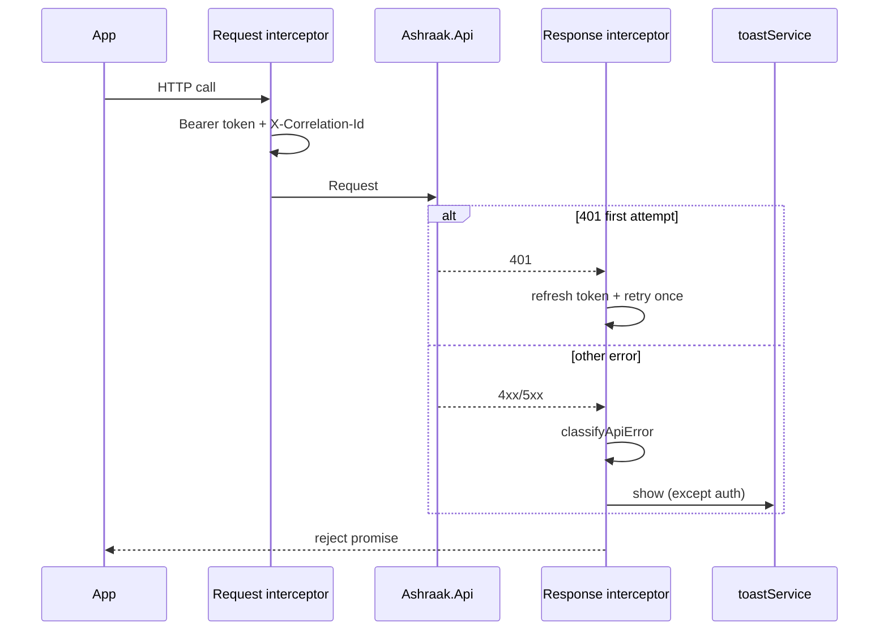

# Interceptor flow

## Auth 401

1. Silent refresh via `tokenService.refresh()`
2. Retry original request once (`_retry` flag)
3. On refresh failure → `clearSession()` + redirect `/login` (no toast)

## Request correlation

If the caller did not set `X-Correlation-Id`, the request interceptor generates one and stores it via `setLastCorrelationId`.
