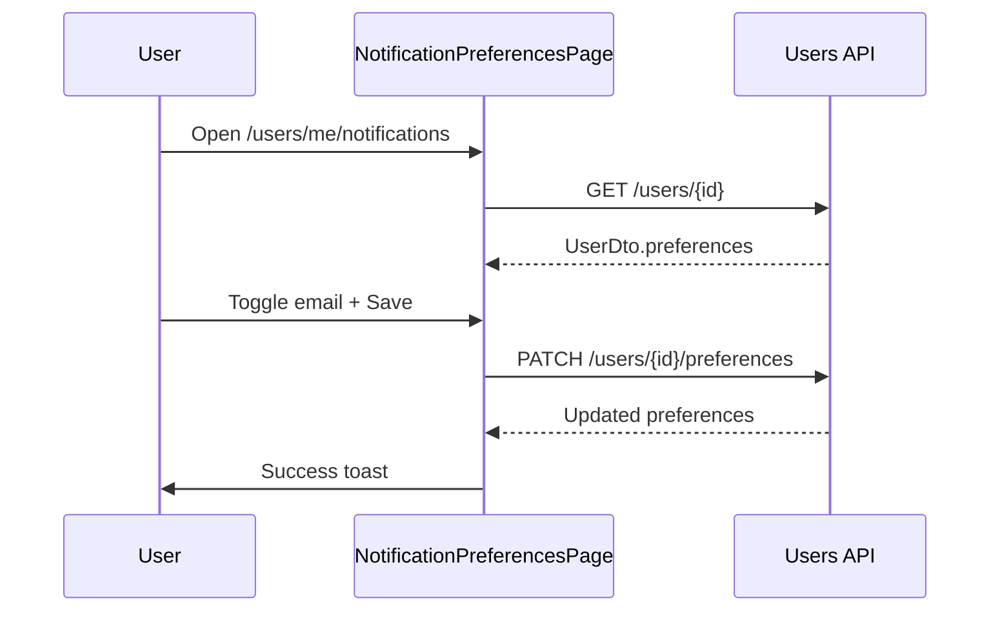

# Notification preferences — Flow

## Navigation

- Sidebar: **Notifications** (all authenticated users)
- User profile: **Manage** link next to email notifications status

## Field

| UI | DTO field |
|----|-----------|
| Email notifications enabled | `preferences.emailNotificationsEnabled` |
