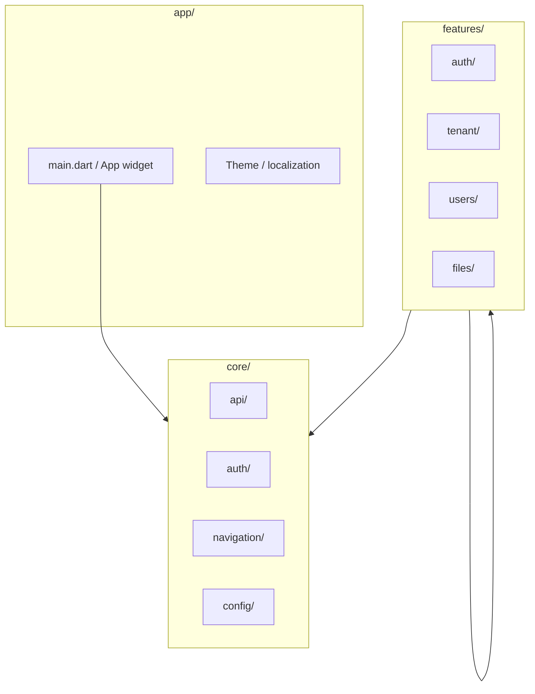

# Mobile architecture

## Strategy

One **Flutter** codebase targets **Android** and **iOS**. Mobile consumes the **same versioned REST and OAuth APIs** as the React web app — no mobile-only backend surface.

Native Kotlin/Swift are **out of scope** unless a future ADR approves a hybrid approach ([ADR-0012](../adr/ADR-0012-flutter-mobile-platform.md)).

---

## Repository layout (M1)

```
FrontEnd.Mobile/
├── android/                 # Flutter Android embedding (bootstrap via flutter create)
├── ios/                     # Flutter iOS embedding
├── lib/
│   ├── app/                 # Composition root, shell pages
│   ├── core/                # api, auth, environment, navigation, logging, …
│   ├── shared/              # Theme and reusable widgets
│   └── features/            # Scaffold only in M1
├── packages/api_client/     # Generated OpenAPI SDK (M2+)
├── test/
└── pubspec.yaml
```

Detail: [foundation/project-structure.md](./foundation/project-structure.md).

---

## Layer responsibilities



| Layer | Owns | Must not own |
|-------|------|--------------|
| `app/` | `runApp`, global theme, env bootstrap | Business rules, API calls |
| `core/` | HTTP client, auth session, routing, secure storage, logging | Feature-specific UI |
| `features/` | Screens, feature state, feature repositories | Duplicate DTOs (use generated SDK) |
| `shared/` (under `lib/shared/`) | Reusable widgets, formatters | Feature navigation rules |

---

## Core structure (`lib/core/`)

| Folder | Purpose (M1+ implementation) |
|--------|-------------------------------|
| `api/` | Dio/http client, interceptors (JWT, correlation, 401 refresh), generated SDK adapter |
| `auth/` | Token storage, session model, login/logout, MFA challenge flow |
| `storage/` | Secure storage (tokens), preferences, future offline cache |
| `config/` | Flavor/env: Dev, QA, UAT, Prod base URLs |
| `navigation/` | GoRouter configuration, guards, deep link table |
| `logging/` | Structured logs, crash reporting hook, correlation ID |
| `feature-flags/` | Remote/config flags aligned with backend `Features` section |
| `notifications/` | Local notifications + push registration facade |

No implementation in M0 — contracts and folder names only.

---

## Feature structure (`lib/features/`)

Each feature mirrors a **backend module** where applicable:

```
features/
  auth/           # login, register, MFA
  tenant/         # current tenant, settings
  users/          # profile, preferences, directory
  files/          # pick, upload, preview, download
  audit/          # admin audit viewer
  notifications/  # in-app notification center
  sessions/       # device/session management
  settings/       # app-level settings shell
```

**Boundary rules:**

- Features may depend on `core/` and `shared/`.
- Features must **not** import another feature's `presentation/` layer directly — use contracts in `core/` or shared events.
- DTOs come from **generated SDK** (`packages/api_client` or `lib/core/api/generated/`), not hand-written duplicates.

---

## Alignment with web

| Concern | Web (React) | Mobile (Flutter) |
|---------|-------------|------------------|
| API base | `VITE_API_BASE_URL` | Flavor `apiBaseUrl` |
| Auth store | Zustand | Riverpod providers |
| Routing | React Router + guards | GoRouter + redirects |
| Errors | Axios + ProblemDetails | Dio + same ProblemDetails |
| Tenant context | JWT claim + header | Same JWT + header |

See [api-integration.md](./api-integration.md) and [security.md](./security.md).
