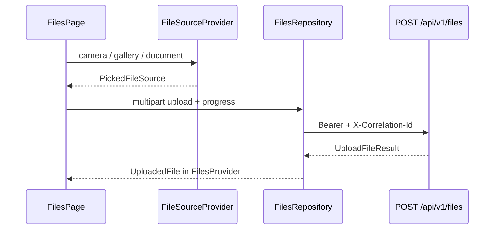

# Files — upload flow

## Sources

| Source | Implementation |
|--------|----------------|
| Camera | `image_picker` `ImageSource.camera` |
| Gallery | `image_picker` `ImageSource.gallery` |
| Documents | `file_picker` (PDF, Office, text) |

## Types

Images, PDFs, and generic documents via MIME detection. Extensible in `MobileFileSourceProvider._guessMimeType`.

## Errors

Upload failures surface via `AppToast.error` with `ApiError` message and correlation ID when present.
