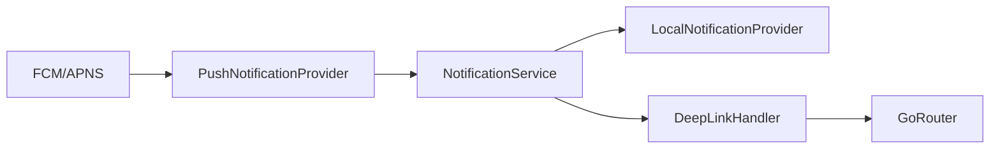

# Push notifications — architecture

- **No Firebase lock-in** at call sites — only `FcmPushNotificationProvider` references Firebase SDK.
- Foreground FCM messages display via local notifications.
- Background/tap events carry `deepLink` payload keys.
