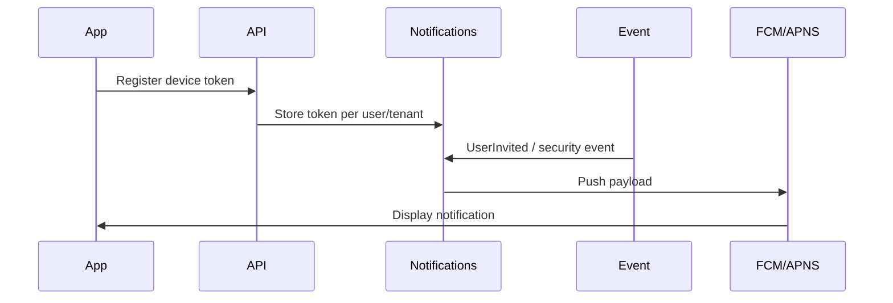

# Push notifications strategy

## M4 status

**Implemented** — provider abstraction + FCM adapter. See [notifications/](./notifications/README.md).

---

## Goals

- Notify users of invitation, security events, and tenant alerts on device.
- **No Firebase lock-in** at architecture level — provider abstraction.

---

## Target abstraction

```
core/notifications/
  push_provider.dart          # interface
  fcm_push_provider.dart      # Android (+ iOS via FCM bridge)
  apns_push_provider.dart     # Optional direct APNS
```

Backend will expose device token registration endpoint in a **future ADR** (not M0).

---

## Providers

| Platform | Transport | Notes |
|----------|-----------|-------|
| Android | FCM | Standard |
| iOS | FCM → APNS or native APNS | Choose in M4 ADR |

---

## Data flow (future)



In-app notification center (`features/notifications/`) complements push.

---

## Security

- Token tied to user + tenant + device id
- Revoke on logout and session revoke-all
- No PII in push payload — deep link to authenticated screen
