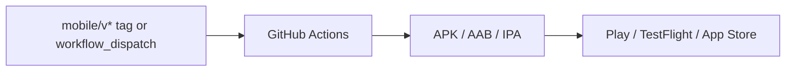

# Release process

## Pipeline

## Environments

| Stage | Flavor | Distribution |
|-------|--------|--------------|
| Development | dev | Local debug |
| QA | qa | Internal / Firebase |
| UAT | uat | Pilot customers |
| Production | prod | Play Store / App Store |

## Standard release

1. Bump `version.yaml` (semver)
2. Update manifest if capabilities changed
3. Run `./scripts/sync-mobile-version.ps1`
4. PR → `mobile.yml` green (all flavors)
5. Tag `mobile/v1.0.0` or dispatch `android-release` / `ios-release`
6. UAT sign-off before prod promotion
7. Upload artifacts via Fastlane or store consoles

## Gates

- `flutter analyze` + `flutter test`
- Flavor matrix smoke builds
- No secrets in repository

See [deployment-checklist.md](./deployment-checklist.md).
