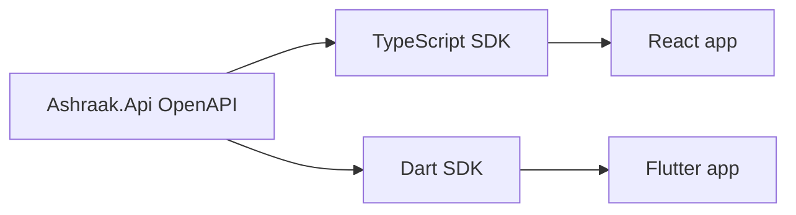

# SDK generation strategy

## Goal

**Single source of truth:** backend OpenAPI document → generated clients for Web (TypeScript) and Mobile (Dart).

**No duplicated DTOs** across Flutter features or between web and mobile.

---

## Pipeline (target)

---

## Process (M1 implementation)

1. Export OpenAPI 3 from host (`/openapi/v1.json` or build-time document).
2. **Dart:** OpenAPI Generator `dart-dio` → `FrontEnd.Mobile/packages/api_client/`:
   - `./scripts/generate-mobile-sdk.ps1`
   - `./scripts/generate-mobile-sdk.sh`
3. **TypeScript (optional):** `openapi-typescript` or `@hey-api/openapi-ts` → `FrontEnd/packages/api-client/`.
4. CI drift check — planned M2 (M1 ships scripts + [ADR-Mobile-0005](../adr/ADR-Mobile-0005-openapi-sdk-generation.md)).
5. PRs that change API contracts must regenerate SDKs in same PR.

---

## Governance rules

1. Generated code is **committed** (or CI-generated artifact) — team policy decided in M1.
2. Manual edits inside `generated/` are **forbidden**.
3. Custom extensions wrap generated client in `core/api/` adapters.
4. Version OpenAPI with API version (`v1`).

---

## Mapping to SharedKernel.Contracts

.NET contracts in `Ashraak.SharedKernel.Contracts` remain the **authoritative domain contract** for backend modules. OpenAPI is the **HTTP projection** for clients.

When they diverge, fix backend serialization or OpenAPI metadata — do not patch mobile DTOs locally.
