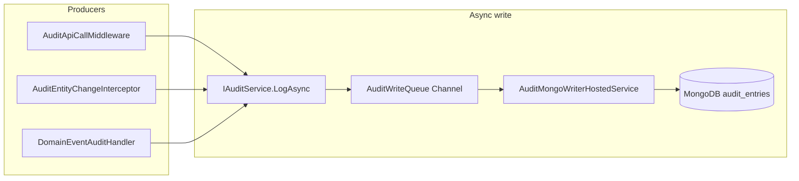
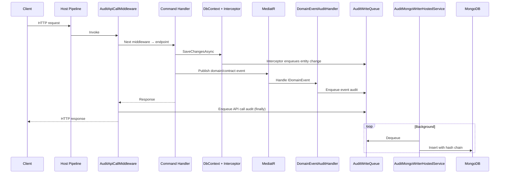

# Audit — Architecture

## Project layout

```
BackEnd/src/Modules/Audit/
├── AUDIT_MODULE_STATUS.md
├── Ashraak.Audit.Domain/
│   └── Entities/AuditEntry.cs
├── Ashraak.Audit.Application/
│   └── EventHandlers/DomainEventAuditHandler.cs
├── Ashraak.Audit.Infrastructure/
│   ├── AuditModule.cs
│   ├── Interceptors/AuditEntityChangeInterceptor.cs
│   ├── Repositories/AuditRepository.cs
│   └── Services/
│       ├── AuditWriteQueue.cs
│       ├── IAuditWriteQueue.cs
│       └── AuditMongoWriterHostedService.cs
└── Ashraak.Audit.Api/
    ├── Endpoints/AuditEndpoints.cs
    └── Middleware/
        ├── AuditApiCallMiddleware.cs
        └── AuditApiCallExtensions.cs
```

## AuditEntry document

MongoDB document in collection `audit_entries`:

| Field | Purpose |
|-------|---------|
| `Id` | Guid |
| `TenantId` | Tenant scope |
| `UserId` | Actor (nullable) |
| `Module` | Source module (`API`, `Tenant`, `Auth`, etc.) |
| `Action` | `ApiCall`, `Created`, `Modified`, `Deleted`, event name |
| `EntityType` | CLR type or path |
| `EntityId` | Optional entity ID |
| `OldValues` / `NewValues` | JSON snapshots |
| `IpAddress` / `UserAgent` | HTTP context |
| `OccurredOnUtc` | Timestamp |
| `PreviousHash` / `Hash` | Per-tenant SHA-256 chain |

Hash computed in `AuditMongoWriterHostedService` using previous entry hash for same tenant.

## Write pipeline



All producers call `IAuditService.LogAsync` — non-blocking enqueue to `Channel<AuditEntryDto>`.

## Three capture mechanisms

### 1. API call middleware

**File:** `AuditApiCallMiddleware.cs`  
**Pipeline position:** After authorization, before output cache

| Behavior | Detail |
|----------|--------|
| Skip paths | `/health`, `/connect`, `/api/audit-logs` |
| Condition | `ITenantContext.TenantId != Guid.Empty` |
| Captures | Method, path, query, status, duration, exception |
| Module | `"API"`, Action | `"ApiCall"` |

### 2. EF entity change interceptor

**File:** `AuditEntityChangeInterceptor.cs`  
**Registration:** `IInterceptor` singleton — picked up by Auth, Tenant, Users DbContexts

| Behavior | Detail |
|----------|--------|
| Events | Added, Modified, Deleted |
| Excludes | Entities whose type name contains `"OutboxMessage"` |
| TenantId | Entity property or JWT/`X-Tenant-ID` |
| UserId | `sub` or `NameIdentifier` claim |
| Snapshots | JSON before/after values |

### 3. Domain event handler

**File:** `DomainEventAuditHandler.cs`  
**Subscribes:** `INotificationHandler<IDomainEvent>`

| Behavior | Detail |
|----------|--------|
| Module | Inferred from event type namespace (2nd segment) |
| TenantId/UserId | Reflection on event properties |

## MongoDB indexes

Created at startup in `AuditModule.EnsureIndexes`:

| Index | Keys |
|-------|------|
| `ix_tenant_id` | `TenantId` |
| `ix_tenant_occurred` | `TenantId ASC, OccurredOnUtc DESC` |

## Read API status

`GET /api/v1/audit-logs` returns placeholder JSON — **Phase 2** planned: Dapper read model + hash-chain validator.

## End-to-end sequence (request with EF save)



## Phase 2 (planned)

- Dapper read model for query endpoint
- Hash-chain integrity validation endpoint
- Real pagination/filtering on MongoDB or read replica

See `AUDIT_MODULE_STATUS.md` in module root.
