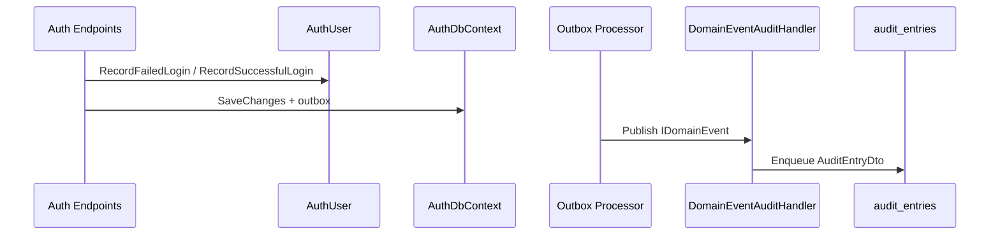

# Security Trail Flow

```mermaid
sequenceDiagram
    participant API as Auth Endpoints
    participant User as AuthUser
    participant DB as AuthDbContext
    participant Outbox as Outbox Processor
    participant Audit as DomainEventAuditHandler
    participant Mongo as audit_entries

    API->>User: RecordFailedLogin / RecordSuccessfulLogin
    API->>DB: SaveChanges + outbox
    Outbox->>Audit: Publish IDomainEvent
    Audit->>Mongo: Enqueue AuditEntryDto
```

Login failure path: `POST /connect/token` calls `RecordFailedLogin` with IP/User-Agent before returning 400.
