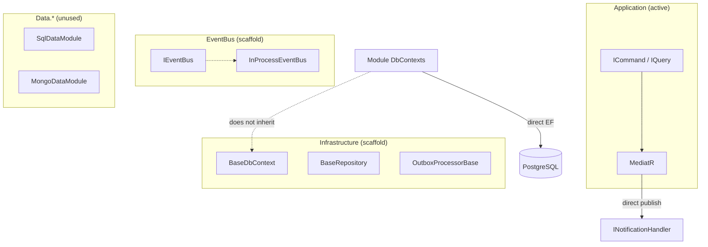

# Building Blocks — Architecture

## Application layer

**Path:** `BackEnd/src/BuildingBlocks/Ashraak.BuildingBlocks.Application/`

```
Application/
├── Commands/
│   ├── ICommand.cs           IRequest<Result> / IRequest<Result<T>>
│   └── ICommandHandler.cs    IRequestHandler aliases
├── Queries/
│   ├── IQuery.cs             IRequest<Result<TResponse>>
│   └── IQueryHandler.cs
└── Behaviors/
    ├── ValidationBehavior.cs     FluentValidation → ValidationException
    ├── LoggingBehavior.cs        Serilog request logging
    └── PerformanceBehavior.cs    Warns if handler > 500 ms
```

Modules implement `ICommand`/`IQuery` in their Application projects. MediatR discovers handlers via `RegisterServicesFromAssembly`.

**Tenant exception:** `ValidationPipelineBehavior<TRequest,TResponse>` in `Ashraak.Tenant.Application/Behaviors/` returns `Result` failures instead of throwing — but it is **not registered** in `TenantModule.cs`.

## Infrastructure layer

**Path:** `BackEnd/src/BuildingBlocks/Ashraak.BuildingBlocks.Infrastructure/`

### BaseDbContext

File: `Persistence/BaseDbContext.cs`

Overrides `SaveChangesAsync` to call `SerializeDomainEventsToOutbox()` before the base save:

1. Scan `ChangeTracker` for `IHasDomainEvents`
2. Serialize each event to JSON via `System.Text.Json`
3. Insert `OutboxMessage` rows (type = assembly-qualified name)
4. Clear domain events on aggregates

Also configures `OutboxMessage` EF mapping in `OnModelCreating`.

**Not used:** Auth, Tenant, and Users DbContexts inherit `DbContext` or `IdentityDbContext` directly. They declare `DbSet<OutboxMessage>` but skip outbox serialization.

### BaseRepository

File: `Persistence/BaseRepository.cs`

Generic CRUD for `AggregateRoot<TId>`: `GetByIdAsync`, `AddAsync`, `Update`, `Remove`.

**Not used:** Modules use custom repositories (e.g. `AuthUserRepository`, `TenantRepository`).

### OutboxProcessorBase

File: `Outbox/OutboxProcessorBase.cs`

Abstract Quartz `IJob` base:

- Batch size: 20 messages
- Deserializes by `Type.GetType(outboxMessage.Type)`
- Dispatches via MediatR `IPublisher`
- Calls `MarkAsProcessed()` or `MarkAsFailed()`

**Not used:** No concrete subclass. No Quartz hosted in `Program.cs`.

## Event bus layer

**Path:** `BackEnd/src/BuildingBlocks/Ashraak.BuildingBlocks.EventBus/`

| Type | Role |
|------|------|
| `IIntegrationEvent` | Marker for broker-bound events |
| `IntegrationEvent` | Abstract record envelope |
| `IEventBus` | `PublishAsync<TEvent>(TEvent)` |
| `InProcessEventBus` | Phase 1 stub — logs and returns `Task.CompletedTask` |

Contract events in SharedKernel use `DomainEvent`, **not** `IIntegrationEvent`.

### Phase plan (from code comments)

| Phase | Mechanism |
|-------|-----------|
| 1 (current) | In-process MediatR + outbox scaffold |
| 3 (future) | Swap `IEventBus` registration to MassTransit (RabbitMQ or Azure Service Bus) |

RabbitMQ appears in `docker-compose.yml` but is **not wired** to application code.

## Data layer (optional scaffold)

**Doc:** `BackEnd/src/BuildingBlocks/DATA_LAYER.md`

| Project | Entry point | Purpose |
|---------|-------------|---------|
| `Data.Abstractions` | — | `IDataRepository<T>`, `IDataUnitOfWork`, `BaseDataEntity`, query options |
| `Data.Sql` | `SqlDataModule.AddSqlDataLayer<TContext>()` | Multi-provider EF + Dapper |
| `Data.Mongo` | `MongoDataModule.AddMongoDataLayer()` | Mongo repositories, index service |

**Not referenced** by any module `.csproj` outside BuildingBlocks. Modules use direct `AddDbContext` + custom repos. Audit registers Mongo manually in `AuditModule.cs`.

### Coexistence model

| Layer | Base type | Use case |
|-------|-----------|----------|
| DDD (current) | `AggregateRoot<TId>`, module DbContext | Domain events, schema-per-module |
| Data layer (scaffold) | `BaseDataEntity`, `IDataRepository<T>` | Generic CRUD, read models, multi-DB |

## EF Core patterns (via modules, not BuildingBlocks DI)

Modules use EF 9.0.4 directly:

- PostgreSQL via Npgsql
- Schema isolation: `auth`, `tenant`, `users`
- `EnableRetryOnFailure(3)`
- `ApplyConfigurationsFromAssembly`
- Interceptors from DI (`IInterceptor`)

See individual module docs for DbContext details.

## Architecture diagram


