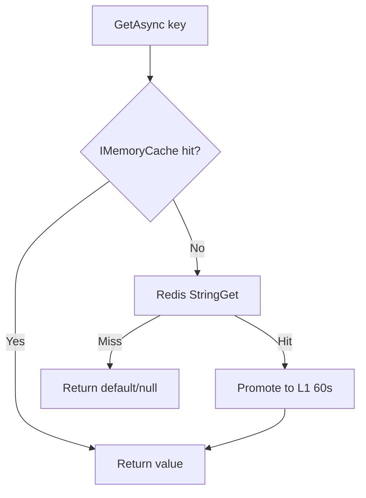

# Caching — Architecture

## Project layout

```
BackEnd/src/Modules/Caching/
├── CACHING_MODULE_STATUS.md
├── Ashraak.Caching.Abstractions/
│   ├── ICacheService.cs
│   ├── ISessionCacheService.cs
│   ├── ICacheInvalidationService.cs
│   ├── IDistributedLockService.cs
│   └── CacheKeyBuilder.cs
└── Ashraak.Caching.Redis/
    ├── CachingModule.cs
    └── Services/
        ├── RedisCacheService.cs       L1 + L2
        ├── SessionCacheService.cs
        ├── CacheInvalidationService.cs
        └── RedisDistributedLockService.cs
```

## Layer 0 vs cache tiers

| Term | Meaning |
|------|---------|
| **Layer 0** | Host registration order — Caching registered first in `AddModules` |
| **L1** | In-process `IMemoryCache` |
| **L2** | Redis distributed cache |

There is no separate "L0" cache store.

## Two-tier read-through cache

Implemented in `RedisCacheService.cs`:



### Write path (SetAsync)

1. Serialize to JSON (`System.Text.Json`, case-insensitive)
2. Write L2 with expiry (default 30 min)
3. Write L1 with `min(60s, L2 expiry)`

### Invalidation

- `RemoveAsync` — delete L2 + L1
- `RemoveByPrefixAsync` — Redis `KEYS`/`SCAN` on first endpoint, bulk delete L2, remove each from L1

### GetOrSetAsync

Returns cached value if **not null**; otherwise runs factory, sets cache, returns. Value types with `default(T)` always invoke factory.

## CacheKeyBuilder

Static key pattern: `{env}:{tenantId}:{module}:{resource}:{id}`

| Method | Example |
|--------|---------|
| `ForEntity(tenantId, module, entity, id)` | `dev:{tenant}:tenant:config:{tenantId}` |
| `ForTenantPrefix(tenantId, module)` | `dev:{tenant}:Tenant:` |
| `ForSession(tenantId, userId)` | `dev:{tenant}:session:{userId}` |
| `ForPermissions(tenantId, userId)` | `dev:{tenant}:auth:perms:{userId}` |
| `ForFeatureFlags(tenantId)` | `dev:{tenant}:tenant:features` |
| `ForRateLimit(tenantId, endpoint)` | `ratelimit:{tenant}:{endpoint}` (no env prefix) |
| `ForDistributedLock(resource, tenantId)` | `lock:{resource}:{tenantId}` |

Environment set at startup: `ASPNETCORE_ENVIRONMENT` lowercased.

## Session cache

`SessionCacheService` wraps `ICacheService` for auth sessions.

**`SessionCacheEntry`:** TenantId, UserId, Roles, Permissions, IssuedOnUtc

Written on token issuance — 8 hour TTL (Auth module).

## Distributed locks

`RedisDistributedLockService`:
- Acquire: `SET NX EX` with GUID fencing token
- Default wait: 5s, retry: 100ms
- Release: Lua CAS script
- **No module callers yet**

## Invalidation service

`CacheInvalidationService` centralizes prefix/key deletes for permissions, sessions, tenant config, module prefixes.

**No module callers yet** — cache expires by TTL only today.

## Consumer modules

| Module | Service | Keys | TTL |
|--------|---------|------|-----|
| Auth | `ICacheService` | `ForPermissions` | 10 min |
| Auth | `ISessionCacheService` | `ForSession` | 8 hours |
| Tenant | `ICacheService` | `ForEntity`, `ForFeatureFlags` | 5 min |

Users references Abstractions but does not use cache directly.

## Host output cache

Separate from Caching module — `Program.cs` uses `AddStackExchangeRedisOutputCache` with same Redis connection, 30s base policy.

## Alternate Redis factory (unused)

`Ashraak.Infrastructure.Shared/Cache/RedisConnectionFactory.cs` — not called from `Program.cs`.
