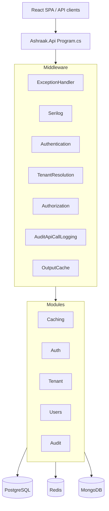

# Host — Architecture

## Project layout

```
BackEnd/src/Host/Ashraak.Api/
├── Program.cs                          Composition root (top-level statements)
├── Ashraak.Api.csproj                  References all module Infrastructure + Api
├── appsettings.json
├── appsettings.Development.json
├── appsettings.Production.json
├── API_COMPOSITION_ROOT.md             In-repo host design doc
├── Extensions/
│   ├── ModuleExtensions.cs             AddModules / MapModules / MapModuleProtocolEndpoints
│   ├── HostPlatformExtensions.cs       Platform health + feature flags
│   ├── EnvironmentValidationExtensions.cs  Fail-fast startup validation
│   └── OpenApiExtensions.cs            Scalar + OpenAPI (dev)
├── Health/
│   ├── NotificationsHealthCheck.cs
│   └── OutboxProcessorsHealthCheck.cs
├── Infrastructure/
│   ├── CurrentUser.cs                  ICurrentUser from JWT claims
│   ├── TenantContext.cs                ITenantContext from claims / X-Tenant-ID
│   ├── DateTimeProvider.cs             IDateTimeProvider
│   └── ConfigFeatureFlagService.cs     IFeatureFlagService
└── Middleware/
    ├── GlobalExceptionHandler.cs       IExceptionHandler → RFC 7807 ProblemDetails
    ├── CorrelationMiddleware.cs        X-Correlation-Id
    └── RateLimitingMiddleware.cs       Redis rate limits
```

## Startup pattern

No `Startup.cs`. `Program.cs` uses top-level statements:

1. Bootstrap Serilog (console fallback for fatal startup errors)
2. `WebApplication.CreateBuilder`
3. Host Serilog from config + Seq
4. Register host services + `AddModules(configuration)` + `AddHostPlatformServices`
5. `ValidateAshraakEnvironment()` (fail-fast)
6. Build app
7. Dev-only: `MapOpenApiDocs()`
8. Middleware pipeline
9. Map endpoints

## Middleware pipeline (request order)

| # | Middleware | Source |
|---|------------|--------|
| 1 | `UseExceptionHandler()` | Host — `GlobalExceptionHandler` |
| 2 | `UseCorrelationMiddleware()` | Host — `X-Correlation-Id` |
| 3 | `UseSerilogRequestLogging()` | Host |
| 4 | `UseRateLimitingMiddleware()` | Host — Redis via `ICacheService` |
| 5 | `UseAuthentication()` | ASP.NET Core + OpenIddict validation |
| 6 | `UseTenantResolution()` | Auth module |
| 7 | `UseAuthorization()` | Host policies + endpoint metadata |
| 8 | `UseAuditApiCallLogging()` | Audit module |
| 9 | `UseOutputCache()` | Host — Redis, 30s base policy |

## Endpoint mapping order

1. `MapModuleProtocolEndpoints()` — unversioned OAuth/SSO on root `WebApplication`
2. Versioned group `/api/v{version:apiVersion}` → `MapModules()`
3. Health checks (outside versioned prefix)

## API versioning

- Package: `Asp.Versioning.Http`
- Default: v1.0
- Readers: URL segment, query `api-version`, header `x-api-version`
- Versioned group created in `Program.cs`, passed to `MapModules()`

Modules map sub-groups (`/auth`, `/tenants`, `/users`, `/audit-logs`) without embedding version prefix.

## Module plug-in pattern

`ModuleExtensions.cs`:

| Method | Purpose |
|--------|---------|
| `AddModules(services, configuration)` | DI for all feature modules |
| `MapModules(routeBuilder)` | Versioned REST endpoints |
| `MapModuleProtocolEndpoints(app)` | Unversioned protocol endpoints |

Adding a module = one line in each method. No other host files need changes.

### Module registration order

```
Layer 0: Caching    (ICacheService dependency for Auth, Tenant)
Layer 1: Auth
Layer 2: Tenant, Users
Layer 3: Audit      (observes all modules via interceptor + middleware)
```

## Authorization policies

Declared in `Program.cs`:

| Policy | Requirement |
|--------|-------------|
| `AdminOnly` | Role `"Admin"` — used by Audit endpoints |
| `TenantAdmin` | Roles `"Admin"` or `"Manager"` — declared, limited endpoint use |

Authentication schemes registered by Auth module (OpenIddict validation, external cookies, Google, Microsoft).

## Observability

- **Serilog:** Console + Seq (`Seq:Url`, default `http://localhost:5341`)
- **OpenTelemetry:** OTLP export, service name `Ashraak.Api`; endpoint from `OTEL_EXPORTER_OTLP_ENDPOINT` env
- **Health:** Liveness vs readiness separation

## Frontend integration

The host is API-only.

| Component | Path | Detail |
|-----------|------|--------|
| React SPA | `FrontEnd/apps/web/` | Vite dev server port 3000 |
| Dev proxy | `FrontEnd/apps/web/vite.config.ts` | Proxies `/api`, `/connect` → `VITE_API_BASE_URL` |
| Env | `FrontEnd/apps/web/.env.example` | `VITE_API_BASE_URL`, `VITE_API_VERSION=v1` |
| Auth client | `FrontEnd/apps/web/src/modules/auth/api.ts` | `POST /connect/token`, `POST /api/v1/auth/register` |

**Path mismatch:** Frontend `endpoints.ts` may reference `/api/v1/auth/sso/*`; backend SSO is unversioned at `/api/auth/sso/*`.

## Architecture diagram


