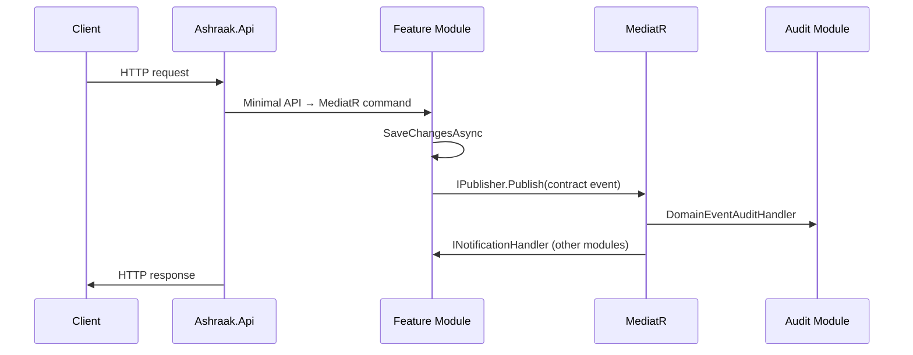

# Host — Events

The host does not publish or consume domain events directly. It provides the runtime context and pipeline through which module events flow.

## Host role in event flow



## What the host provides

| Abstraction | Event relevance |
|-------------|-----------------|
| `ICurrentUser` | Populated from JWT after authentication — used by audit interceptor |
| `ITenantContext` | Set by `TenantResolutionMiddleware` — scopes events and audit entries |
| `IDateTimeProvider` | Consistent timestamps in handlers |

## Middleware and event timing

Events publish **during** the request, typically after `SaveChangesAsync` in command handlers — before the HTTP response completes.

Audit middleware (`UseAuditApiCallLogging`) runs in the pipeline and logs API calls independently of domain events.

## Outbox and host

The host does **not** run:
- Quartz jobs
- `OutboxProcessorBase` subclasses
- Background event dispatch

Outbox tables exist in module schemas as scaffold only. See [Building Blocks events](../building-blocks/events.md).

## Integration events (future)

When `IEventBus` is registered, the registration would likely occur in host `Program.cs` or a new `AddBuildingBlocks()` extension. RabbitMQ in docker-compose is not connected.

Host would add:
- MassTransit/RabbitMQ health check
- Hosted consumers (if using inbox pattern)

Not implemented today.

## Cross-module event example (via host pipeline)

```
POST /api/v1/auth/register
  → Host pipeline (auth, tenant resolution, audit)
  → RegisterUserCommandHandler
  → UserRegisteredEvent published
  → UserRegisteredEventHandler (Users module)
  → DomainEventAuditHandler (Audit module)
```

All within the same process and request scope (synchronous MediatR).

## Observability of events

- **Serilog:** Request logging at host level; module handlers may log via MediatR behaviors (if registered)
- **OpenTelemetry:** Traces span the HTTP request including handler execution
- **Audit MongoDB:** Domain events captured by `DomainEventAuditHandler`

No dedicated event bus metrics until RabbitMQ is wired.
