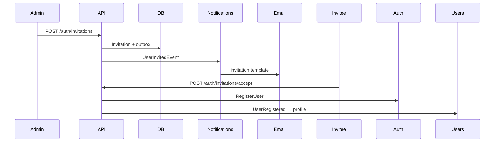

# Invitation flows

## New user

## Existing user (link)

Authenticated user whose email matches the invitation calls accept with token only (no password). A new per-tenant `AuthUser` is created with the same credential hash and the invited role is assigned.

## Resend / revoke

- **Resend** rotates token hash and republishes `UserInvitedEvent`.
- **Revoke** marks invitation revoked; audit event recorded.
