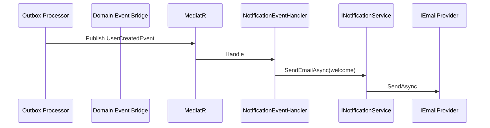

# Notifications — Architecture

Observer module (Layer 3) — no business aggregates. Reacts to contract events via MediatR.



## Provider model

| Provider key | Implementation | Use |
|--------------|----------------|-----|
| `console` | `ConsoleEmailProvider` | Development (default) |
| `smtp` | `SmtpEmailProvider` | Production SMTP |
| `sendgrid` / `ses` | Falls back to console until wired | Future |

Configuration: `Notifications` section in `appsettings.json`.

## Templates

File-based `Templates/{name}.txt` under host content root (`Ashraak.Api/Templates/`).

Format:

```
Subject: Line one
Body lines...
{{Placeholder}}
```
