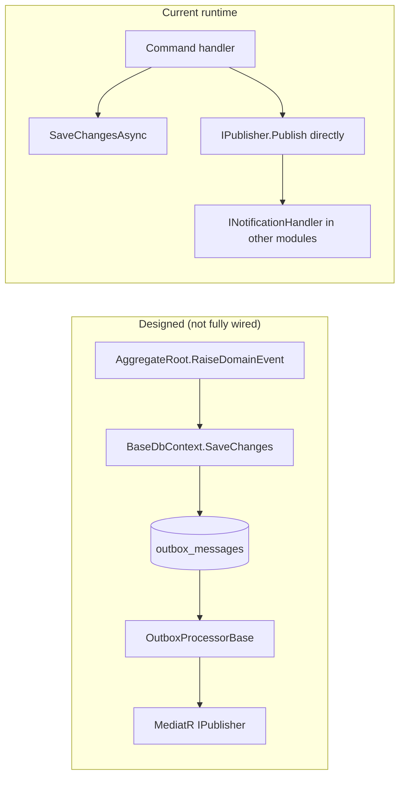

# Shared Kernel — Architecture

## Layout

```
BackEnd/src/Shared/
├── Ashraak.SharedKernel/
│   ├── Domain/
│   │   ├── Events/          IDomainEvent, DomainEvent, IHasDomainEvents, IDomainEventPublisher
│   │   └── Primitives/      Entity, AggregateRoot, ValueObject
│   ├── Outbox/              IOutboxMessage, OutboxMessage
│   ├── Interfaces/          IUnitOfWork, ICurrentUser, ITenantContext, IDateTimeProvider
│   ├── Results/             Result, Error
│   ├── Pagination/          PagedList, PaginationRequest
│   ├── Guards/              Guard
│   └── Extensions/          StringExtensions, DateTimeExtensions
└── Ashraak.SharedKernel.Contracts/
    ├── Auth/                Events, IAuthPermissionChecker, ITokenService
    ├── Tenant/              Events, ITenantService, TenantDto
    ├── Users/               Events, IUserService, UserDto
    └── Audit/               IAuditService, AuditEntryDto
```

## Domain primitives

### Entity and AggregateRoot

`Entity<TId>` provides identity-based equality. `AggregateRoot<TId>` extends it with domain event collection:

```csharp
// BackEnd/src/Shared/Ashraak.SharedKernel/Domain/Primitives/AggregateRoot.cs
protected void RaiseDomainEvent(IDomainEvent domainEvent);
public IReadOnlyCollection<IDomainEvent> GetDomainEvents();
public void ClearDomainEvents();
```

Module aggregates (e.g. `Tenant`, `UserProfile`, `AuthUser`) inherit `AggregateRoot<TId>` and raise events on state changes.

### ValueObject

Structural equality via `GetAtomicValues()`. Used for settings, subscriptions, preferences in Tenant and Users modules.

## Domain events

| Type | File | Role |
|------|------|------|
| `IDomainEvent` | `Domain/Events/IDomainEvent.cs` | Extends `MediatR.INotification`; adds `EventId`, `OccurredOnUtc` |
| `DomainEvent` | `Domain/Events/DomainEvent.cs` | Abstract record base for concrete events |
| `IHasDomainEvents` | `Domain/Events/IHasDomainEvents.cs` | Lets infrastructure collect events without knowing `TId` |
| `IDomainEventPublisher` | `Domain/Events/IDomainEventPublisher.cs` | Optional immediate MediatR dispatch (Auth module only) |

**Important:** Contract events in `Ashraak.SharedKernel.Contracts` also extend `DomainEvent`. They are MediatR notifications, not `IIntegrationEvent`.

## Outbox entity (scaffold)

`OutboxMessage` (`Outbox/OutboxMessage.cs`):

| Field | Purpose |
|-------|---------|
| `Id` | Guid primary key |
| `Type` | Assembly-qualified event type name (max 500 chars) |
| `Content` | JSON-serialized event payload |
| `CreatedOnUtc` | Insert timestamp |
| `ProcessedOnUtc` | Set when dispatched (null = pending) |
| `Error` | Failure message from processor |

Factory: `OutboxMessage.Create(IDomainEvent)`. Mutators: `MarkAsProcessed()`, `MarkAsFailed(string)`.

**Current state:** Module DbContexts declare `DbSet<OutboxMessage>` but do **not** inherit `BaseDbContext`, so events are **not** auto-serialized on save. Handlers publish contract events directly via `IPublisher` after `SaveChangesAsync`.

## Result pattern

`Result` / `Result<TValue>` provide railway-oriented returns for CQRS handlers. Implicit conversion from `Error` and from `TValue` on success. Used by all Application-layer commands and queries.

`Error` carries `Code`, `Message`, and `ErrorType` (`Validation`, `NotFound`, `Conflict`, `Unauthorized`, etc.).

## Runtime abstractions

| Interface | Implemented by | Registered in |
|-----------|----------------|---------------|
| `ICurrentUser` | `Ashraak.Api.Infrastructure.CurrentUser` | Host `Program.cs` (scoped) |
| `ITenantContext` | `Ashraak.Api.Infrastructure.TenantContext` | Host `Program.cs` (scoped) |
| `IDateTimeProvider` | `Ashraak.Api.Infrastructure.DateTimeProvider` | Host `Program.cs` (singleton) |
| `IUnitOfWork` | Each module's `DbContext` | Module `*Module.cs` (scoped alias) |

## Contracts project design

Contracts define **interfaces and DTOs only** — no implementations. Each module's Infrastructure project implements the interfaces it owns and references the contracts for cross-module calls.

Dependency direction:

```
Module.Application → SharedKernel.Contracts ← Other modules' Infrastructure
Module.Domain      → SharedKernel
Module.Infrastructure → SharedKernel + SharedKernel.Contracts
```

## Outbox vs direct publish (intended vs actual)



See [Building Blocks architecture](../building-blocks/architecture.md) for `BaseDbContext` and `OutboxProcessorBase` details.
