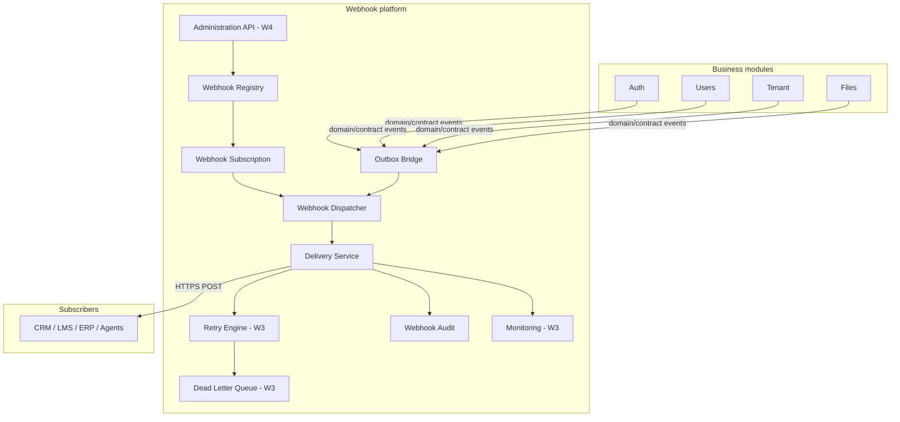

# Webhook platform architecture

**W2:** Foundation + delivery engine implemented — subscriptions, catalog, outbox publish, async HTTP dispatch, delivery logs.

---

## Positioning

Webhooks sit alongside **Notifications** and **Audit** as cross-cutting platform infrastructure:

- **Not** a vertical business module (Auth, Tenant, Files).
- **Reusable** across Ashraak template and future products.
- **Consumes** domain/contract events; **does not** replace internal MediatR handlers.

---

## Logical layers



| Layer | Responsibility |
|-------|----------------|
| **Webhook Registry** | Canonical list of webhook-enabled event types, schemas, versions |
| **Webhook Subscription** | Per-tenant endpoint URL, secret, enabled events, filters |
| **Outbox Bridge** | Maps committed outbox/integration messages to webhook dispatch jobs |
| **Webhook Dispatcher** | Schedules delivery work; never runs in HTTP request thread |
| **Delivery Service** | HTTP client, signing, timeout, response classification |
| **Retry Engine** | Backoff, max attempts, jitter |
| **Dead Letter Queue** | Terminal failures, manual replay |
| **Webhook Audit** | Immutable delivery attempt record (aligns with Audit read patterns) |
| **Monitoring** | Success rate, latency, backlog, DLQ depth |
| **Administration** | APIs + web UI for registry CRUD, secret rotation, replay |

---

## Dependencies

| Dependency | Why |
|------------|-----|
| **Outbox** | At-least-once dispatch after DB commit ([outbox.md](../../architecture/outbox.md)) |
| **Auth / Tenant** | Tenant context, admin RBAC for subscription management |
| **Audit** | Optional correlation with platform audit read model |
| **Correlation ID** | End-to-end trace across delivery attempts |
| **Feature flags** | Gradual rollout per tenant/event type |
| **Notifications** | Complementary channel — webhooks ≠ email |

---

## Admin experience (future)

### Web (W4)

Full management surface for tenant administrators:

| Screen | Capabilities |
|--------|--------------|
| **Webhook Registry** | Browse catalog events; enable/disable per subscription |
| **Subscriptions** | Create/edit endpoint URL, event filters, enabled flag |
| **Webhook Secrets** | Generate, rotate (dual-secret window), revoke |
| **Webhook Logs** | Search by correlation id, event type, status, time range |
| **Retry History** | Per-delivery attempt timeline (status code, latency, error) |
| **Delivery Status** | Live health per subscription; degraded / DLQ indicators |
| **DLQ replay** | Manual replay after root-cause fix (authorized roles only) |

Aligns with existing web patterns: tenant context, RBAC, correlation ID copy, audit trail for admin actions.

### Mobile (W5)

Read-only visibility — **no editing** of subscriptions or secrets:

| Screen | Capabilities |
|--------|--------------|
| **Recent deliveries** | Last N outcomes for tenant |
| **Failure detail** | Read-only attempt history for a delivery id |
| **Deep link** | Open web admin for configuration changes |

Mobile consumes the same logs read API as web; configuration remains web-only for security (secret handling).

---

## Non-goals (W0)

- Synchronous “call subscriber during request”
- Product-specific webhook formats (Salesforce-only payloads, etc.)
- Replacing internal `IPublisher` / MediatR for in-process workflows

---

## Physical placement (future)

Recommended: dedicated **Webhooks** module or **Host platform extension** under `BuildingBlocks` + `Host` — decision deferred to W1 ADR amendment if module boundary changes.

Implemented projects (W1):

```
BackEnd/src/Modules/Webhooks/
├── Ashraak.Webhooks.Domain
├── Ashraak.Webhooks.Application
├── Ashraak.Webhooks.Infrastructure
└── Ashraak.Webhooks.Api
```

---

## References

- [delivery-engine.md](./delivery-engine.md)
- [delivery-model.md](./delivery-model.md)
- [ADR-Webhook-0001](../../adr/ADR-Webhook-0001-webhook-platform-architecture.md)
- [ADR-Webhook-0003](../../adr/ADR-Webhook-0003-webhook-delivery-engine.md)
- [platform/outbox/](../../platform/outbox/README.md)
