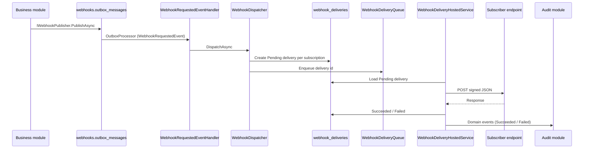

# Webhook delivery engine (W2)

**Status:** Implemented — first-attempt HTTP delivery only. No retries, DLQ, or circuit breaker.

---

## Objective

Publish webhook events from the outbox, deliver them to subscriber endpoints asynchronously, capture delivery outcomes, and prepare the platform for the W3 retry engine.

---

## Delivery flow

| Step | Component | Notes |
|------|-----------|-------|
| 1 | `IWebhookPublisher` | Enqueues `WebhookRequestedEvent` via outbox — never HTTP |
| 2 | `OutboxProcessorHostedService<WebhooksDbContext>` | Dispatches to MediatR |
| 3 | `WebhookRequestedEventHandler` | Invokes dispatcher |
| 4 | `WebhookDispatcher` | Filters subscriptions; builds envelope; creates `WebhookDelivery` |
| 5 | `WebhookDeliveryHostedService` | Background worker; concurrency via `MaxConcurrentDeliveries` |
| 6 | `WebhookDeliveryService` | HTTP POST, HMAC signing, outcome persistence |
| 7 | Domain events | `WebhookDeliverySucceeded` / `WebhookDeliveryFailed` → Audit |

---

## Event filtering

Deliveries are created only for subscriptions that:

- belong to the event's `tenantId`
- are **enabled**
- subscribe to the event type (`subscribed_event_names` empty = all catalog events)

Tenant isolation is enforced at query time and again in `WebhookDeliveryService` before HTTP dispatch.

---

## Database

Table: `webhooks.webhook_deliveries`

| Column | Purpose |
|--------|---------|
| `id` | Delivery id (`X-Webhook-Delivery-Id`) |
| `subscription_id` | Target subscription |
| `tenant_id` | Tenant scope |
| `event_name` | Catalog event name |
| `event_version` | Payload version |
| `correlation_id` | Platform correlation |
| `payload` | Request JSON envelope |
| `attempt_number` | Always `1` in W2 |
| `status` | `Pending`, `Succeeded`, `Failed` |
| `response_code` | HTTP status when available |
| `response_body` | Truncated response (max 4000 chars) |
| `started_on_utc` | Delivery start |
| `completed_on_utc` | Delivery end |

---

## Configuration

Section: `WebhookDelivery` in `appsettings.json`

| Key | Default | Purpose |
|-----|---------|---------|
| `TimeoutSeconds` | `30` | HTTP client timeout |
| `MaxConcurrentDeliveries` | `4` | Worker parallelism |
| `UserAgent` | `Ashraak-Webhooks/1.0` | Outbound `User-Agent` |

Named HTTP client: `WebhookClient` (via `IHttpClientFactory`).

---

## Health checks

`/health/ready` includes **Webhooks** check verifying:

- `IWebhookDispatcher`, `IWebhookDeliveryService`, `IWebhookDeliveryRepository`
- Named `WebhookClient` HTTP client
- `WebhookDeliveryHostedService` registration

---

## Out of scope (W3+)

- Retry scheduling and backoff
- Dead letter queue and replay API
- Circuit breaker
- Admin UI and mobile visibility

See [roadmap.md](./roadmap.md).

---

## References

- [payload-format.md](./payload-format.md)
- [hmac-signing.md](./hmac-signing.md)
- [delivery-history.md](./delivery-history.md)
- [observability.md](./observability.md)
- [ADR-Webhook-0003](../../adr/ADR-Webhook-0003-webhook-delivery-engine.md)
