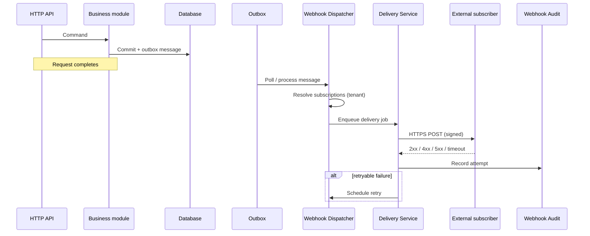

# Webhook delivery model

**Principle:** Webhook delivery is **always asynchronous** and **outbox-driven**.

---

## Why not synchronous

| Risk | Async mitigation |
|------|------------------|
| External downtime blocks user requests | Decoupled worker |
| Slow subscriber increases API latency | Bounded HTTP timeouts in worker only |
| Partial commit if HTTP succeeds but DB rolls back | Outbox after commit |
| Retry storms on user-facing path | Retry engine isolated |

**Never** call subscriber URLs from MediatR handlers or MVC action methods.

---

## Target flow

---

## Outbox integration

1. Module raises domain/contract event as today.
2. **Webhook bridge** (future) writes additional outbox entry type `WebhookDispatchRequested` or maps existing integration event types.
3. Processor guarantees **at-least-once** delivery; subscribers must be **idempotent** (use `id` + `correlationId`).

Aligns with [ADR-0002 Outbox](../../adr/ADR-0002-outbox-pattern.md) and [platform/outbox/](../../platform/outbox/README.md).

---

## Delivery semantics

| Aspect | Target |
|--------|--------|
| Guarantee | At-least-once |
| Ordering | **Not** guaranteed across events; per-subscription ordering optional future enhancement |
| Timeout | Configurable per subscription (default 30s) |
| Success | HTTP 2xx within timeout |
| Idempotency | Subscriber responsibility |

---

## Fan-out

One domain event may trigger **N** deliveries (N active subscriptions for that tenant + event type).

---

## What W0 does not define

- Exact outbox message schema (W1)
- Queue technology (in-process vs broker — prefer in-process + outbox first, ADR if broker required)

See [retry-strategy.md](./retry-strategy.md) for failure paths.
