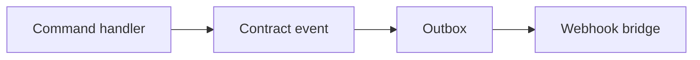

# Extending the webhook platform

How future modules and products participate without redesign.

---

## For module authors (publish events)

1. **Do not** add HTTP webhook calls in your module.
2. Raise **domain** or **contract** events using existing patterns ([eventing.md](../../architecture/eventing.md)).
3. Register event in [event-catalog.md](./event-catalog.md) with `domain.entity.action` name.
4. Provide JSON Schema for `data` payload (W1+).
5. Webhook platform **maps** your event to dispatch — module stays unaware of subscriber URLs.

---

## For platform team (new event types)

1. Update event catalog + manifest
2. Add registry schema version `v1.new.event`
3. Wire outbox consumer mapping
4. Feature-flag rollout per tenant
5. Document in module `events.md` cross-link

---

## For integrators (consume events)

1. Create **subscription** (future API): URL, secret, event filters
2. Verify HMAC per [security.md](./security.md)
3. Implement idempotent handler
4. Return 2xx quickly

Products (CRM, LMS, HRMS, ERP, AI agents) use the **same** subscription model — no product-specific endpoints.

---

## For web admin (W4)

- Registry CRUD
- Secret rotation UI
- Delivery log viewer
- DLQ replay

---

## For mobile (W5)

- Read-only delivery status and recent failures
- Deep link to web admin for configuration changes

---

## Anti-patterns

| Avoid | Why |
|-------|-----|
| CRM-only webhook module | Violates platform capability model |
| Synchronous POST in command handler | Blocks users; breaks outbox guarantees |
| Undocumented event strings in code | Drift from catalog |
| Shared secret across tenants | Breaks isolation |
