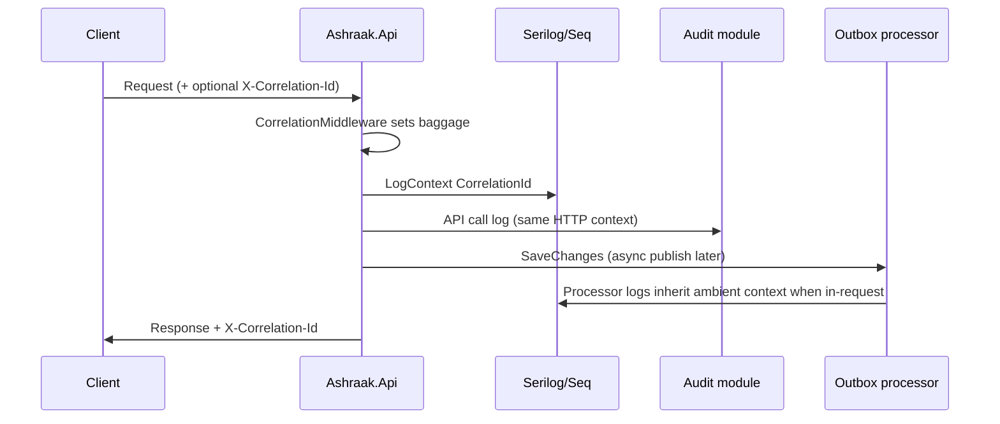

# Correlation — Tracing flow



## Client usage

Send a stable ID per user action:

```http
X-Correlation-Id: 7f3c2a1b9e0d4f6a8b2c1d3e4f5a6b7c
```

Downstream support staff can search Seq by `CorrelationId` across login failures, audit entries, and outbox errors.
