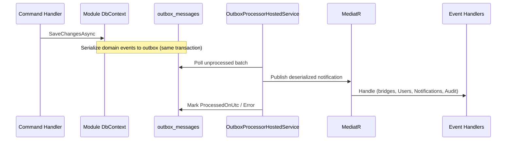

# Outbox — Processing Flow

## Registration flow change

`RegisterUserCommandHandler` no longer calls `IPublisher.Publish` directly — `UserRegisteredDomainEvent` is raised on the aggregate and written to outbox on save.
