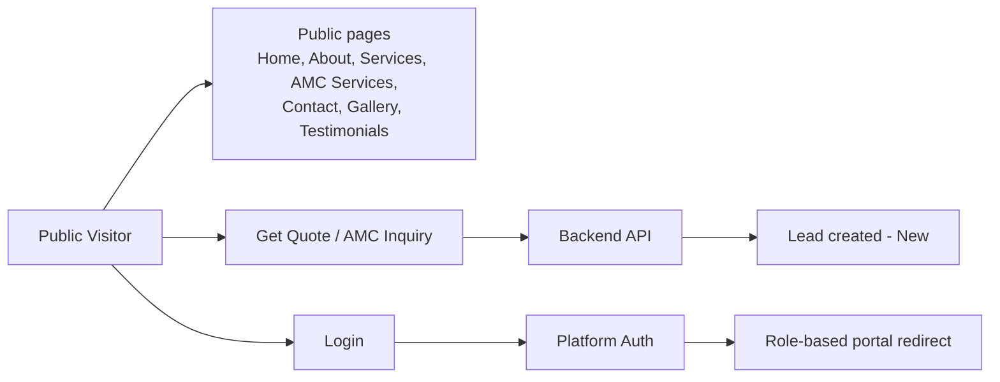

# Application Architecture

**Project:** Aarvii CCTV AMC Management System
**Phase:** D0 — Project Foundation Documentation
**Source of truth:** [requirements-freeze-v1.md §2](./requirements-freeze-v1.md) · HLD: [high-level-design.md](./high-level-design.md)

The solution consists of **four business applications sharing a common backend** (freeze §2).

---

## 1. Public Website

| Aspect | Detail |
|--------|--------|
| Domain | [www.aarvii.in](http://www.aarvii.in) |
| Audience | Public Visitor (anonymous) |
| Purpose | Business showcase, lead generation, AMC plan information, contact inquiries, quote requests |
| Content | Reuse existing public website content wherever possible (freeze §2) |

**Pages (approved):** Home · About Us · Services · AMC Services · Contact Us · Gallery · Testimonials · Login
**Enhancements (approved):** Get Quote · AMC Inquiry

**Behavior:**

- Get Quote / AMC Inquiry / Contact submissions call the backend and **automatically create leads** (freeze §10), firing the Lead Created notification (§17).
- Login routes authenticated users to their portal (Customer / Engineer / Admin) based on role.
- No authenticated functionality lives on the public site itself.

## 2. Customer Portal

| Aspect | Detail |
|--------|--------|
| Channels | Web (React SPA module) + Customer App (Flutter) |
| Audience | Customer |
| Features (freeze §2) | Dashboard · AMC Details · Service History · Upcoming Visits · Tickets · Invoices · Profile Management · Password Reset |

**Behavioral rules:**

- Shows only the customer's **own** data (freeze §3).
- AMC view shows the **current active term**; renewal history is admin-only (§8).
- Service history shows **approved** visit reports only (§13).
- Tickets: create, track, and **reopen closed tickets** (§14).
- Invoices: view and **download PDF** (§16).
- AMC renewal can be **requested** from the portal (§3).

## 3. Engineer Portal

| Aspect | Detail |
|--------|--------|
| Channels | Web (React SPA module) + Engineer App (Flutter, offline-capable) |
| Audience | Engineer |
| Features (freeze §2) | Assigned Visits · Assigned Tickets · Visit Reporting · Photo Upload · GPS Capture · Selfie Capture · Customer Signature · Ticket Creation |

**Behavioral rules:**

- Work queue limited to **assigned** visits and tickets (§3, §15).
- Visit completion enforces the mandatory evidence checklist: selfie, GPS (lat/long/timestamp), ≥1 photo, customer signature, remarks (§12).
- Photos categorized Before / During / After; video upload supported (§12, §15).
- Submitted reports go to **admin review** before customer visibility (§13).
- Engineers can create tickets during visits (§3) but **cannot** manage customers, plans, or contracts (§15).

## 4. Admin Portal

| Aspect | Detail |
|--------|--------|
| Channel | Web (React SPA module) |
| Audience | Admin |
| Features (freeze §2) | Lead Management · Customer Management · Site Management · Asset Management · AMC Plans · AMC Contracts · Scheduling · Ticket Management · Engineer Management · Invoice Management · Reporting |

**Behavioral rules:**

- Full lead pipeline management and conversion (Customer + Site + Initial AMC Contract, §10).
- AMC contract master + term management with full renewal history visibility (§8); versioned plan management (§9).
- Visit scheduling: auto-generation oversight, rescheduling, **mandatory engineer assignment** (§11).
- Visit report **review & approval** gate (§13).
- Invoice lifecycle management with PDF generation (§16, §19).

## 5. Backend APIs

| Aspect | Detail |
|--------|--------|
| Host | `Ashraak.Api` — .NET 10 modular monolith composition root (shared by all four applications) |
| Core (frozen) | Auth, Tenant, Users, Files, Notifications (email), Audit, Webhooks, ApiKeys, Caching/Outbox |
| CCTV business modules (new) | Lead, Customer/Site/Asset, AMC (Plans + Contracts), Scheduling/Visits, Tickets, Engineer, Invoices, Reporting — registered at Host **Layer 2** |
| API style | REST (Minimal APIs), versioned routes, JWT bearer auth; OpenAPI feeds the mobile SDK |
| Cross-module rule | Business modules ↔ Core only via `SharedKernel.Contracts`; no Core edits (freeze §20) |

**Platform contracts consumed:**

| Contract | Used for |
|----------|----------|
| Auth / RBAC / ABAC | Login, roles (Customer/Engineer/Admin), permission checks |
| `IFileStorage` | Photos, videos, selfies, signatures, generated PDFs |
| `INotificationService` | Email notifications; SMS via provider integration |
| `IAuditService` (observer) | Automatic business-event audit capture |
| `IWebhookPublisher` | Outbound CCTV catalog events |
| `ICacheService` / Outbox | Caching and reliable event publication |

## 6. Database

> Logical view only — **physical design and ERD are deferred to D0-4** per D0 quality rules.

| Store | Usage |
|-------|-------|
| PostgreSQL | CCTV business data in **new per-module schemas** (platform convention); core platform schemas remain untouched |
| Redis | Platform caching, sessions, rate limiting |
| MongoDB | Platform audit entries |
| File storage (local/S3/Azure) | Binary content via platform Files module |

Logical data areas implied by the freeze (to be modeled in D0-4): Leads · Customers · Sites · Contact Persons (≤3/site) · Asset Summaries · AMC Plans (versioned) · AMC Contracts + Terms · Scheduled Visits · Visit Reports/Evidence · Tickets · Engineers · Invoices · Notifications log.

## 7. External integrations

| Integration | Direction | Purpose | Freeze ref |
|-------------|-----------|---------|-----------|
| SMTP / email provider | Outbound | Email notifications | §17 |
| SMS gateway | Outbound | SMS notifications, Login OTP, Password Reset OTP | §17 |
| Cloud storage (S3/Azure, optional) | Outbound | File blobs via platform Files | §12, §19, §20 |
| Webhook consumers | Outbound | Platform webhook delivery to external systems | §20 |
| App stores | Release | Customer & Engineer app distribution | §18 |

**Explicitly excluded** (freeze §21): WhatsApp integration, payment gateway, accounting/GST systems.

---

## Related documents

- [high-level-design.md](./high-level-design.md)
- [module-architecture.md](./module-architecture.md)
- [mobile-architecture.md](./mobile-architecture.md)
- [navigation-map.md](./navigation-map.md)
