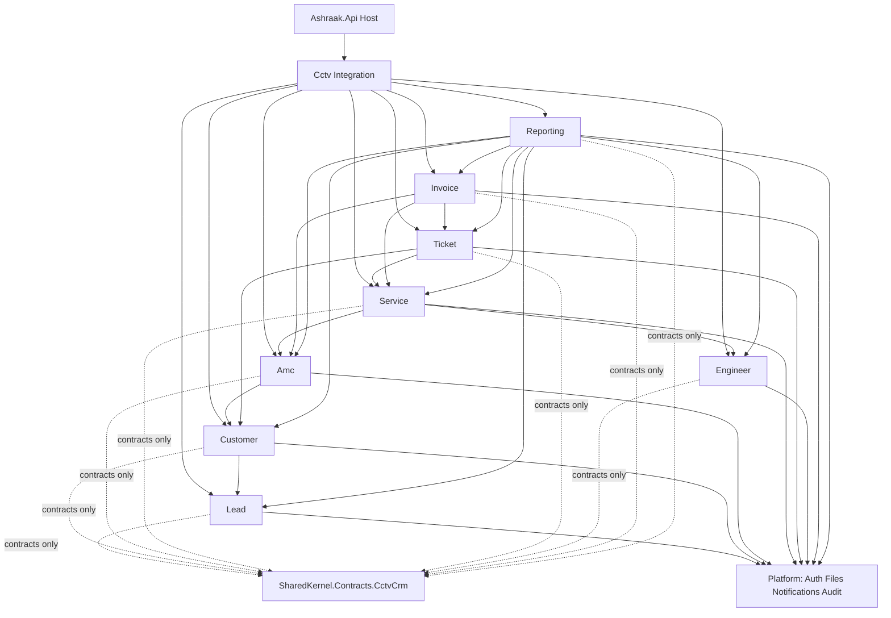

# CCTV Module Map

**Project:** Aarvii CCTV AMC Management System  
**Status:** Sprint 0 foundation — naming frozen ([cctv-module-naming-freeze.md](./cctv-module-naming-freeze.md))  
**Platform baseline:** Ashraak Enterprise Platform V1 (Auth, Files, Notifications, Audit, Webhooks — reused)

---

## 1. Module inventory

| # | Business module | C# module | Schema | Phase | Feature flag |
|---|-----------------|-----------|--------|:-----:|----------------|
| 1 | Lead Management | `Lead` | `cctv_lead` | B1 | `cctv.leads.enabled` |
| 2 | Customer / Site / Asset | `Customer` | `cctv_customer` | B2 | `cctv.customers.enabled` |
| 3 | AMC Plans & Contracts | `Amc` | `cctv_amc` | B3 | `cctv.amc.enabled` |
| 4 | Scheduling & Visits | `Service` | `cctv_service` | B4 | `cctv.service.enabled` |
| 5 | Ticket Management | `Ticket` | `cctv_ticket` | B5 | `cctv.tickets.enabled` |
| 6 | Engineer Management | `Engineer` | `cctv_engineer` | B5 | `cctv.engineers.enabled` |
| 7 | Invoice Management | `Invoice` | `cctv_invoice` | B6 | `cctv.invoices.enabled` |
| 8 | Reporting | `Reporting` | — | B7 | `cctv.reporting.enabled` |
| — | Integration | `Integration` | — | D1 | `cctv.enabled` (master) |

**Portals (no schema):** Customer Portal · Engineer Portal · Public Website — see §5.

---

## 2. Project structure (per module)

```
BackEnd/src/Modules/Cctv/{Module}/
  Ashraak.Cctv.{Module}.Domain/
  Ashraak.Cctv.{Module}.Application/
  Ashraak.Cctv.{Module}.Infrastructure/
  Ashraak.Cctv.{Module}.Api/
```

**Host aggregation:**

| Project | Role |
|---------|------|
| `Ashraak.Cctv.Integration.Application` | `ISmsProvider`, `IPdfGenerationService`, `CctvPermissions` |
| `Ashraak.Cctv.Integration.Infrastructure` | Stubs, RBAC seed, `CctvModules.AddCctvModules` |
| `Ashraak.Cctv.Api` | `MapCctvEndpoints`, health |

---

## 3. Dependency graph



**Rules:**

- No CCTV module references another module's Infrastructure or Domain.
- Cross-module orchestration via `SharedKernel.Contracts.CctvCrm` + domain events.
- Platform services consumed via existing platform APIs only.

---

## 4. API route map

| Module | Route group | Sprint 0 | Target phase |
|--------|-------------|:--------:|:------------:|
| All | `GET /api/v1/cctv/health` | ✅ | D1 |
| Lead | `/api/v1/cctv/leads/*` | Group only | B1 |
| Customer | `/api/v1/cctv/customers/*` | Group only | B2 |
| AMC | `/api/v1/cctv/amc/*` | Group only | B3 |
| Service | `/api/v1/cctv/service/*` | Group only | B4 |
| Ticket | `/api/v1/cctv/tickets/*` | Group only | B5 |
| Engineer | `/api/v1/cctv/engineers/*` | Group only | B5 |
| Invoice | `/api/v1/cctv/invoices/*` | Group only | B6 |
| Reporting | `/api/v1/cctv/reports/*` | Group only | B7 |

Authoritative route list: [endpoint-catalog.md](./design/endpoint-catalog.md).

---

## 5. Frontend & mobile map

| Surface | Folder / app | Feature flag | Phase |
|---------|--------------|--------------|:-----:|
| Admin CCTV pages | `FrontEnd/apps/web/src/modules/cctv/` | Per-module flags | FP-1..FP-9 |
| Customer portal | `ROUTES.cctv.portal.*` | `cctv.portal.customer.enabled` | FP-7 |
| Engineer portal | `ROUTES.cctv.engineer.*` | `cctv.portal.engineer.enabled` | FP-8 |
| Customer mobile | `FrontEnd.Mobile/` feature slices | `cctv.mobile.customer.enabled` | Sprint 9 |
| Engineer mobile | `FrontEnd.Mobile/` feature slices | `cctv.mobile.engineer.enabled` | Sprint 9 |

Navigation: [cctvNavigationConfig.ts](../FrontEnd/apps/web/src/modules/cctv/navigation/cctvNavigationConfig.ts)

---

## 6. Platform reuse (not in this map)

These remain **platform modules** — not duplicated:

| Capability | Platform module | CCTV usage |
|------------|-----------------|------------|
| Authentication | Auth | JWT, MFA, sessions |
| Authorization | Auth RBAC | 30 CCTV permissions seeded |
| Files | Files | Two-step upload |
| Notifications | Notifications | Email + future SMS |
| Audit | Audit | DbContext interceptor |
| Webhooks | Webhooks | Event catalog entries (B1+) |
| Theme / shell | platform-ui | All CCTV pages |

---

## 7. Documentation map

| Module | README |
|--------|--------|
| Lead | [cctv-lead](../modules/cctv-lead/README.md) |
| Customer | [cctv-customer](../modules/cctv-customer/README.md) |
| AMC | [cctv-amc](../modules/cctv-amc/README.md) |
| Service | [cctv-service](../modules/cctv-service/README.md) |
| Ticket | [cctv-ticket](../modules/cctv-ticket/README.md) |
| Engineer | [cctv-engineer](../modules/cctv-engineer/README.md) |
| Invoice | [cctv-invoice](../modules/cctv-invoice/README.md) |
| Reporting | [cctv-reporting](../modules/cctv-reporting/README.md) |
| Integration | [cctv-integration](../modules/cctv-integration/README.md) |

Design authority: [entity-model.md](./design/entity-model.md) · [module-contracts.md](./design/module-contracts.md)

---

## 8. Implementation sequence

| Order | Phase | Modules unlocked |
|:-----:|-------|------------------|
| 0 | D1 / Sprint 0 | All skeletons + health ✅ |
| 1 | B1 | Lead |
| 2 | B2 | Customer |
| 3 | B3 | Amc |
| 4 | B4 | Service (+ Engineer assignment) |
| 5 | B5 | Ticket, Engineer |
| 6 | B6 | Invoice |
| 7 | B7 | Reporting |

See [backend-development-phases.md](./roadmap/backend-development-phases.md) · [sprint-plan.md](./roadmap/sprint-plan.md).

---

## 9. Feature flag rollout

| Flag | Default (prod config) | Enable when |
|------|:---------------------:|-------------|
| `cctv.enabled` | `true` | Sprint 0 — master gate |
| Module flags (`cctv.leads.enabled`, etc.) | `false` | Respective phase exit gate |
| `cctv.integrations.sms.enabled` | `false` | SMS provider live |
| `cctv.integrations.pdf.enabled` | `false` | PDF library integrated (B3/B6) |

Config: `Features:Flags` in `appsettings.json`. Dev overrides: `appsettings.Development.json`.

---

Related: [architecture/module-map.md](../architecture/module-map.md) · [cctv-module-naming-freeze.md](./cctv-module-naming-freeze.md)
