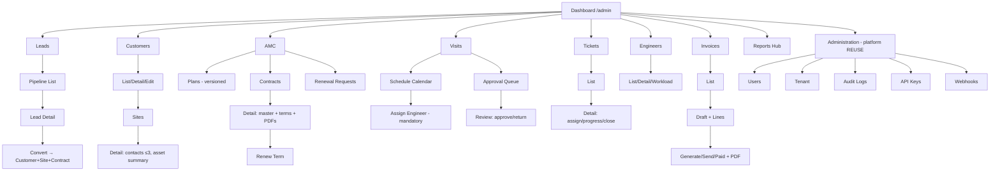

# Admin Portal Navigation

**Project:** Aarvii CCTV AMC Management System · **Phase:** D0-5
**Shell:** platform Theme Engine navigation (REUSE) · **Role:** `Admin` (RoleGuard) · Route prefix: `/admin`

The Administration group mounts the **existing platform screens unchanged** (REUSE). All business groups are NEW route trees on the platform shell.

---

## Navigation tree

| Menu | Submenu | Route | Permission | Class |
|------|---------|-------|------------|-------|
| Dashboard | — | `/admin` | (role) | EXTEND (platform dashboard + CCTV widgets) |
| **Leads** | Lead List (pipeline) | `/admin/leads` | `leads:read` | NEW |
| | Lead Detail (activities/remarks/attachments) | `/admin/leads/:id` | `leads:manage` | NEW |
| | Convert Lead | `/admin/leads/:id/convert` | `leads:convert` | NEW |
| **Customers** | Customer List | `/admin/customers` | `customers:read` | NEW |
| | Customer Detail | `/admin/customers/:id` | `customers:read` | NEW |
| | Create / Edit | `/admin/customers/new`, `/:id/edit` | `customers:manage` | NEW |
| **Sites** | Site Detail (contacts ≤3, assets, aggregation) | `/admin/sites/:id` | `sites:read` | NEW |
| | Create / Edit + Asset Summary | `/admin/sites/new`, `/:id/edit` | `sites:manage` | NEW |
| **AMC** | Plans (versioned) | `/admin/amc/plans` | `amcplans:read` | NEW |
| | Plan Detail / New Version | `/admin/amc/plans/:id` | `amcplans:manage` | NEW |
| | Contracts | `/admin/amc/contracts` | `amc:read` | NEW |
| | Contract Detail (master + term history + PDFs) | `/admin/amc/contracts/:id` | `amc:read` | NEW |
| | New Term / Renew | `/admin/amc/contracts/:id/renew` | `amc:manage` | NEW |
| | Renewal Requests queue | `/admin/amc/renewal-requests` | `amc:manage` | NEW |
| **Visits** | Schedule Calendar / List | `/admin/schedules` | `schedules:read` | NEW |
| | Schedule Detail (assign — mandatory / reschedule / cancel) | `/admin/schedules/:id` | `visits:assign`, `schedules:manage` | NEW |
| | Report Approval Queue | `/admin/visits/approvals` | `visits:approve` | NEW |
| | Report Review Detail (approve/return) | `/admin/visits/:id/review` | `visits:approve` | NEW |
| **Tickets** | Ticket List (status/priority) | `/admin/tickets` | `tickets:read` | NEW |
| | Ticket Detail (assign/progress/close) | `/admin/tickets/:id` | `tickets:assign/update/close` | NEW |
| | Create Ticket | `/admin/tickets/new` | `tickets:create` | NEW |
| **Engineers** | Engineer List | `/admin/engineers` | `engineers:read` | NEW |
| | Engineer Detail / Edit (workload, account link) | `/admin/engineers/:id` | `engineers:manage` | NEW |
| **Invoices** | Invoice List (status/type — Option B) | `/admin/invoices` | `invoices:read` | NEW |
| | Create / Edit Draft (+lines) | `/admin/invoices/new`, `/:id/edit` | `invoices:manage` | NEW |
| | Invoice Detail (Generate/Send/Paid/Cancel + PDF) | `/admin/invoices/:id` | `invoices:manage` | NEW |
| **Reports** | Reports Hub | `/admin/reports` | `reports:read` | NEW |
| | Leads / AMC / Visits / Tickets / Invoices views | `/admin/reports/:area` | `reports:read` | NEW |
| **Administration** | Users | existing `/users` | platform | **REUSE** |
| | Tenant Profile / Settings | existing `/tenant/*` | platform | **REUSE** |
| | Audit Logs | existing `/audit` | `audit:read` | **REUSE** |
| | API Keys | existing api-keys routes | `apikeys:read` | **REUSE** |
| | Webhooks Operations Center | existing webhooks routes | `webhooks:read` | **REUSE** |
| | My Profile / Sessions | existing | platform | **REUSE** |

## Mermaid view

## Notes

- Nav items render through the existing theme NavigationContract with `PermissionGuard` gating per item (platform pattern, e.g. audit link).
- The lead conversion action navigates into the created Customer/Site/Contract records on success (BR-LEAD-03).
- The Renewal Requests queue surfaces customer-initiated requests (BR-AMC-08) feeding the renew-term flow.

Related: [navigation-architecture.md](./navigation-architecture.md) · [screen-inventory.md](./screen-inventory.md) · [dashboard-design.md](./dashboard-design.md)
