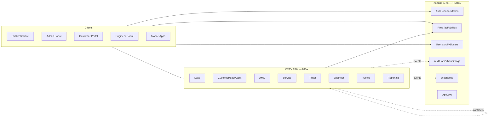
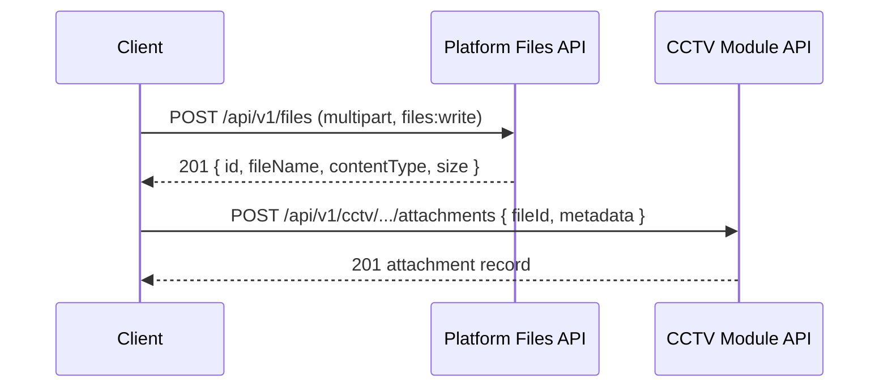

# API Architecture

**Project:** Aarvii CCTV AMC Management System
**Phase:** D0-6 — API Architecture, Module Contracts & Integration Design (base-template aware)
**Platform baseline:** Ashraak V1 host composition, Minimal APIs, MediatR CQRS, JWT RBAC, platform Outbox, ProblemDetails ([host architecture](../../modules/host/architecture.md), [building blocks](../../modules/building-blocks/api.md))

> CCTV business APIs are **new route groups** on the frozen host. Platform APIs (`/connect/token`, `/api/v1/files`, …) are consumed as-is — never reimplemented.

---

## 1. API strategy

| Principle | Decision |
|-----------|----------|
| Style | REST over HTTPS; resource-oriented nouns; state changes via explicit sub-resources or PATCH |
| Host | Single Ashraak.Api modular monolith — CCTV modules register via `ModuleExtensions.MapModules()` |
| Transport | JSON request/response bodies; `multipart/form-data` only for platform Files upload |
| Auth | JWT Bearer on all CCTV endpoints except anonymous inquiries; API-key auth for M2M integrations (platform ApiKeys) |
| Tenancy | Mandatory `tenant_id` from JWT; cross-tenant access returns **404** (platform convention) |
| Cross-module writes | Orchestrated via **SharedKernel.Contracts** + Outbox — no direct Infrastructure references |
| Client SDKs | OpenAPI projection of HTTP surface → TypeScript (web) + Dart (mobile) — see [openapi-roadmap.md](./openapi-roadmap.md) |

### Route namespace

All CCTV business endpoints live under the versioned host group:

```
/api/v1/cctv/{resource-group}/...
```

Platform endpoints remain at their existing paths (`/api/v1/files`, `/api/v1/users`, …).

### Backend module → route map

| Backend slice | Route prefix | Schema |
|---------------|--------------|--------|
| Lead | `/api/v1/cctv/leads`, `/api/v1/cctv/inquiries` | `cctv_lead` |
| Customer / Site / Asset | `/api/v1/cctv/customers`, `/api/v1/cctv/sites` | `cctv_customer` |
| AMC | `/api/v1/cctv/amc-plans`, `/api/v1/cctv/contracts` | `cctv_amc` |
| Service (Scheduling + Visits) | `/api/v1/cctv/schedules`, `/api/v1/cctv/visits` | `cctv_service` |
| Ticket | `/api/v1/cctv/tickets` | `cctv_ticket` |
| Engineer | `/api/v1/cctv/engineers` | `cctv_engineer` |
| Invoice | `/api/v1/cctv/invoices` | `cctv_invoice` |
| Reporting | `/api/v1/cctv/reports` | *(read-only, no schema)* |

Portal convenience aggregations (dashboard widgets) use scoped sub-routes:

- `/api/v1/cctv/portal/*` — Customer role + row scope
- `/api/v1/cctv/engineer/*` — Engineer role + assignment scope

---

## 2. Versioning strategy

| Layer | Strategy |
|-------|----------|
| URL | `/api/v1/...` — matches platform version group; **v1 frozen** for CCTV V1 scope |
| Breaking changes | New major URL version (`/api/v2/cctv/...`) — never silent breaks in v1 |
| DTO fields | Additive only in v1 (optional new properties); never remove/rename without version bump |
| Webhook payloads | `v1.{event.name}` type identifier per [webhook event catalog](../../modules/webhooks/event-catalog.md) |
| OpenAPI document | Single `v1` document exported from host; tagged by module |

OAuth/OpenIddict paths (`/connect/token`) remain **unversioned** (platform requirement).

---

## 3. Module boundaries

Enforced at three layers:

1. **Database** — schema-per-module; only owning module writes its schema ([database-architecture.md §2](./database-architecture.md))
2. **Application** — cross-module calls via `SharedKernel.Contracts` interfaces only
3. **HTTP** — each route group maps to one owning module; Reporting is read-only across contract queries



---

## 4. Endpoint naming conventions

| Rule | Example |
|------|---------|
| Plural resource collections | `GET /api/v1/cctv/leads` |
| Single resource by id | `GET /api/v1/cctv/leads/{leadId}` |
| Business numbers in responses only | Response includes `leadNumber: "LD-2026-0001"`; routes use UUID `{leadId}` |
| Sub-resource collections | `GET /api/v1/cctv/leads/{leadId}/activities` |
| State transitions | `POST /api/v1/cctv/leads/{leadId}/status` or `PATCH` with transition intent |
| Commands (non-CRUD) | `POST /api/v1/cctv/leads/{leadId}/convert` |
| File linking (after platform upload) | `POST /api/v1/cctv/leads/{leadId}/attachments` body `{ "fileId": "uuid", "title": "..." }` |
| Scoped portal reads | `GET /api/v1/cctv/portal/amc` |
| Health | `GET /api/v1/cctv/health` per module slice (optional, mirrors platform pattern) |

**Avoid:** verbs in collection paths (`/createLead`), nested depth > 3, file bytes in JSON bodies.

---

## 5. Request / response standards

### Request headers (reuse platform)

| Header | Required | Purpose |
|--------|:--------:|---------|
| `Authorization: Bearer {jwt}` | Yes (except anonymous inquiries) | Platform JWT |
| `Content-Type: application/json` | Yes (JSON bodies) | Standard |
| `X-Correlation-Id` | Optional | Platform correlation middleware |
| `X-Api-Key` | M2M only | Platform ApiKeys middleware |

### Success responses

| Operation | Status | Body |
|-----------|--------|------|
| Create | `201 Created` | Resource DTO + `Location` header |
| Read single | `200 OK` | Detail DTO |
| Read list | `200 OK` | Paged list wrapper |
| Update | `200 OK` | Updated DTO |
| Delete / soft-delete | `204 No Content` | — |
| Command (convert, approve, generate) | `200 OK` or `201 Created` | Result DTO |

### Response envelope — lists

Reuse platform `PagedResult<T>` shape (BuildingBlocks `PagedResult.cs`, Audit viewer precedent):

```json
{
  "items": [ ],
  "page": 1,
  "pageSize": 25,
  "totalCount": 142,
  "totalPages": 6,
  "hasNextPage": true,
  "hasPreviousPage": false
}
```

### Standard metadata on all CCTV DTOs

| Field | Type | Notes |
|-------|------|-------|
| `id` | UUID | Surrogate key |
| `{entity}Number` | string | Human-readable business number where applicable |
| `createdAt` / `updatedAt` | ISO-8601 UTC | Audit fields |
| `rowVersion` | base64 or integer | Optimistic concurrency on mutating requests |

Mutating requests that support concurrency accept `rowVersion` in body or `If-Match` header (implementation choice in LLD — document both as acceptable).

---

## 6. Error handling standards

Reuse platform **GlobalExceptionHandler** → RFC 7807 ProblemDetails ([error catalog](../../errors/error-catalog.md)).

| HTTP | When | ProblemDetails `title` pattern |
|------|------|-------------------------------|
| `400` | Validation failure, business rule violation | `"Validation failed"` or rule-specific title |
| `401` | Missing/invalid JWT | Platform auth |
| `403` | Missing permission or row scope denied | `"Forbidden"` |
| `404` | Resource not found **or** cross-tenant / out-of-scope | `"Not found"` (no information leakage) |
| `409` | Optimistic concurrency conflict (`rowVersion` mismatch) | `"Conflict"` |
| `422` | Semantic state transition invalid (e.g. approve non-submitted visit) | `"Unprocessable entity"` |
| `429` | Rate limit (anonymous inquiries) | Platform rate limiting |
| `500` | Unhandled exception | Platform handler |

Business rule failures return `400` or `422` with:

```json
{
  "type": "https://aarvii.in/problems/cctv/{rule-code}",
  "title": "Business rule violation",
  "status": 422,
  "detail": "Only approved visit reports are visible to customers.",
  "traceId": "...",
  "errors": {
    "status": ["Cannot transition from Closed to InProgress without Reopened."]
  }
}
```

Problem `type` URIs are stable contract identifiers for client handling (LLD will enumerate per rule).

---

## 7. Pagination standards

| Query param | Default | Max | Notes |
|-------------|---------|-----|-------|
| `page` | `1` | — | 1-based (Audit viewer precedent) |
| `pageSize` | `25` | `100` | Admin lists; mobile may request smaller |
| `sort` | module-specific default | — | e.g. `-createdAt` (prefix `-` = descending) |

Cursor-based pagination is **out of scope for V1** — offset pagination matches platform Audit API and frontend table components.

---

## 8. Filtering standards

Query parameters on list endpoints — all optional, AND-combined:

| Pattern | Example | Applies to |
|---------|---------|------------|
| `status` | `?status=Open,Assigned` | Entities with status enums |
| `fromDate` / `toDate` | ISO date | Schedules, visits, invoices |
| `customerId` / `siteId` | UUID | Admin scoped lists |
| `engineerId` | UUID | Admin assignment views |
| `priority` | `High,Critical` | Tickets |
| `invoiceType` | `AmcRenewal` | Invoices (Option B) |
| `q` | free text | Lead/customer/ticket search (admin) |

Engineer and Customer roles: server **ignores** filter params outside their scope and applies mandatory row filters ([rbac-matrix.md §6](./rbac-matrix.md)).

---

## 9. Sorting standards

| Param | Format | Example |
|-------|--------|---------|
| `sort` | `{field}` or `-{field}` | `sort=-createdAt`, `sort=priority` |
| Multi-sort | comma-separated (optional V1) | `sort=-priority,createdAt` |

Allowed sort fields are documented per endpoint in [endpoint-catalog.md](./endpoint-catalog.md). Unknown fields → `400`.

---

## 10. File upload standards (platform Files — REUSE)

**Two-step pattern** (mandated — no file bytes in CCTV JSON endpoints):



| Rule | Detail |
|------|--------|
| Upload | Always `POST /api/v1/files` — REUSE platform endpoint |
| Download | Always `GET /api/v1/files/{fileId}` after module authorizes access |
| Delete | Platform soft-delete via `DELETE /api/v1/files/{fileId}`; business attachment row deleted separately |
| Ownership | Module API validates tenant + business ownership before returning FileId to client |
| Content types | Platform `AllowedContentTypes` config; CCTV modules document recommended types per use case in [file-management-design.md](./file-management-design.md) |

---

## 11. Notification integration (platform Notifications — REUSE/EXTEND)

| Step | Mechanism |
|------|-----------|
| 1 | CCTV aggregate raises domain event → Outbox (same transaction) |
| 2 | Outbox processor publishes contract event via MediatR |
| 3 | CCTV `INotificationHandler<TEvent>` in business module **or** extended Notifications handlers |
| 4 | `INotificationService.SendEmailAsync` / SMS adapter (EXTEND) |
| 5 | Template from `Ashraak.Api/Templates/cctv/{key}.txt` |

CCTV does **not** expose notification send APIs — notifications are event-driven only (freeze §17). User preferences: REUSE `PATCH /api/v1/users/{userId}/preferences`.

See [notification-mapping.md](./notification-mapping.md).

---

## 12. Audit integration (platform Audit — REUSE)

| Capture path | CCTV responsibility |
|--------------|---------------------|
| Domain events (`IDomainEvent`) | Publish from command handlers after `SaveChangesAsync` — auto-captured by `DomainEventAuditHandler` |
| EF entity changes | Automatic via `AuditEntityChangeInterceptor` on CCTV DbContexts |
| HTTP API calls | Automatic via `AuditApiCallMiddleware` |
| Custom actions | Optional `IAuditService.LogAsync` for operations without entity change |

CCTV does **not** implement audit storage or read APIs — REUSE `GET /api/v1/audit-logs` (Admin, `audit:read`).

See [audit-mapping.md](./audit-mapping.md).

---

## 13. Authorization pattern (per endpoint)

Every CCTV endpoint applies:

1. `[RequireAuthorization]` — JWT present
2. Permission policy — e.g. `.RequirePermission("leads:read")` (platform RBAC checker)
3. Row scope filter — Customer/Engineer queries constrained in handler/repository

Anonymous endpoints:

- `POST /api/v1/cctv/inquiries` — rate-limited (platform middleware)

---

## Related documents

- [module-contracts.md](./module-contracts.md) · [endpoint-catalog.md](./endpoint-catalog.md) · [dto-catalog.md](./dto-catalog.md)
- [api-reuse-analysis.md](./api-reuse-analysis.md) · [integration-design.md](./integration-design.md)
