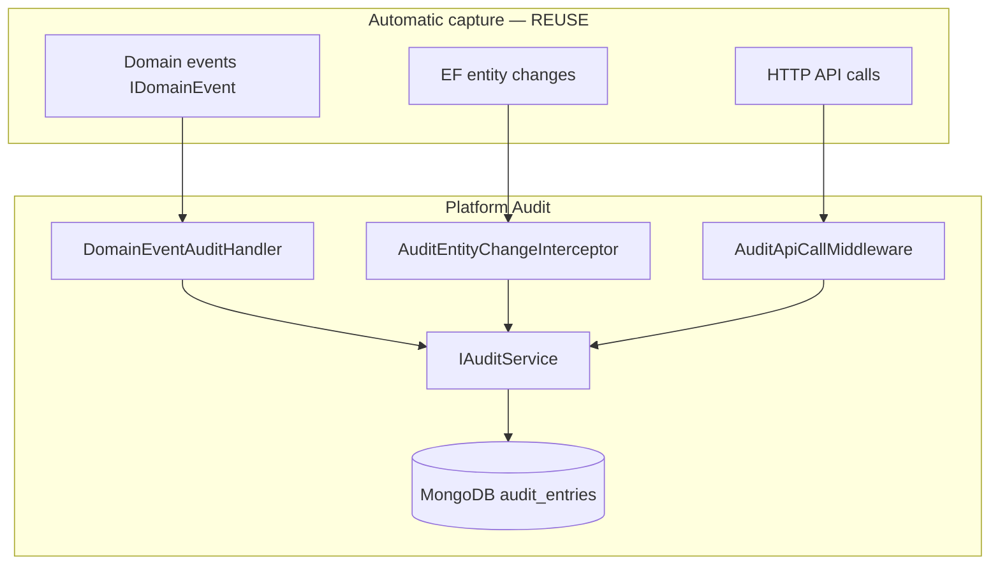

# Audit Mapping

**Project:** Aarvii CCTV AMC Management System
**Phase:** D0-6 — Audit module reuse for compliance trail
**Platform:** REUSE MongoDB observer, `DomainEventAuditHandler`, EF interceptor, API middleware ([audit events](../../modules/audit/events.md))

> CCTV does **not** implement audit storage or a custom audit API. Business-visible histories (ticket status timeline, etc.) are **first-class CCTV entities** — distinct from platform audit logs.

---

## 1. Audit architecture (REUSE)



CCTV module DbContexts register `AuditEntityChangeInterceptor` (same as platform modules).

---

## 2. Auditable actions by category

### Security events (platform + CCTV context)

| Action | Capture path | Module name in audit |
|--------|--------------|---------------------|
| Login success/failure | Platform Auth + security events | `Auth` |
| Token revocation | Platform sessions | `Auth` |
| Permission denied (403) | API middleware (optional) | `Host` |
| CCTV admin mutating protected resource | HTTP + domain event | `CctvCrm.{Module}` |

Platform security event catalog: [security-events/event-catalog.md](../../modules/audit/security-events/event-catalog.md).

### Operational events (CCTV domain)

| Action | Domain event | Also EF audit |
|--------|--------------|:-------------:|
| Lead created / converted | `LeadCreatedEvent`, `LeadConvertedEvent` | ✅ |
| Customer/site changes | `Customer*`, `Site*` events | ✅ |
| AMC plan publish | `AmcPlanVersionPublishedEvent` | ✅ |
| Contract term activate/renew | `AmcContractTermActivatedEvent` | ✅ |
| Schedule assign/reschedule | `VisitSchedule*Event` | ✅ |
| Visit submit/approve/return | `VisitReport*Event` | ✅ |
| Ticket lifecycle | `Ticket*Event` | ✅ |
| Invoice generate/send/paid | `Invoice*Event` | ✅ |
| Engineer create/deactivate | `Engineer*Event` | ✅ |

### File operations (platform Files — automatic)

| Action | Platform event | Audit |
|--------|----------------|:-----:|
| File upload | Files domain event | ✅ REUSE |
| File download | API middleware | ✅ REUSE |
| File delete | Files domain event | ✅ REUSE |

---

## 3. Domain event → audit entry mapping

`DomainEventAuditHandler` behavior (REUSE):

| Audit field | Source |
|-------------|--------|
| `TenantId` | Event property reflection |
| `UserId` | Event property or `ICurrentUser` |
| `Module` | Namespace segment (e.g. `CctvCrm.Lead`) |
| `Action` | Event type name (e.g. `LeadConvertedEvent`) |
| `EntityType` | Parsed from event |
| `EntityId` | Event id properties |
| `Payload` | Serialized event (sanitized — no secrets) |

Every event in [event-catalog.md](./event-catalog.md) is auditable when published via MediatR.

---

## 4. EF entity audit (REUSE interceptor)

All CCTV tables with audit columns trigger interceptor records on:

| Operation | Captured |
|-----------|----------|
| `Added` | New entity snapshot |
| `Modified` | Changed fields |
| `Deleted` | Soft-delete flag change |

**Excluded:** Outbox rows (platform rule).

**High-volume tables:** `visit_photos`, `lead_activities`, `ticket_status_histories` — all audited; consider payload truncation in LLD for photo link rows (fileId only, not blob).

---

## 5. HTTP API audit (REUSE middleware)

All `/api/v1/cctv/*` endpoints logged with:

- Method, path, status code
- User id, tenant id
- Correlation id
- Duration

Admin read: REUSE `GET /api/v1/audit-logs` (`audit:read`). **Note:** platform read endpoint is currently a stub — business histories in-portal do not depend on it.

---

## 6. Custom audit via IAuditService (optional EXTEND)

For sensitive operations without a dedicated domain event:

```csharp
await _auditService.LogAsync(new AuditEntryDto(
    tenantId, userId, "CctvCrm.Lead", "ManualDataCorrection", entityId, details));
```

Use sparingly — prefer domain events for consistency.

---

## 7. Business history vs platform audit

| Need | Mechanism | Visible to |
|------|-----------|------------|
| Compliance / forensics | Platform audit log | Admin (`audit:read`) |
| Ticket status timeline | `ticket_status_histories` entity | Admin, Customer, Engineer (scoped) |
| Invoice status history | `invoice_status_histories` | Admin, Customer |
| Visit approval rounds | `visit_approvals` | Admin, Engineer |
| Lead activity log | `lead_activities` | Admin |

Do not duplicate business history into audit payloads — cross-reference by entity id.

---

## 8. Audit visibility by role ([rbac-matrix.md](./rbac-matrix.md))

| Role | Platform audit viewer | Business histories |
|------|:--------------------:|:------------------:|
| Admin | ✅ | ✅ all |
| Engineer | ❌ | ✅ own visit/ticket contexts only |
| Customer | ❌ | ✅ own ticket/invoice/approved visit |

---

## 9. Retention

| Store | Retention |
|-------|-----------|
| MongoDB audit entries | Platform hash-chain integrity; retention per tenant compliance policy (default: indefinite) |
| Business history tables | Permanent — same as business entities |

---

## 10. Classification summary

| Capability | Class |
|------------|-------|
| Audit storage (MongoDB) | **REUSE** |
| Domain event handler | **REUSE** |
| EF interceptor on CCTV DbContexts | **REUSE** (register) |
| API call middleware | **REUSE** |
| Read API | **REUSE** (stub acceptable V1) |
| Business history entities | **NEW** (by design — not audit duplication) |
| Custom `IAuditService` calls | **EXTEND** (optional) |

---

Related: [event-catalog.md](./event-catalog.md) · [integration-design.md](./integration-design.md) · [database-architecture.md §6](./database-architecture.md)
