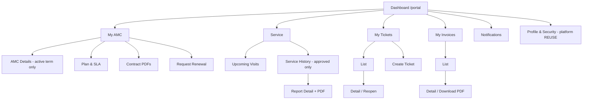

# Customer Portal Navigation

**Project:** Aarvii CCTV AMC Management System · **Phase:** D0-5
**Shell:** platform Theme Engine navigation (REUSE) · **Role:** `Customer` (RoleGuard) · Route prefix: `/portal`

All routes require AuthGuard + RoleGuard(Customer); each item additionally permission-gated as listed. Row scope = own customer data only ([rbac-matrix.md §6](./rbac-matrix.md)).

---

## Navigation tree

| Menu | Submenu | Route | Permission | Class | Mobile (Customer App) |
|------|---------|-------|------------|-------|:---------------------:|
| Dashboard | — | `/portal` | (role) | NEW | ✅ Dashboard tab |
| My AMC | AMC Details (active term) | `/portal/amc` | `amc:read` | NEW | ✅ AMC tab |
| | Plan inclusions & SLA | `/portal/amc/plan` | `amc:read` | NEW | ✅ (within AMC) |
| | Contract documents (PDF) | `/portal/amc/documents` | `amc:read` + `files:read` | NEW (platform Files REUSE) | ✅ |
| | Request Renewal | `/portal/amc/renewal` | `amc:request-renewal` | NEW | ✅ |
| Service | Upcoming Visits | `/portal/visits/upcoming` | `schedules:read` | NEW | ✅ (within AMC/Dashboard) |
| | Service History (approved) | `/portal/visits/history` | `visits:read` | NEW | ✅ |
| | Visit Report detail + PDF | `/portal/visits/:id` | `visits:read` + `files:read` | NEW | ✅ |
| My Tickets | Ticket List | `/portal/tickets` | `tickets:read` | NEW | ✅ Tickets tab |
| | Create Ticket | `/portal/tickets/new` | `tickets:create` | NEW | ✅ |
| | Ticket Detail / Reopen | `/portal/tickets/:id` | `tickets:read`, `tickets:reopen` | NEW | ✅ |
| My Invoices | Invoice List | `/portal/invoices` | `invoices:read` | NEW | ✅ Invoices tab |
| | Invoice Detail / Download PDF | `/portal/invoices/:id` | `invoices:download` + `files:read` | NEW | ✅ |
| Notifications | Notification list | `/portal/notifications` | (role) | EXTEND (platform plumbing) | ✅ Notifications tab |
| Profile | Profile Management | `/portal/profile` | platform | **REUSE** | ✅ Profile tab |
| | Password Reset (OTP) | platform flow | platform | **REUSE** | ✅ |
| | Sessions | platform | platform | **REUSE** | ✅ |
| | Notification Preferences | platform | platform | **REUSE** | ✅ |

## Mermaid view

## Visibility rules (frozen)

- AMC shows the **current active term only** (BR-AMC-03); renewal history is never exposed here.
- Service History lists **approved** visit reports only (BR-VISIT-05).
- Reopen appears only on **Closed** tickets owned by the customer (BR-TKT-06).
- All file downloads resolve FileIds via module APIs → platform Files (no direct file URLs).

Related: [navigation-architecture.md](./navigation-architecture.md) · [screen-inventory.md](./screen-inventory.md) · [mobile-screen-inventory.md](./mobile-screen-inventory.md)
