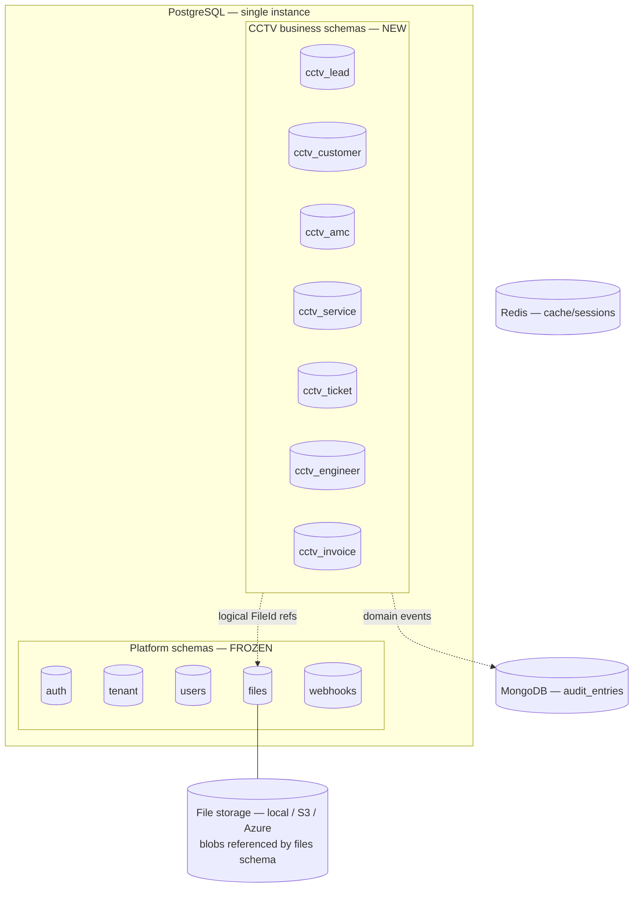

# Database Architecture

**Project:** Aarvii CCTV AMC Management System
**Phase:** D0-4 — Entity Model, ER Diagram & Database Architecture (design only — no code, no migrations)
**Source of truth:** [requirements-freeze-v1.md](../requirements-freeze-v1.md) · Platform baseline: [platform-discovery-report.md](../../project-bootstrap/platform-discovery-report.md)

---

## 1. Database strategy

| Decision | Choice | Rationale |
|----------|--------|-----------|
| Engine | **PostgreSQL** (platform standard, v17) | Platform convention; per-module schemas already established |
| Topology | **Single database, schema-per-module** | Matches the Ashraak modular-monolith convention ([add-backend-module](../../extending/add-backend-module.md)); enables future extraction per module |
| Identifiers | UUID surrogate keys + human-readable business numbers (e.g. `LD-2026-0001`) | Platform convention; offline-friendly (engineer app can pre-generate UUIDs, freeze §18) |
| Binary content | **None in PostgreSQL** — all binaries via platform Files (`FileId` references) | Mandated; no path columns in business tables |
| Audit trail | Platform Audit module (MongoDB observer) | Mandated reuse; no custom audit log tables |
| ORM mapping | EF Core per-module DbContext (design intent only; implementation in D2) | Platform convention |

## 2. Schemas and module ownership

| Schema | Owning module slice | Tables (see domain ERDs) |
|--------|--------------------|---------------------------|
| `cctv_lead` | CctvCrm.Lead | leads, lead_activities, lead_remarks, lead_attachments |
| `cctv_customer` | CctvCrm.Customer | customers, sites, site_contacts, site_documents, site_asset_summaries |
| `cctv_amc` | CctvCrm.Amc | amc_plans, amc_plan_versions, amc_contracts, amc_contract_terms, amc_contract_documents |
| `cctv_service` | CctvCrm.Service | service_schedules, engineer_assignments, service_visits, visit_photos, visit_locations, visit_signatures, visit_approvals, visit_attachments |
| `cctv_ticket` | CctvCrm.Ticket | tickets, ticket_comments, ticket_attachments, ticket_assignments, ticket_status_histories |
| `cctv_engineer` | CctvCrm.Engineer | engineers |
| `cctv_invoice` | CctvCrm.Invoice | invoices, invoice_lines, invoice_attachments, invoice_status_histories |

**Rules:**

1. A schema is owned by exactly one module; **no other module writes to it**.
2. Each module has its own DbContext and EF migrations history table (`__ef_migrations_history` in its schema, platform pattern).
3. Reporting reads via module read-APIs/queries — it owns no schema.
4. Platform schemas (`auth`, `files`, …) are **never modified** (Core freeze).

## 3. Reference integrity policy

| Reference kind | Mechanism |
|----------------|-----------|
| Within one schema (composition, e.g. Ticket → TicketComment) | **Physical FK constraints** + cascade rules per [naming standards](./database-naming-standards.md) |
| Across CCTV schemas (e.g. ServiceSchedule → AMCContractTerm) | **Logical reference** (UUID column, no physical FK) — preserves module decoupling and future extraction; integrity enforced by the owning module's application services + contract lookups |
| To platform schemas (FileId → files.FileRecord; user ids → auth) | **Logical reference only** — never a physical FK into frozen Core schemas |

This mirrors the platform's "no cross-module Infrastructure references" rule at the database level.

## 4. Key integrity constraints (DB-supported business rules)

| Rule | Enforcement |
|------|-------------|
| One active AMC contract per site (BR-AMC-02) | Partial unique index on `amc_contracts(site_id) WHERE status = 'Active'` |
| One active term per contract | Partial unique index on `amc_contract_terms(contract_id) WHERE status = 'Active'` |
| Max 3 contacts per site (BR-STRUCT-03) | Aggregate invariant (application) + `contact_slot smallint CHECK (1..3)` with unique `(site_id, contact_slot)` |
| One asset summary per site | Unique index on `site_asset_summaries(site_id)` |
| One visit per schedule | Unique index on `service_visits(service_schedule_id)` |
| One location/signature per visit | Unique index on `visit_locations(service_visit_id)`, `visit_signatures(service_visit_id)` |
| One active engineer assignment per schedule/ticket | Partial unique index `WHERE is_active = true` |
| Plan version immutability (BR-AMC-07) | Application invariant (no UPDATE after first reference) + append-only versioning |
| Status vocabularies (all lifecycles) | CHECK constraints against the frozen status lists |
| Business number uniqueness | Unique indexes on `lead_number`, `customer_number`, `contract_number`, `ticket_number`, `invoice_number`, … |

## 5. Transaction boundaries

| Boundary | Scope |
|----------|-------|
| **One transaction = one aggregate** | Default: a command mutates a single aggregate (e.g. submit visit report = ServiceVisit aggregate only) |
| **Lead conversion** (BR-LEAD-03) | Multi-module operation (Lead → Customer + Site + AMC Contract). Orchestrated by the Lead module via module contracts; each module commits its own aggregate; the **platform Outbox** carries the events; compensation/retry on partial failure. No distributed transaction across schemas. |
| **Visit auto-generation** (BR-SCHED-02) | Term activation event (outbox) → Service module generates schedules in its own transaction |
| **Cross-module notifications** (freeze §17) | Domain event → outbox → notification dispatch; never inside the business transaction |
| **Approval gate** (BR-VISIT-04) | Approval recorded in the ServiceVisit aggregate; "customer visible" is a query-side filter on approval status — no cross-schema write |
| Concurrency | Optimistic concurrency via `row_version` on all aggregate roots |

## 6. Audit considerations (mandated platform reuse)

**Strategy:** no custom audit tables. Domain events from CCTV aggregates are observed by the platform **Audit module** (MediatR observer → MongoDB `audit_entries` with per-tenant hash chains).

### Auditable entities & events

| Entity | Audited events (domain events) |
|--------|--------------------------------|
| Lead | Created, StatusChanged, Converted |
| Customer / Site | Created, Updated, Deactivated; SiteContact added/removed; AssetSummary updated |
| AMCPlan / Version | PlanCreated, VersionPublished, PlanRetired |
| AMCContract / Term | ContractCreated, TermCreated (new/renewal), TermActivated, TermExpired, ContractCancelled, RenewalRequested |
| ServiceSchedule | Generated, Assigned, Rescheduled, Cancelled, Missed |
| ServiceVisit | Started, EvidenceCaptured (photo/GPS/signature), ReportSubmitted, **ReportApproved/Returned**, Completed |
| Ticket | Created (with source actor), Assigned, StatusChanged, Closed, **Reopened** |
| Engineer | Created, Updated, Deactivated |
| Invoice | Created, Generated, Sent, Paid, Cancelled |

### Audit boundaries

| Concern | Boundary |
|---------|----------|
| Platform audit (who/what/when, API + entity + event capture) | Platform Audit module — automatic via interceptors/observer; **system of record for compliance trail** |
| Business-visible histories (ticket status timeline, invoice status timeline, visit approval rounds, lead activities) | First-class domain tables (`*_status_histories`, `visit_approvals`, `lead_activities`) — these are **business data shown in the UI**, not audit duplication |
| Mandatory row stamps | `created_at/by`, `updated_at/by` on every table ([naming standards](./database-naming-standards.md)) |
| Webhook-eligible events | Registered in the platform webhook event catalog before publishers ship (platform governance) |

## 7. File storage strategy (mandated)

| Aspect | Design |
|--------|--------|
| Mechanism | Platform **Files module** (`IFileStorage`): metadata in `files` schema, blobs in local/S3/Azure provider |
| Business reference | **`file_id UUID` columns referencing platform FileRecord ids** — the *only* file reference pattern allowed |
| Forbidden | Path/URL/blob columns in business tables; direct provider access from CCTV modules |
| File-bearing tables | lead_attachments, site_documents, amc_contract_documents, visit_photos, visit_signatures, visit_attachments, ticket_attachments, invoice_attachments (+ generated PDF references on service_visits/invoices via attachments) |
| Generated PDFs (freeze §19) | AMC Contract PDF → amc_contract_documents; Visit Report PDF → visit_attachments (type=ReportPdf); Invoice PDF → invoice_attachments (type=InvoicePdf) |
| Access control | Tenant/customer scoping enforced by module APIs before issuing file access via platform Files |
| Offline capture (freeze §18) | Engineer app queues media locally; on sync, uploads to Files first, then submits business records carrying the returned FileIds |

## 8. Future scaling considerations

| Concern | Headroom in this design |
|---------|--------------------------|
| Module extraction | Schema-per-module + logical cross-schema references → any module (e.g. Invoicing) can move to its own database without redesign |
| Read/reporting load | Reporting reads can move to a read replica; reporting owns no schema so no write coupling |
| High-volume tables | visit_photos, lead_activities, ticket_status_histories are append-only → time/range partitioning is possible later without model change |
| Media growth | Blobs live in provider storage (S3/Azure capable) — PostgreSQL stores only metadata/references |
| Multi-branch growth | Covered (without current change) in [database-future-considerations.md](./database-future-considerations.md) |
| Archival | Soft-delete + status-terminal rows enable archive jobs later (no schema change required) |

---

## Related documents

- [entity-model.md](./entity-model.md)
- [database-naming-standards.md](./database-naming-standards.md)
- [entity-lifecycle-matrix.md](./entity-lifecycle-matrix.md)
- [erd-overview.md](./erd-overview.md)
- [database-future-considerations.md](./database-future-considerations.md)
