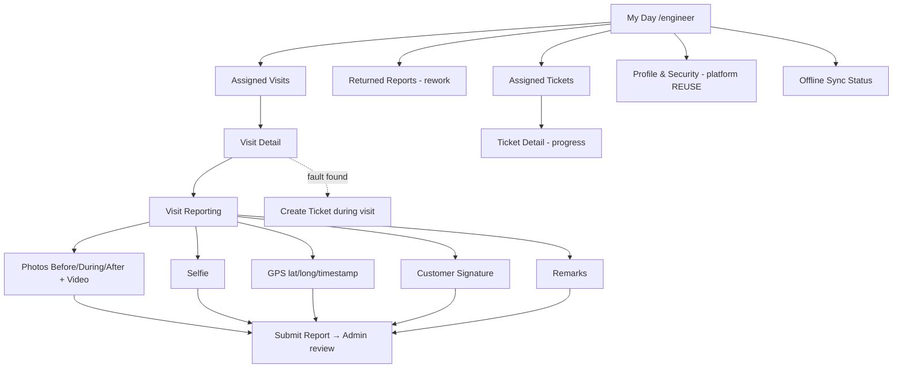

# Engineer Portal Navigation

**Project:** Aarvii CCTV AMC Management System · **Phase:** D0-5
**Shell:** platform Theme Engine navigation (REUSE) · **Role:** `Engineer` (RoleGuard) · Route prefix: `/engineer`

Scope: **assigned work only**; §15 restrictions mean no customer/plan/contract management items exist anywhere in this portal.

---

## Navigation tree

| Menu | Submenu | Route | Permission | Class | Mobile (Engineer App) |
|------|---------|-------|------------|-------|:---------------------:|
| My Day | — | `/engineer` | (role) | NEW | ✅ Home |
| Visits | Assigned Visits | `/engineer/visits` | `schedules:read` | NEW | ✅ Visits tab (offline read) |
| | Visit Detail | `/engineer/visits/:id` | `visits:read` | NEW | ✅ (offline read) |
| | Visit Reporting | `/engineer/visits/:id/report` | `visits:execute` | NEW | ✅ (offline capture) |
| Uploads (within reporting) | Photo Upload (Before/During/After) | `/engineer/visits/:id/report#photos` | `visits:execute` + `files:write` | NEW (platform file-upload REUSE) | ✅ camera/gallery |
| | Video Upload | same | `visits:execute` + `files:write` | NEW | ✅ |
| | Selfie Capture | `/engineer/visits/:id/report#selfie` | `visits:execute` + `files:write` | NEW | ✅ camera |
| | GPS Capture | `/engineer/visits/:id/report#gps` | `visits:execute` | NEW | ✅ device GPS |
| | Customer Signature | `/engineer/visits/:id/report#signature` | `visits:execute` + `files:write` | NEW | ✅ touch capture |
| Reports | Submit Report | reporting flow action | `visits:execute` | NEW | ✅ (sync on reconnect) |
| | Returned Reports (rework) | `/engineer/reports/returned` | `visits:read` (own) | NEW | ✅ |
| | My Completed Visits | `/engineer/reports/history` | `visits:read` (own) | NEW | ✅ |
| Tickets | Assigned Tickets | `/engineer/tickets` | `tickets:read` | NEW | ✅ Tickets tab |
| | Ticket Detail (progress) | `/engineer/tickets/:id` | `tickets:update` | NEW | ✅ |
| | Create Ticket (during visit) | `/engineer/tickets/new?visit=:id` | `tickets:create` | NEW | ✅ |
| Profile | Profile / Sessions / Password | `/engineer/profile` | platform | **REUSE** | ✅ |
| Sync | Offline Sync Status | `/engineer/sync` (app-centric) | (role) | NEW (platform offline/sync core REUSE) | ✅ mobile-primary |

## Mermaid view

## Enforcement notes

- **Completion gate** (BR-VISIT-01): Submit is disabled until selfie + GPS + ≥1 photo + signature + remarks exist — and re-validated server-side.
- Engineer queues are filtered to **active assignments** server-side; the portal never offers other engineers' work.
- Mobile-first: every reporting interaction is offline-capable on the Engineer App (freeze §18); web portal offers the same flow when online.

Related: [navigation-architecture.md](./navigation-architecture.md) · [mobile-screen-inventory.md](./mobile-screen-inventory.md) · [workflow-overview.md §4](../workflow-overview.md)
