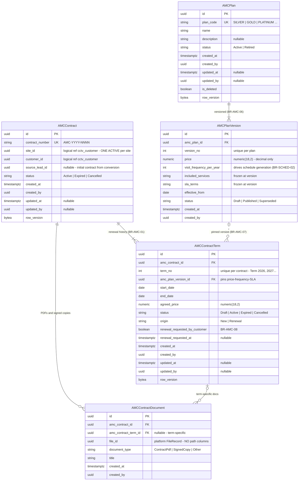

# ERD — AMC Domain

**Schema:** `cctv_amc` · **Modules:** AMC Plans (6), AMC Contracts (7)
**Source of truth:** [requirements-freeze-v1.md §8–§9](../requirements-freeze-v1.md) · Rules: BR-AMC-01..08

---

## ER diagram

## Relationships

| Relationship | Cardinality | Type |
|--------------|-------------|------|
| AMCPlan → AMCPlanVersion | 1:N | Composition; versions append-only, immutable once referenced (BR-AMC-07) |
| AMCContract → AMCContractTerm | 1:N | Composition; **permanent renewal history** — never deleted (BR-AMC-01) |
| AMCPlanVersion → AMCContractTerm | 1:N | Physical FK (same schema); pins commercial terms |
| AMCContract → Site / Customer | N:1 | **Logical** cross-schema references |
| AMCContractDocument → FileRecord | N:1 | **Logical** platform reference (`file_id`) |

## Constraints & indexes

| Object | Definition |
|--------|-----------|
| `ux_amc_contracts_site_id_active` | unique (site_id) **WHERE status = 'Active'** — one active contract per site (BR-AMC-02) |
| `ux_amc_contract_terms_contract_id_active` | unique (amc_contract_id) **WHERE status = 'Active'** — one active term |
| `ux_amc_plan_versions_plan_id_version_no` | unique (amc_plan_id, version_no) |
| `ux_amc_contract_terms_contract_id_term_no` | unique (amc_contract_id, term_no) |
| `ck_amc_contract_terms_dates` | `end_date > start_date` |
| `ix_amc_contract_terms_end_date` | AMC Expiry Reminder scans (freeze §17) |
| Visibility rule | Customer queries filter to the **active term** only (BR-AMC-03/04) — query-side, not schema-side |

## Domain events

| Event | Notes |
|-------|-------|
| PlanCreated / PlanVersionPublished / PlanRetired | audit |
| ContractCreated (incl. from lead conversion) | audit |
| TermCreated (origin New/Renewal) / TermActivated / TermExpired | audit; TermActivated triggers schedule auto-generation (BR-SCHED-02) |
| RenewalRequested (by customer) | audit; admin work queue |
| AmcExpiryReminderDue | Notification "AMC Expiry Reminder" (freeze §17) |
| ContractPdfGenerated | document row + platform Files (freeze §19) |

Related: [entity-model.md §2.3](./entity-model.md) · [entity-lifecycle-matrix.md §3](./entity-lifecycle-matrix.md) · [workflow-overview.md §2](../workflow-overview.md)
