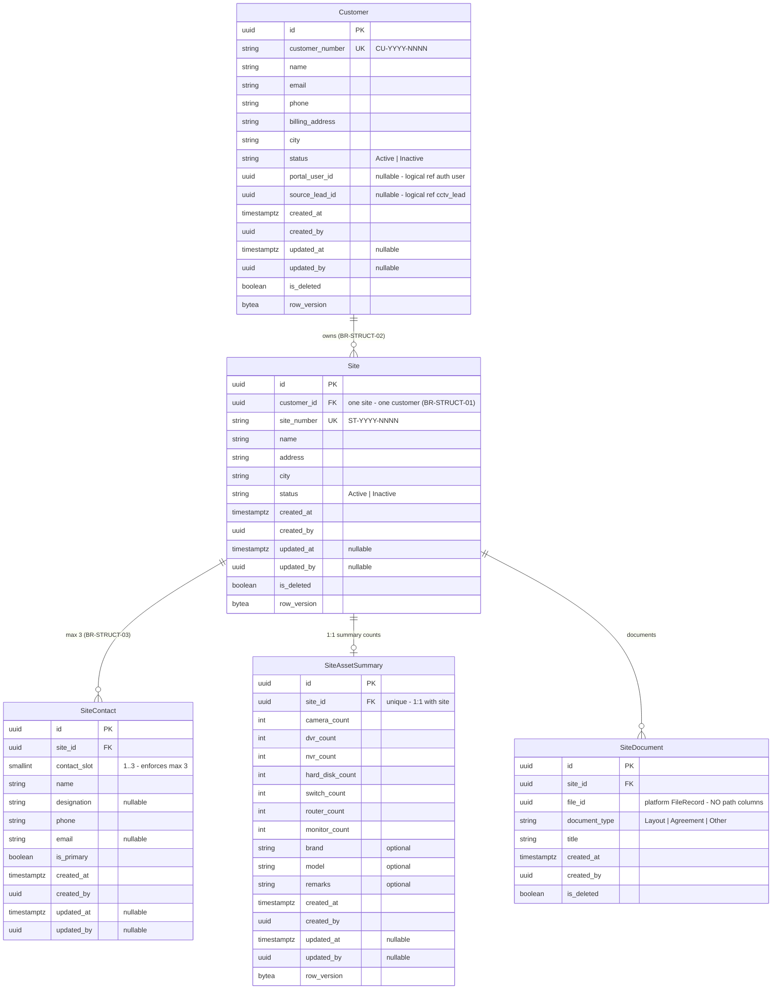

# ERD — Customer Domain

**Schema:** `cctv_customer` · **Modules:** Customer (3), Site (4), Asset (5) Management
**Source of truth:** [requirements-freeze-v1.md §5–§7](../requirements-freeze-v1.md) · Rules: BR-STRUCT-01..05

---

## ER diagram

> **Mandated:** assets are **summary counts only** — there is deliberately **no Camera/Device entity** (freeze §7). Individual cameras are NOT tracked.

## Relationships

| Relationship | Cardinality | Type |
|--------------|-------------|------|
| Customer → Site | 1:N | Physical FK (same schema); site never moves between customers |
| Site → SiteContact | 1:0..3 | Composition; slot-constrained |
| Site → SiteAssetSummary | 1:1 | Composition; unique site_id |
| Site → SiteDocument | 1:N | Composition |
| Customer → platform user (portal login) | 0..1 | Logical reference |
| Site → AMCContract / Ticket / Invoice / ServiceSchedule | 1:N | **Logical** — owned by other schemas; site is the aggregation point (freeze §5) |

## Constraints & indexes

| Object | Definition |
|--------|-----------|
| `ux_customers_customer_number`, `ux_sites_site_number` | business numbers |
| `ck_site_contacts_contact_slot` | `contact_slot BETWEEN 1 AND 3` |
| `ux_site_contacts_site_id_contact_slot` | unique (site_id, contact_slot) — **DB-guaranteed max 3** |
| `ux_site_asset_summaries_site_id` | unique (site_id) — one summary per site |
| `ck_site_asset_summaries_counts_non_negative` | all `*_count >= 0` |
| `ix_sites_customer_id`, `ix_site_contacts_site_id`, `ix_site_documents_site_id` | child lookups |

## Domain events

| Event | Notes |
|-------|-------|
| CustomerCreated / Updated / Deactivated | audit |
| SiteCreated / Updated / Deactivated | audit |
| SiteContactAdded / Removed | audit |
| SiteAssetSummaryUpdated | audit |

Related: [entity-model.md §2.2](./entity-model.md) · [entity-lifecycle-matrix.md §2](./entity-lifecycle-matrix.md)
