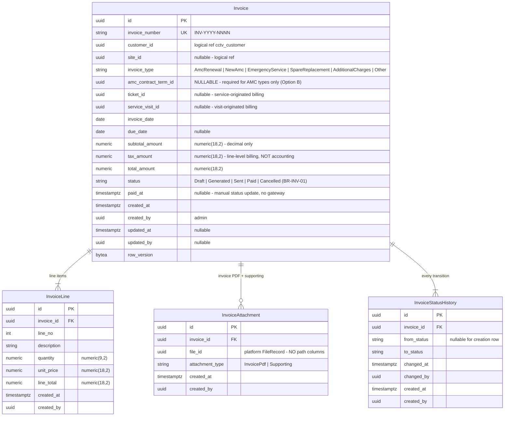

# ERD — Invoice Domain

**Schema:** `cctv_invoice` · **Module:** Invoice Management (12)
**Source of truth:** [requirements-freeze-v1.md §16, §19](../requirements-freeze-v1.md) · Rules: BR-INV-01..05
**Mandated design decision:** **OPTION B APPROVED** — invoices may be generated for AMC Renewal, New AMC, Emergency Service, Spare Replacement, Additional Charges, and Other Billable Activities. The invoice is **not tightly coupled only to AMC terms**: the contract-term link is **optional** and required only for AMC-type invoices.

---

## ER diagram

## Option B reference model

| invoice_type | amc_contract_term_id | ticket_id / service_visit_id | Example |
|--------------|----------------------|------------------------------|---------|
| AmcRenewal | **Required** (BR-INV-02 preserved) | — | Renewal term billing |
| NewAmc | **Required** | — | Initial contract billing (lead conversion) |
| EmergencyService | optional | optional | Out-of-contract emergency callout |
| SpareReplacement | optional | optional | Replaced hard disk / camera part |
| AdditionalCharges | optional | optional | Extra work beyond included services |
| Other | optional | optional | Any other billable activity |

Consistency is enforced at the aggregate boundary (and `ck_invoices_amc_term_required` CHECK for AMC types). The schema requires **no change** to support non-AMC billing — this is the point of Option B.

## Relationships

| Relationship | Cardinality | Type |
|--------------|-------------|------|
| Invoice → InvoiceLine | 1:N | Composition; editable in Draft only |
| Invoice → InvoiceAttachment | 1:N | Composition; PDF immutable once Generated |
| Invoice → InvoiceStatusHistory | 1:N | Composition; append-only |
| Invoice → Customer / Site | N:1 / N:0..1 | **Logical** cross-schema |
| Invoice → AMCContractTerm | N:0..1 | **Logical**, optional (Option B) |
| Invoice → Ticket / ServiceVisit | N:0..1 | **Logical**, optional |
| InvoiceAttachment → FileRecord | N:1 | **Logical** platform reference |

## Constraints & indexes

| Object | Definition |
|--------|-----------|
| `ux_invoices_invoice_number` | business number |
| `ck_invoices_status`, `ck_invoices_invoice_type` | frozen vocabularies + Option B types |
| `ck_invoices_amc_term_required` | `invoice_type IN ('AmcRenewal','NewAmc') ⇒ amc_contract_term_id IS NOT NULL` |
| `ck_invoices_amounts` | amounts ≥ 0; `total_amount = subtotal_amount + tax_amount` |
| `ux_invoice_lines_invoice_id_line_no` | unique (invoice_id, line_no) |
| `ix_invoices_customer_id_status` | customer portal "my invoices" |
| `ix_invoices_amc_contract_term_id` | term billing lookups |

## Domain events

| Event | Notes |
|-------|-------|
| InvoiceCreated (Draft) | audit |
| InvoiceGenerated | **Notification "Invoice Generated"** (freeze §17); Invoice PDF generated → attachment (freeze §19, BR-INV-04); audit |
| InvoiceSent / InvoicePaid / InvoiceCancelled | history rows; audit |

**Out of scope reminders:** no accounting features (BR-INV-05), no payment gateway (freeze §21) — `Paid` is a manual admin status update. Customer download (BR-INV-03) is served via the platform Files module from `InvoiceAttachment.file_id`.

Related: [entity-model.md §2.7](./entity-model.md) · [entity-lifecycle-matrix.md §7](./entity-lifecycle-matrix.md) · [workflow-overview.md §5](../workflow-overview.md) · [database-future-considerations.md](./database-future-considerations.md)
