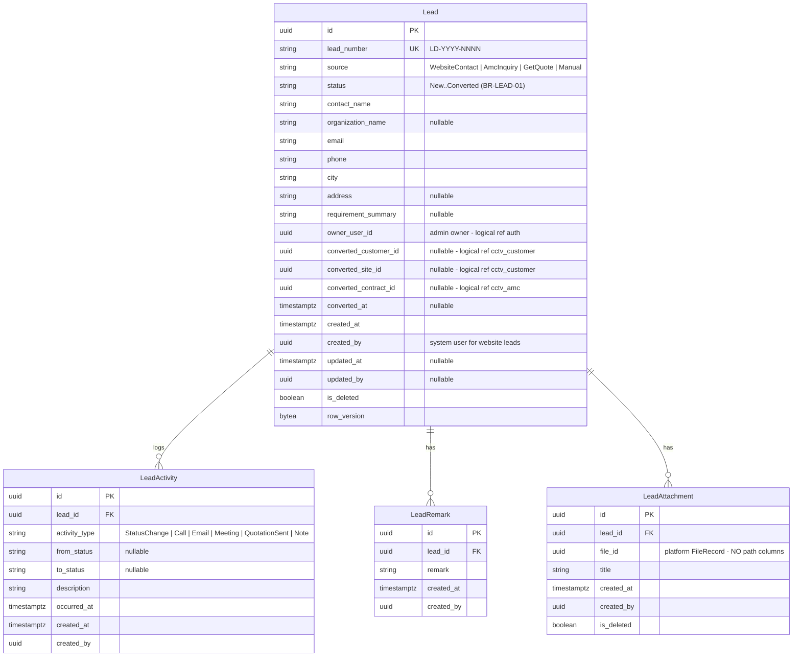

# ERD — Lead Domain

**Schema:** `cctv_lead` · **Module:** Lead Management (2)
**Source of truth:** [requirements-freeze-v1.md §10](../requirements-freeze-v1.md) · Rules: BR-LEAD-01..03

---

## ER diagram

## Relationships

| Relationship | Cardinality | Type |
|--------------|-------------|------|
| Lead → LeadActivity | 1:N | Composition (physical FK, append-only) |
| Lead → LeadRemark | 1:N | Composition (physical FK, append-only) |
| Lead → LeadAttachment | 1:N | Composition (physical FK) |
| Lead → Customer / Site / AMCContract (conversion) | 0..1 each | **Logical** cross-schema references set atomically at conversion (BR-LEAD-03) |
| LeadAttachment → FileRecord | N:1 | **Logical** platform reference (`file_id`) |

## Constraints & indexes

| Object | Definition |
|--------|-----------|
| `ux_leads_lead_number` | unique (lead_number) |
| `ck_leads_status` | status ∈ frozen list (BR-LEAD-01) |
| `ck_leads_source` | source ∈ {WebsiteContact, AmcInquiry, GetQuote, Manual} |
| `ix_leads_status`, `ix_leads_created_at` | pipeline queries |
| `ix_lead_activities_lead_id`, `ix_lead_remarks_lead_id`, `ix_lead_attachments_lead_id` | child lookups |
| Conversion consistency | `converted_*` columns all set together with status=Converted (application invariant) |

## Domain events (→ platform Audit / Notifications / Webhooks)

| Event | Triggers |
|-------|----------|
| LeadCreated | Notification "Lead Created" (freeze §17); audit |
| LeadStatusChanged | Activity row; audit |
| LeadConverted | Creates Customer + Site + Initial Contract via module contracts (outbox); Notification "Lead Converted"; audit |

Related: [entity-model.md §2.1](./entity-model.md) · [entity-lifecycle-matrix.md §1](./entity-lifecycle-matrix.md) · [workflow-overview.md §1](../workflow-overview.md)
