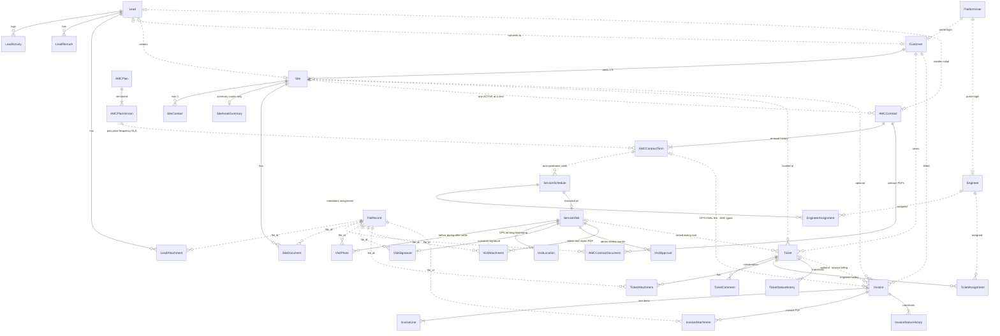
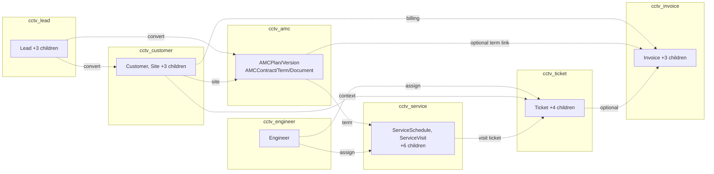

# ERD Overview — Complete System

**Project:** Aarvii CCTV AMC Management System
**Phase:** D0-4 — Entity Model, ER Diagram & Database Architecture (design only)
**Source of truth:** [requirements-freeze-v1.md](../requirements-freeze-v1.md) · [entity-model.md](./entity-model.md)

Complete system ERD across all CCTV domains. Attribute-level detail lives in the per-domain ERDs (linked below). Dashed/cross-schema references are **logical** (no physical FK — see [database-architecture.md §3](./database-architecture.md)).

---

## 1. Full system ERD (relationships)

> `FileRecord` and `PlatformUser` are **frozen platform entities** (Files / Auth modules) shown for reference only — they are reused, never redesigned (freeze §20).

## 2. Domain-to-schema map

## 3. Mandated design decisions reflected in this ERD

| Decision | Where visible |
|----------|---------------|
| Customer 1:N Site | `Customer ||--o{ Site` |
| Max 3 site contacts | `Site ||--o{ SiteContact` + slot constraint ([naming standards §5](./database-naming-standards.md)) |
| One site = one **active** AMC contract | `Site ||..o{ AMCContract` + partial unique index |
| AMC Contract = master record | `AMCContract` permanent root |
| AMC Contract Term = renewal history | `AMCContract ||--|{ AMCContractTerm` |
| Asset tracking = summary counts only (no individual cameras) | Single `SiteAssetSummary` 1:1 with Site — **no device/camera entity exists** |
| **Invoices — Option B approved** | `AMCContractTerm |o..o{ Invoice` is **optional**; `invoice_type` covers AMC Renewal, New AMC, Emergency Service, Spare Replacement, Additional Charges, Other |
| Files via platform FileRecord (no path columns) | All `file_id` references to `FileRecord` |
| Audit via platform module | No custom audit entities; histories shown are business data |

## 4. Entity count summary

| Domain | Entities | Detail ERD |
|--------|----------|-----------|
| Lead | 4 | [erd-lead-domain.md](./erd-lead-domain.md) |
| Customer | 5 | [erd-customer-domain.md](./erd-customer-domain.md) |
| AMC | 5 | [erd-amc-domain.md](./erd-amc-domain.md) |
| Service | 8 | [erd-service-domain.md](./erd-service-domain.md) |
| Ticket | 5 | [erd-ticket-domain.md](./erd-ticket-domain.md) |
| Invoice | 4 | [erd-invoice-domain.md](./erd-invoice-domain.md) |
| Engineer | 1 | (in [entity-model.md §2.6](./entity-model.md)) |
| **Total CCTV entities** | **32** | + reused platform entities |
