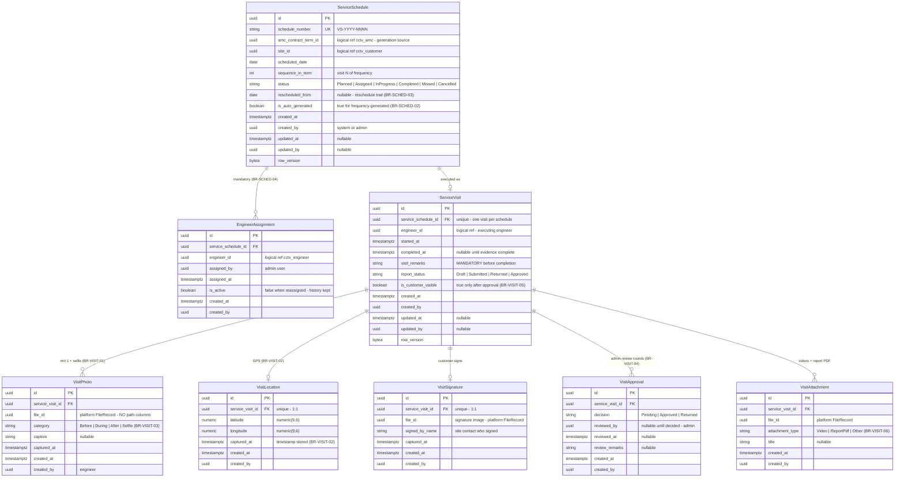

# ERD — Service Domain

**Schema:** `cctv_service` · **Modules:** Service Scheduling (8), Visit Management (9)
**Source of truth:** [requirements-freeze-v1.md §11–§13](../requirements-freeze-v1.md) · Rules: BR-SCHED-01..04, BR-VISIT-01..07

---

## ER diagram

## Relationships

| Relationship | Cardinality | Type |
|--------------|-------------|------|
| ServiceSchedule → EngineerAssignment | 1:N (one active) | Composition; reassignment keeps history |
| ServiceSchedule → ServiceVisit | 1:0..1 | Composition; unique schedule_id |
| ServiceVisit → VisitPhoto / VisitAttachment / VisitApproval | 1:N | Composition |
| ServiceVisit → VisitLocation / VisitSignature | 1:1 | Composition; unique visit_id |
| ServiceSchedule → AMCContractTerm / Site | N:1 | **Logical** cross-schema |
| EngineerAssignment / ServiceVisit → Engineer | N:1 | **Logical** cross-schema |
| Media → FileRecord | N:1 | **Logical** platform reference (`file_id`) — no path columns |

## Constraints & indexes

| Object | Definition |
|--------|-----------|
| `ux_service_visits_service_schedule_id` | one visit per schedule |
| `ux_visit_locations_service_visit_id`, `ux_visit_signatures_service_visit_id` | 1:1 evidence |
| `ux_engineer_assignments_schedule_active` | unique (service_schedule_id) WHERE is_active — one active engineer |
| `ck_service_schedules_status` | frozen status list (BR-SCHED-01) |
| `ck_visit_photos_category` | Before/During/After/Selfie |
| `ck_visit_locations_range` | lat ∈ [-90,90], lng ∈ [-180,180] |
| `ix_service_schedules_scheduled_date`, `ix_service_schedules_status` | calendar/queue queries |
| `ix_engineer_assignments_engineer_id` | engineer work queue (freeze §2) |

### Completion invariant (BR-VISIT-01) — application-enforced at the aggregate boundary

A `ServiceVisit` may transition to completed/Submitted **only when all hold**:
`∃ VisitPhoto(category=Selfie)` · `∃ VisitPhoto(category∈Before/During/After)` · `∃ VisitLocation` · `∃ VisitSignature` · `visit_remarks` non-empty.

### Offline capture (freeze §18)

Engineer app captures evidence offline; on sync it uploads files (→ FileIds) then submits the visit aggregate. `captured_at` reflects capture time, not sync time.

## Domain events

| Event | Notes |
|-------|-------|
| SchedulesGenerated (per term) | from TermActivated (BR-SCHED-02); audit |
| VisitScheduled / Rescheduled / Cancelled / Missed | Notification "Visit Scheduled" (freeze §17); audit |
| EngineerAssigned / Reassigned | audit |
| VisitStarted / ReportSubmitted | audit |
| VisitReportApproved / Returned | approval gate (BR-VISIT-04); customer visibility flips on approval; audit |
| VisitCompleted | Notification "Visit Completed" (freeze §17); audit |
| VisitReportPdfGenerated | attachment row (freeze §19) |

Related: [entity-model.md §2.4](./entity-model.md) · [entity-lifecycle-matrix.md §4](./entity-lifecycle-matrix.md) · [workflow-overview.md §4](../workflow-overview.md)
