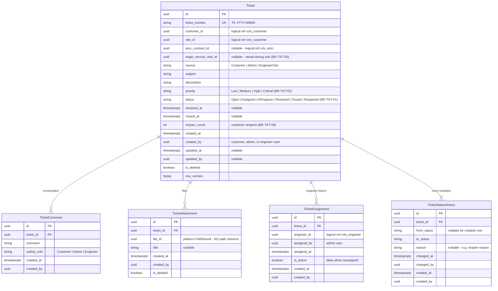

# ERD — Ticket Domain

**Schema:** `cctv_ticket` · **Module:** Ticket Management (10)
**Source of truth:** [requirements-freeze-v1.md §14](../requirements-freeze-v1.md) · Rules: BR-TKT-01..06

---

## ER diagram

## Relationships

| Relationship | Cardinality | Type |
|--------------|-------------|------|
| Ticket → TicketComment / TicketAttachment | 1:N | Composition |
| Ticket → TicketAssignment | 1:N (one active) | Composition; reassignment history |
| Ticket → TicketStatusHistory | 1:N | Composition; append-only, one row per transition |
| Ticket → Customer / Site / AMCContract | N:1 | **Logical** cross-schema |
| Ticket → ServiceVisit (origin) | N:0..1 | **Logical** — tickets raised during visits (BR-TKT-05) |
| TicketAssignment → Engineer | N:1 | **Logical** cross-schema |
| TicketAttachment → FileRecord | N:1 | **Logical** platform reference |

## Constraints & indexes

| Object | Definition |
|--------|-----------|
| `ux_tickets_ticket_number` | business number |
| `ck_tickets_status`, `ck_tickets_priority`, `ck_tickets_source` | frozen vocabularies (BR-TKT-01/02) |
| `ux_ticket_assignments_ticket_active` | unique (ticket_id) WHERE is_active |
| `ix_tickets_customer_id_status`, `ix_tickets_site_id` | customer portal "my tickets" |
| `ix_ticket_assignments_engineer_id` | engineer queue |
| `ix_ticket_status_histories_ticket_id` | timeline rendering |

### Transition rules (application-enforced)

| Transition | Allowed actor |
|------------|---------------|
| `Open → Assigned` | Admin (assignment) |
| `Assigned → InProgress` | Engineer / Admin |
| `InProgress → Resolved` | Engineer / Admin |
| `Resolved → Closed` | Admin |
| `Closed → Reopened` | **Customer** (BR-TKT-06) — increments `reopen_count`, requires reason |
| `Reopened → Assigned` | Admin |

## Domain events

| Event | Notes |
|-------|-------|
| TicketCreated (source actor recorded) | Notification "Ticket Created" (freeze §17); audit |
| TicketAssigned / Reassigned | Notification "Ticket Assigned"; audit |
| TicketStatusChanged | history row; audit |
| TicketClosed | Notification "Ticket Closed"; audit |
| TicketReopened | audit; back into admin queue |

Related: [entity-model.md §2.5](./entity-model.md) · [entity-lifecycle-matrix.md §5](./entity-lifecycle-matrix.md) · [workflow-overview.md §3](../workflow-overview.md)
