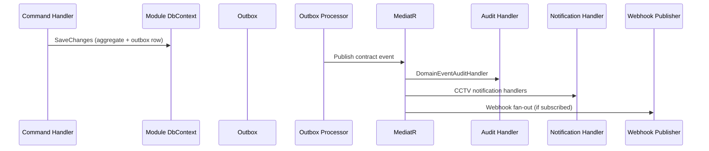

# Event Catalog

**Project:** Aarvii CCTV AMC Management System
**Phase:** D0-6 — domain and contract events
**Naming:** Internal C# events use `{Entity}{Action}Event`. Webhook wire names follow platform catalog: `domain.entity.action` ([webhook event catalog](../../modules/webhooks/event-catalog.md)).

> All events implement `IDomainEvent` → MediatR → Audit capture. Contract events live in `SharedKernel.Contracts/CctvCrm/Events/`.

---

## 1. Event taxonomy

| Layer | Type | Transport | Consumers |
|-------|------|-----------|-----------|
| Domain event | Aggregate-internal | Outbox → MediatR | Same module handlers |
| Contract event | Cross-module public | Outbox → MediatR | Other modules, Notifications, Webhooks, Audit |
| Integration event | External broker | **Not used in V1** | Future |

---

## 2. Lead domain events

| Contract event | Webhook name | Trigger | Key payload |
|----------------|--------------|---------|-------------|
| `LeadCreatedEvent` | `lead.created` | Website inquiry or admin create | `leadId`, `leadNumber`, `source`, `inquiryType` |
| `LeadStatusChangedEvent` | `lead.status_changed` | Pipeline transition | `leadId`, `fromStatus`, `toStatus` |
| `LeadConvertedEvent` | `lead.converted` | Successful conversion | `leadId`, `customerId`, `siteId`, `contractId`, `termId` |
| `LeadLostEvent` | `lead.lost` | Marked Lost | `leadId`, `reason` |

---

## 3. Customer / Site / Asset events

| Contract event | Webhook name | Trigger | Key payload |
|----------------|--------------|---------|-------------|
| `CustomerCreatedEvent` | `customer.created` | Admin or conversion | `customerId`, `customerNumber` |
| `CustomerDeactivatedEvent` | `customer.deactivated` | Admin deactivate | `customerId` |
| `CustomerProfileUpdatedEvent` | `customer.profile_updated` | Self or admin update | `customerId`, `changedFields[]` |
| `SiteCreatedEvent` | `site.created` | Admin or conversion | `siteId`, `customerId`, `siteNumber` |
| `SiteUpdatedEvent` | `site.updated` | Admin update | `siteId`, `changedFields[]` |
| `SiteContactChangedEvent` | `site.contacts_changed` | Contact CRUD | `siteId`, `contactCount` |
| `SiteAssetSummaryUpdatedEvent` | `site.asset_summary_updated` | Asset counts update | `siteId` |

---

## 4. AMC events

| Contract event | Webhook name | Trigger | Key payload |
|----------------|--------------|---------|-------------|
| `AmcPlanVersionPublishedEvent` | `amc.plan_version.published` | Admin publishes version | `planId`, `versionId`, `price` |
| `AmcContractCreatedEvent` | `amc.contract.created` | New master contract | `contractId`, `siteId`, `customerId` |
| `AmcContractTermActivatedEvent` | `amc.contract_term.activated` | Term activated | `contractId`, `termId`, `planVersionId`, `startDate`, `endDate` |
| `AmcContractTermExpiredEvent` | `amc.contract_term.expired` | Term end date passed | `contractId`, `termId` |
| `AmcRenewalRequestedEvent` | `amc.renewal_requested` | Customer renewal request | `contractId`, `customerId`, `requestedAt` |
| `AmcExpiryReminderDueEvent` | `amc.expiry_reminder_due` | Scheduled job (30/60/90 days) | `contractId`, `termId`, `daysRemaining` |
| `AmcContractCancelledEvent` | `amc.contract.cancelled` | Admin cancel | `contractId`, `reason` |

**Downstream:** `AmcContractTermActivatedEvent` → Service module generates schedules.

---

## 5. Scheduling events

| Contract event | Webhook name | Trigger | Key payload |
|----------------|--------------|---------|-------------|
| `VisitScheduleCreatedEvent` | `service.schedule.created` | Auto or ad-hoc | `scheduleId`, `siteId`, `termId`, `scheduledDate` |
| `VisitScheduleAssignedEvent` | `service.schedule.assigned` | Engineer assigned | `scheduleId`, `engineerId`, `assignedAt` |
| `VisitScheduleRescheduledEvent` | `service.schedule.rescheduled` | Admin reschedule | `scheduleId`, `oldDate`, `newDate`, `reason` |
| `VisitScheduleCancelledEvent` | `service.schedule.cancelled` | Admin cancel | `scheduleId`, `reason` |
| `VisitScheduleMissedEvent` | `service.schedule.missed` | Overdue job | `scheduleId`, `scheduledDate` |

---

## 6. Visit events

| Contract event | Webhook name | Trigger | Key payload |
|----------------|--------------|---------|-------------|
| `VisitStartedEvent` | `service.visit.started` | Engineer starts | `visitId`, `scheduleId`, `engineerId` |
| `VisitReportSubmittedEvent` | `service.visit.report_submitted` | Engineer submits | `visitId`, `scheduleId` |
| `VisitReportApprovedEvent` | `service.visit.report_approved` | Admin approves | `visitId`, `approvedBy`, `approvedAt` |
| `VisitReportReturnedEvent` | `service.visit.report_returned` | Admin returns | `visitId`, `returnReason` |
| `VisitCompletedEvent` | `service.visit.completed` | Schedule completed | `visitId`, `scheduleId`, `siteId`, `customerId` |

Granular evidence events (`VisitPhotoAddedEvent`, etc.) are **optional V1** — audit EF interceptor captures entity changes; primary contract events above drive notifications.

---

## 7. Ticket events

| Contract event | Webhook name | Trigger | Key payload |
|----------------|--------------|---------|-------------|
| `TicketCreatedEvent` | `ticket.created` | Any actor creates | `ticketId`, `ticketNumber`, `siteId`, `customerId`, `priority`, `createdByRole` |
| `TicketAssignedEvent` | `ticket.assigned` | Admin assigns | `ticketId`, `engineerId` |
| `TicketStatusChangedEvent` | `ticket.status_changed` | Status transition | `ticketId`, `fromStatus`, `toStatus` |
| `TicketClosedEvent` | `ticket.closed` | Admin closes | `ticketId`, `closedAt` |
| `TicketReopenedEvent` | `ticket.reopened` | Customer reopens | `ticketId`, `reason`, `reopenCount` |

---

## 8. Engineer events

| Contract event | Webhook name | Trigger | Key payload |
|----------------|--------------|---------|-------------|
| `EngineerCreatedEvent` | `engineer.created` | Admin create | `engineerId`, `userId?` |
| `EngineerDeactivatedEvent` | `engineer.deactivated` | Admin deactivate | `engineerId` |

---

## 9. Invoice events

| Contract event | Webhook name | Trigger | Key payload |
|----------------|--------------|---------|-------------|
| `InvoiceCreatedEvent` | `invoice.created` | Draft created | `invoiceId`, `invoiceType`, `customerId` |
| `InvoiceGeneratedEvent` | `invoice.generated` | PDF generated | `invoiceId`, `invoiceNumber`, `totalAmount`, `pdfFileId` |
| `InvoiceSentEvent` | `invoice.sent` | Marked sent | `invoiceId`, `sentAt` |
| `InvoicePaidEvent` | `invoice.paid` | Manual paid | `invoiceId`, `paidAt` |
| `InvoiceCancelledEvent` | `invoice.cancelled` | Cancelled | `invoiceId`, `reason` |

---

## 10. Event publication flow

---

## 11. Events with notification obligations (freeze §17)

| Event | Notification required |
|-------|----------------------|
| `LeadCreatedEvent` | ✅ Admin |
| `LeadConvertedEvent` | ✅ Admin, Customer welcome |
| `TicketCreatedEvent` | ✅ Admin, Customer |
| `TicketAssignedEvent` | ✅ Admin, Engineer, Customer |
| `TicketClosedEvent` | ✅ Admin, Customer |
| `VisitScheduleAssignedEvent` | ✅ Admin, Engineer, Customer (Visit Scheduled) |
| `VisitCompletedEvent` | ✅ Admin, Customer |
| `AmcExpiryReminderDueEvent` | ✅ Admin, Customer |
| `InvoiceGeneratedEvent` | ✅ Admin, Customer |

Auth OTP events remain platform-owned.

---

## 12. Adding new events (governance)

1. Add to this catalog + [module-contracts.md](./module-contracts.md)
2. Register webhook name in platform [event-catalog.md](../../modules/webhooks/event-catalog.md)
3. Add notification mapping in [notification-mapping.md](./notification-mapping.md)
4. Add audit notes in [audit-mapping.md](./audit-mapping.md)
5. Update OpenAPI only if HTTP-triggered — events are internal

---

Related: [notification-mapping.md](./notification-mapping.md) · [audit-mapping.md](./audit-mapping.md) · [module-contracts.md](./module-contracts.md)
