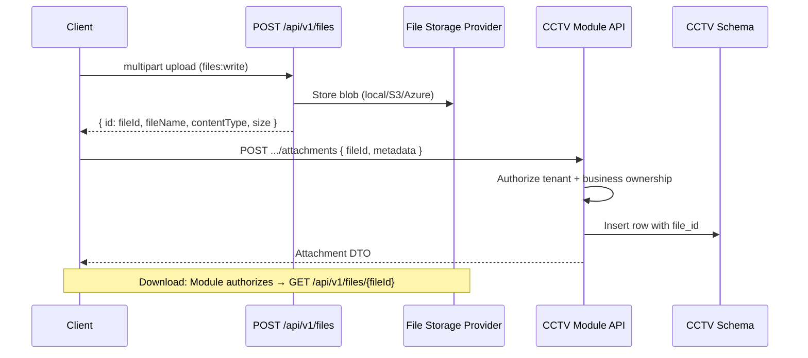

# File Management Design

**Project:** Aarvii CCTV AMC Management System
**Phase:** D0-6 — Files module reuse for all binary content
**Mandate:** All binaries via platform `FileRecord` — business tables store `file_id` UUID only ([database-architecture.md §7](./database-architecture.md))

> **Do not create duplicate file storage.** CCTV modules never store paths, URLs, or blob bytes in PostgreSQL.

---

## 1. Architecture (REUSE)



Platform guarantees reused: tenant scoping, auth-only download, upload validation, virus-scan hook (`IFileScanService`), audit on upload/download/delete.

---

## 2. Upload categories

| Category | Owner module | Business table | Upload permission | Typical content types |
|----------|--------------|----------------|-------------------|----------------------|
| Lead attachments | Lead | `lead_attachments` | Admin `leads:manage` + `files:write` | PDF, DOCX, images |
| Site documents | Customer/Site | `site_documents` | Admin `sites:manage` | PDF, images |
| Contract PDFs | AMC | `amc_contract_documents` | System/Admin `amc:manage` | `application/pdf` |
| Visit photos | Service/Visit | `visit_photos` | Engineer `visits:execute` | JPEG, PNG, WEBP |
| Visit selfie | Service/Visit | `visit_photos` (category Selfie) | Engineer | JPEG, PNG |
| Visit videos | Service/Visit | `visit_attachments` | Engineer | MP4, MOV |
| Visit signature | Service/Visit | `visit_signatures` | Engineer | PNG (canvas export) |
| Visit report PDF | Service/Visit | `visit_attachments` | System on approval/generate | PDF |
| Ticket attachments | Ticket | `ticket_attachments` | Creator role + `files:write` | images, PDF |
| Invoice PDF | Invoice | `invoice_attachments` | System on generate | PDF |

---

## 3. Authorization before FileId disclosure

Module APIs must verify access **before** returning a `fileId` to a client or redirecting to Files download:

| Check | Rule |
|-------|------|
| Tenant | JWT `tenant_id` matches file tenant |
| Role scope | Customer: own entities only; Engineer: assigned visits/tickets |
| Business state | Customer visit media: only after `VisitReportApprovedEvent` |
| Invoice PDF | Customer: own invoice only |

Failed authorization → `404` (no leak whether file exists).

---

## 4. Server-generated PDFs (NEW service, REUSE storage)

| Document | Generator | Stored as |
|----------|-----------|-----------|
| AMC Contract PDF | AMC module PDF renderer | `amc_contract_documents.file_id` |
| Visit Report PDF | Visit module PDF renderer (on approve or submit) | `visit_attachments.file_id` |
| Invoice PDF | Invoice module PDF renderer (on generate) | `invoice_attachments.file_id` |

Flow: render bytes in memory → call platform `IFileService.StoreAsync` → receive `fileId` → link in business table → raise domain event.

---

## 5. Mobile / offline file handling

| Step | Engineer app behavior |
|------|----------------------|
| Capture | Store bytes locally with temp id |
| Online upload | `POST /api/v1/files` via platform Files feature (REUSE) |
| Link | Include `fileId` in visit sync batch |
| Offline queue | Upload files first in sync pipeline, then submit visit aggregate |
| Failure | Retry with exponential backoff (platform sync core REUSE) |

Customer app: online-first upload for ticket attachments.

---

## 6. Storage ownership

| Layer | Owner |
|-------|-------|
| Blob bytes | Platform Files module → configured provider (local/S3/Azure) |
| File metadata | Platform `files` schema (`FileRecord`) |
| Business attachment row | Owning CCTV module schema |
| Retention policy | Business rules below; physical delete via platform soft-delete |

---

## 7. File retention

| File class | Retention | Delete policy |
|------------|-----------|---------------|
| Lead attachments | Life of lead + 7 years (compliance default) | Soft-delete link; platform file retained until admin purge job |
| Contract / Invoice PDFs | Permanent (legal/financial) | Never delete in V1 |
| Visit evidence | Permanent service record | Never delete in V1 |
| Ticket attachments | Life of ticket + 7 years | Soft-delete on erroneous upload (admin) |
| Orphan uploads | Files uploaded but never linked | Platform cleanup job (future) — client should link promptly |

V1 implements soft-delete on business attachment rows; platform file soft-delete only when business row deleted and no other references.

---

## 8. Content validation

| Rule | Source |
|------|--------|
| Max size | Platform `MaxUploadBytes` config |
| Allowed types | Platform `AllowedContentTypes`; CCTV docs recommend per-category lists in module config |
| Virus scan | Platform `IFileScanService` stub → replace in production |
| Image dimensions | Optional client-side; server validates file signature only in V1 |

Recommended CCTV config extensions (module `appsettings` section):

```json
"CctvFiles": {
  "VisitPhotoMaxBytes": 10485760,
  "VisitVideoMaxBytes": 104857600,
  "AllowedPhotoContentTypes": ["image/jpeg", "image/png", "image/webp"],
  "AllowedVideoContentTypes": ["video/mp4", "video/quicktime"]
}
```

Validation runs in CCTV link endpoints **after** platform upload (reject link if type mismatch).

---

## 9. Classification summary

| Capability | Class |
|------------|-------|
| Upload / download / delete HTTP | **REUSE** platform Files API |
| FileId in business tables | **NEW** (design rule) |
| Attachment link endpoints | **NEW** per module |
| PDF generation | **NEW** service; storage **REUSE** Files |
| Authorization gate | **NEW** business logic in modules |
| Mobile camera/gallery upload UI | **REUSE** platform Files feature |

---

Related: [api-architecture.md §10](./api-architecture.md) · [endpoint-catalog.md](./endpoint-catalog.md) · [mobile-api-consumption.md](./mobile-api-consumption.md)
