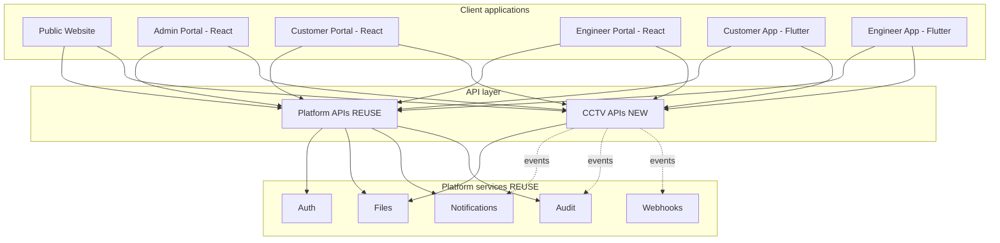
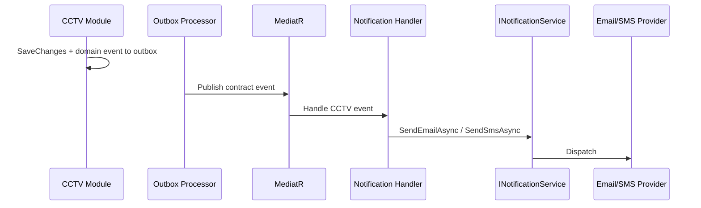

# Integration Design

**Project:** Aarvii CCTV AMC Management System
**Phase:** D0-6 — cross-application and cross-module integration map
**Principle:** Clients call **platform APIs + CCTV APIs** only. No direct database access. No duplicate platform services.

---

## 1. Integration overview

---

## 2. Public Website ↔ Backend

| Integration | Direction | API / mechanism | Class |
|-------------|-----------|-----------------|-------|
| Login redirect | Website → Auth | `POST /connect/token` via login page | REUSE |
| Contact / Quote / AMC Inquiry | Website → Lead | `POST /api/v1/cctv/inquiries` | NEW |
| Rate limiting | Website → Host | Platform rate-limit middleware on inquiries | REUSE |
| AMC marketing content | Website → AMC (read-only) | Optional `GET /api/v1/cctv/amc-plans/public` or static content — **V1: static/marketing copy** | NEW (optional) |
| Content pages | Static / CMS | Reuse www.aarvii.in content — no API | — |

**Flow:** Form submit → inquiry API → Lead created → `LeadCreatedEvent` → notification + audit.

---

## 3. Admin Portal ↔ Backend

| Feature area | Platform APIs | CCTV APIs |
|--------------|---------------|-----------|
| Authentication | `/connect/token`, sessions | — |
| Administration group | Users, Tenant, Audit, Webhooks, ApiKeys | — |
| Lead pipeline | — | `/api/v1/cctv/leads/*` |
| Customers / Sites / Assets | — | `/customers`, `/sites`, asset-summary |
| AMC | — | `/amc-plans`, `/contracts` |
| Scheduling / Visits | — | `/schedules`, `/visits`, approvals |
| Tickets / Engineers | — | `/tickets`, `/engineers` |
| Invoices / Reports | — | `/invoices`, `/reports`, `/admin/dashboard` |
| File uploads | `POST /api/v1/files` then link | Attachment endpoints |

**Web client pattern:** `endpoints.ts` extends with `/api/v1/cctv/*` paths ([add-frontend-route.md](../../extending/add-frontend-route.md)). Generated TypeScript SDK (OpenAPI) preferred for type safety.

---

## 4. Customer Portal ↔ Backend

| Feature | APIs | Scoping |
|---------|------|---------|
| Dashboard | `GET /portal/dashboard` | Customer role + own `customerId` |
| AMC (active term) | `GET /portal/amc`, `/portal/amc/documents` | Active term only (BR-AMC-03) |
| Renewal request | `POST /contracts/{id}/renewal-request` | Own contract |
| Upcoming visits | `GET /portal/visits/upcoming` | Own sites |
| Service history | `GET /portal/visits/history`, `/{id}` | Approved only (BR-VISIT-05) |
| Tickets | `/portal/tickets`, `/tickets` (scoped) | Own |
| Invoices | `/portal/invoices`, PDF via Files | Own |
| Profile | `GET/PATCH /portal/profile` + platform Users | BR-AUTH-05 |
| Password reset | Platform Auth flows | REUSE |

---

## 5. Engineer Portal ↔ Backend

| Feature | APIs | Scoping |
|---------|------|---------|
| My Day | `GET /engineer/dashboard`, `/engineer/schedules/today` | Assigned only |
| Visit execution | `/engineer/visits/{id}`, evidence POSTs, `/submit` | Assigned + `visits:execute` |
| Offline sync (mobile) | `POST /engineer/visits/sync` | Idempotent batch |
| Tickets | `/engineer/tickets`, `/tickets` (scoped) | Assigned |
| File capture | Platform Files upload → link endpoints | REUSE + NEW |
| Profile | Platform Users/Auth | REUSE |

---

## 6. Backend module ↔ module integration

| From | To | Mechanism | Example |
|------|-----|-----------|---------|
| Lead | Customer, Site, AMC | SharedKernel contracts + Outbox | Lead conversion |
| AMC | Service | Event `AmcContractTermActivatedEvent` | Schedule generation |
| Service | Visit | Same module / shared DbContext | Schedule → Visit execution |
| Visit | Ticket | Command via `ITicketLifecycleService` | Fault found on site |
| AMC / Ticket / Visit | Invoice | Logical refs in Invoice aggregate | Option B billing |
| All modules | Reporting | Lookup contracts | Read models |
| All modules | Files | `IFileService` platform contract | Store binaries |
| All modules | Notifications | Contract events → handlers | §17 events |
| All modules | Audit | Domain events + EF interceptor | Compliance |
| All modules | Webhooks | Outbox → `IWebhookPublisher` | External integrations |

**Forbidden:** Lead.Infrastructure → Customer.Infrastructure direct reference.

---

## 7. Notifications integration

Details: [notification-mapping.md](./notification-mapping.md). User opt-out: REUSE `emailNotificationsEnabled` preference.

---

## 8. Files integration

Universal two-step pattern — see [file-management-design.md](./file-management-design.md).

| Client action | Step 1 (platform) | Step 2 (CCTV) |
|---------------|-------------------|---------------|
| Attach to ticket | Upload file | `POST /tickets/{id}/attachments` |
| Visit photo | Upload file | `POST /visits/{id}/photos` |
| Download invoice PDF | Module authorizes | `GET /files/{fileId}` |

---

## 9. Audit integration

Automatic + event-driven — see [audit-mapping.md](./audit-mapping.md).

| Visibility | Consumer |
|------------|----------|
| Platform audit viewer | Admin (`audit:read`) |
| Business timelines | Ticket status history, invoice status history, visit approval rounds — **CCTV entities**, not audit log |

---

## 10. Mobile apps integration

Both apps use:

1. Platform auth + secure storage (REUSE)
2. OpenAPI-generated `api_client` (REUSE pipeline)
3. Platform Files feature for upload/download (REUSE)
4. CCTV endpoints per role (NEW)

Engineer app additionally: offline queue → `POST /engineer/visits/sync` + background file uploads.

Details: [mobile-api-consumption.md](./mobile-api-consumption.md).

---

## 11. External M2M integration (optional)

| Integration | Mechanism |
|-------------|-----------|
| ERP / accounting export | API Key with scoped permissions + Webhook subscriptions on `invoice.generated` |
| Partner lead feed | API Key + `POST /leads` or custom adapter (future) |
| SMS gateway | Backend provider adapter (EXTEND) — not client-facing |

Webhook subscription management: REUSE `/api/v1/webhooks/subscriptions`.

---

## 12. Correlation & observability

| Concern | Integration |
|---------|-------------|
| Request tracing | `X-Correlation-Id` propagated web → API → audit |
| Structured logging | Platform Serilog + module name from event namespace |
| Health | `/health` + optional `/api/v1/cctv/health` |
| Errors | ProblemDetails with `traceId` |

---

Related: [api-architecture.md](./api-architecture.md) · [module-contracts.md](./module-contracts.md) · [event-catalog.md](./event-catalog.md)
