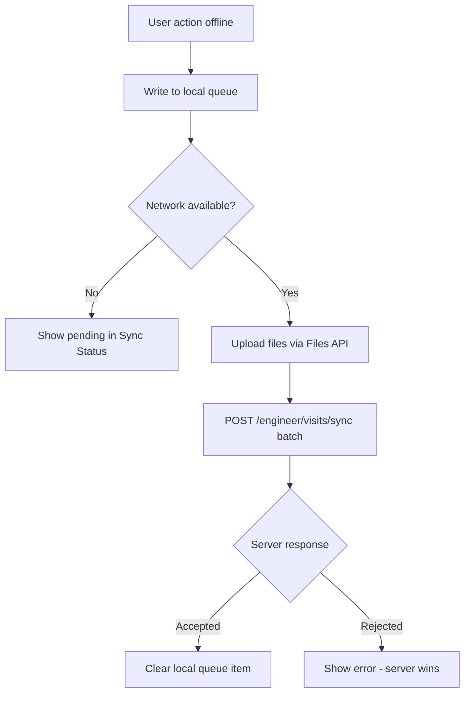

# Mobile API Consumption

**Project:** Aarvii CCTV AMC Management System
**Phase:** D0-6 — Flutter apps API usage and offline boundaries
**Foundation (REUSE):** OpenAPI SDK, auth, Files, offline/sync, push ([mobile module map](../../mobile/module-map.md), [mobile-architecture.md](../mobile-architecture.md))

---

## 1. Shared mobile stack (REUSE)

| Concern | Implementation | APIs |
|---------|----------------|------|
| Authentication | `features/auth` + secure storage | `POST /connect/token` |
| Token refresh | Platform auth client | `/connect/token` (refresh grant if enabled) |
| HTTP client | Generated `api_client` (Dart Dio) | All `/api/v1/*` |
| File upload | `features/files` | `POST /api/v1/files` |
| File download/preview | `features/files` | `GET /api/v1/files/{fileId}` |
| Profile | `features/profile` | `GET /api/v1/users/{userId}` |
| Sessions | `features/sessions` | `/api/v1/auth/sessions/*` |
| Notification prefs | `features/notifications` | `PATCH /api/v1/users/{id}/preferences` |
| Push | `core/notifications` | Event-driven (no direct API) |
| Offline cache | `core/offline` | Local SQLite/Hive |
| Background sync | `core/sync` | Retry queue |
| Correlation | `X-Correlation-Id` on all requests | Platform standard |

**Rule:** No hand-written DTOs in Flutter — regenerate SDK from OpenAPI after API changes.

---

## 2. Customer Mobile App — API map

| Screen | Primary endpoints | Platform vs CCTV |
|--------|-------------------|------------------|
| Login / OTP | `/connect/token`, Auth OTP endpoints | REUSE |
| Dashboard | `GET /api/v1/cctv/portal/dashboard` | NEW |
| AMC details | `GET /api/v1/cctv/portal/amc` | NEW |
| Contract PDFs | `GET /portal/amc/documents` → Files download | NEW + REUSE |
| Request renewal | `POST /contracts/{id}/renewal-request` | NEW |
| Upcoming visits | `GET /portal/visits/upcoming` | NEW |
| Service history | `GET /portal/visits/history`, `GET /portal/visits/{id}` | NEW |
| Report PDF | Authorized FileId → Files GET | REUSE |
| Tickets list/detail | `GET /portal/tickets`, `GET /tickets/{id}` | NEW |
| Create ticket | `POST /tickets` + Files upload for attachments | NEW + REUSE |
| Reopen ticket | `POST /tickets/{id}/reopen` | NEW |
| Invoices | `GET /portal/invoices`, `GET /invoices/{id}/pdf` | NEW |
| Notifications | Push + in-app list (EXTEND) | EXTEND |
| Profile | Platform Users + `PATCH /portal/profile` | REUSE + NEW |

**Connectivity:** Online-first — no offline write queue required (freeze §18).

---

## 3. Engineer Mobile App — API map

| Screen | Primary endpoints | Platform vs CCTV |
|--------|-------------------|------------------|
| Login / biometrics | `/connect/token` | REUSE |
| My Day | `GET /engineer/dashboard`, `GET /engineer/schedules/today` | NEW |
| Assigned visits | `GET /engineer/schedules`, `GET /engineer/visits/{id}` | NEW |
| Start visit | `POST /visits/{id}/start` | NEW |
| Capture evidence | Files upload + link endpoints (`/photos`, `/selfie`, `/location`, `/signature`, `/attachments`) | REUSE + NEW |
| Submit report | `POST /visits/{id}/submit` | NEW |
| Offline sync | `POST /engineer/visits/sync` | NEW |
| Returned reports | `GET /visits?status=Returned` (scoped) | NEW |
| Tickets | `GET /engineer/tickets`, ticket mutations | NEW |
| Create ticket (visit) | `POST /tickets?serviceVisitId=` | NEW |
| Sync status | Local queue state + sync API response | NEW UI on REUSE sync |
| Profile | Platform Users/Sessions | REUSE |

**Connectivity:** Offline-capable for visit execution (freeze §18).

---

## 4. Offline considerations (Engineer App)

| Data | Offline read | Offline write |
|------|:------------:|:-------------:|
| Assigned schedules | ✅ cached | ❌ |
| Visit detail | ✅ cached | ❌ |
| Evidence capture | ✅ local bytes | ✅ queued |
| GPS / signature / remarks | ✅ local | ✅ queued |
| Ticket list (assigned) | ✅ cached | ❌ |
| Ticket status update | ❌ V1 online only | ❌ |
| Submit visit report | ✅ queued | ✅ |

---

## 5. Synchronization boundaries

| Boundary | Rule |
|----------|------|
| **File upload before visit submit** | Sync pipeline uploads all pending files first; submit batch references `fileId`s only |
| **Idempotency** | Every offline mutation carries `clientCorrelationId` (UUID generated on device at capture time) |
| **Server validation** | Server re-validates BR-VISIT-01 checklist on submit — client checklist is UX only |
| **Conflict resolution** | **Server wins** ([mobile offline strategy](../../mobile/offline-strategy.md)); rejected items surface in Sync Status with ProblemDetails `detail` |
| **Clock skew** | `capturedAt` from device stored as-is; server may record `receivedAt` separately |
| **Cancelled visit while offline** | Submit rejected with `422`; engineer must acknowledge and discard local queue |
| **Partial batch** | `OfflineSyncResultDto` returns per-item `accepted[]` / `rejected[]` — client retries only failed items |
| **Token expiry during sync** | Refresh token flow (REUSE auth) before retry |

---

## 6. API call patterns

### List screens

- Use summary DTOs with `pageSize=20` default
- Pull-to-refresh triggers network fetch; cache previous page for offline (Engineer reads)

### Detail screens

- Fetch detail on navigation; cache for Engineer offline read

### Mutations

- Always send `rowVersion` from last successful fetch
- On `409 Conflict`, refetch detail and prompt user

### Files

1. `POST /api/v1/files` (multipart)
2. Store returned `fileId` locally
3. Include in link or sync batch

---

## 7. Permissions (JWT)

Mobile apps receive same JWT claims as web:

| App | Role | Key permissions |
|-----|------|-----------------|
| Customer | `Customer` | `amc:read`, `schedules:read`, `visits:read`, `tickets:*`, `invoices:*`, `files:read/write` |
| Engineer | `Engineer` | `schedules:read`, `visits:execute/read`, `tickets:create/read/update`, `files:read/write` |

SDK calls include Bearer token via auth interceptor (REUSE platform mobile auth layer).

---

## 8. Deep links (REUSE + EXTEND)

Push notifications route via platform deep link handler:

| Notification | Route |
|--------------|-------|
| Ticket assigned | `/tickets/{ticketId}` |
| Visit scheduled | `/visits/{visitId}` |
| Invoice generated | `/invoices/{invoiceId}` |

CCTV feature routes registered in app router (NEW); deep link infrastructure REUSE.

---

## 9. Classification summary

| Area | REUSE | EXTEND | NEW |
|------|:-----:|:------:|:---:|
| Auth, Files, Profile, Sessions | ✅ | — | — |
| HTTP client / SDK pipeline | ✅ | regenerate with CCTV paths | — |
| Offline/sync infrastructure | ✅ | CCTV sync payload shapes | sync endpoint |
| Push delivery | ✅ | CCTV event wiring | — |
| CCTV business endpoints | — | — | ✅ all `/api/v1/cctv/*` consumed |

---

Related: [endpoint-catalog.md](./endpoint-catalog.md) · [openapi-roadmap.md](./openapi-roadmap.md) · [mobile-screen-inventory.md](./mobile-screen-inventory.md) · [file-management-design.md](./file-management-design.md)
