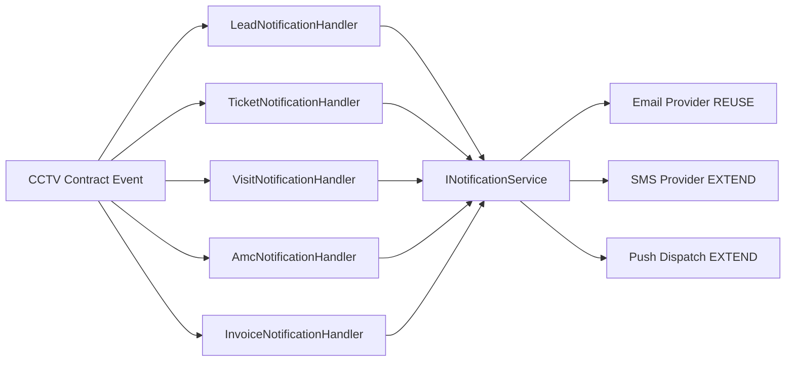

# Notification Mapping

**Project:** Aarvii CCTV AMC Management System
**Phase:** D0-6 — event → notification channel mapping
**Platform:** REUSE `INotificationService`, email templates, user preferences; EXTEND SMS provider ([notifications architecture](../../modules/notifications/architecture.md))

> CCTV does not expose notification APIs. All sends are triggered by domain events via `INotificationHandler<TEvent>`.

---

## 1. Channel matrix

| Channel | V1 status | Platform mechanism |
|---------|-----------|-------------------|
| **Email** | ✅ Required | `IEmailProvider` (console/SMTP) + `Templates/cctv/*.txt` |
| **SMS** | ✅ Required (OTP + alerts) | **EXTEND** — `ISmsProvider` adapter (provider TBD, BRD DEP-02) |
| **Push (mobile)** | ✅ Required | REUSE mobile `core/notifications` — triggered by same events via push dispatch service (EXTEND wiring) |
| **In-app** | ✅ Customer/Admin | EXTEND notification feed API or client-side event polling (LLD) |

User email opt-out: REUSE `PATCH /api/v1/users/{userId}/preferences` (`emailNotificationsEnabled`). SMS for OTP/security is **not** opt-out in V1.

---

## 2. Freeze §17 — full mapping

| # | Business event | Template key | Email | SMS | Push | Recipients |
|---|----------------|--------------|:-----:|:---:|:----:|------------|
| 1 | `LeadCreatedEvent` | `cctv-lead-created` | ✅ | ❌ | ❌ | Admin distribution list |
| 2 | `LeadConvertedEvent` | `cctv-lead-converted` | ✅ | ❌ | ❌ | Admin |
| 2b | *(same event)* | `cctv-customer-welcome` | ✅ | ❌ | ✅ | New Customer |
| 3 | `TicketCreatedEvent` | `cctv-ticket-created` | ✅ | ❌ | ✅ | Admin; Customer (confirmation) |
| 4 | `TicketAssignedEvent` | `cctv-ticket-assigned` | ✅ | ✅ | ✅ | Admin; assignee Engineer; Customer |
| 5 | `TicketClosedEvent` | `cctv-ticket-closed` | ✅ | ❌ | ✅ | Admin; Customer |
| 6 | `VisitScheduleAssignedEvent` | `cctv-visit-scheduled` | ✅ | ✅ | ✅ | Admin; Engineer; Customer |
| 7 | `VisitCompletedEvent` | `cctv-visit-completed` | ✅ | ❌ | ✅ | Admin; Customer |
| 8 | `AmcExpiryReminderDueEvent` | `cctv-amc-expiry-reminder` | ✅ | ✅ | ✅ | Admin; Customer |
| 9 | `InvoiceGeneratedEvent` | `cctv-invoice-generated` | ✅ | ❌ | ✅ | Admin; Customer |
| 10 | Password Reset OTP | `password-reset-otp` | ✅ | ✅ | ❌ | Requesting user (platform Auth) |
| 11 | Login OTP | `login-otp` | ✅ | ✅ | ❌ | Requesting user (platform Auth) |

---

## 3. Template placeholders (CCTV templates)

Standard placeholders across templates:

| Placeholder | Source |
|-------------|--------|
| `{{TenantName}}` | `ITenantContext` |
| `{{RecipientName}}` | User/Customer profile |
| `{{CustomerName}}` | Customer aggregate |
| `{{SiteName}}` | Site aggregate |
| `{{LeadNumber}}` | Lead |
| `{{TicketNumber}}` | Ticket |
| `{{TicketSubject}}` | Ticket |
| `{{VisitDate}}` | Schedule |
| `{{EngineerName}}` | Engineer |
| `{{ContractExpiryDate}}` | Active term |
| `{{InvoiceNumber}}` | Invoice |
| `{{InvoiceAmount}}` | Invoice total |
| `{{PortalUrl}}` | Configured base URL |
| `{{OtpCode}}` | Auth (platform) |

Template file format (platform standard):

```
Subject: First line
Body line 2...
{{Placeholder}}
```

Path: `Ashraak.Api/Templates/cctv/{template-key}.txt`

---

## 4. Handler architecture



**Placement options (LLD decision):**
- **Preferred:** Handlers in each CCTV module's `Application/EventHandlers/` calling shared `ICctvNotificationDispatcher`
- **Alternative:** Centralized handlers in extended Notifications module subscribing to CCTV contract events

Both reuse platform `INotificationService` — no duplicate send infrastructure.

---

## 5. Recipient resolution

| Recipient | Resolution |
|-----------|------------|
| Admin | Tenant admin role users with `emailNotificationsEnabled`; configurable admin distribution in tenant settings (future) — V1: all Admin role users |
| Customer | `Customer.portalUserId` → platform User email/phone |
| Engineer | `Engineer.portalUserId` → platform User email/phone |

Missing contact info: log warning, skip channel, do not fail transaction.

---

## 6. Push notification mapping (mobile — future-ready, V1 wiring)

| Event | Push title (example) | Deep link |
|-------|---------------------|-----------|
| `TicketAssignedEvent` | Ticket assigned: {{TicketNumber}} | `/tickets/{id}` |
| `VisitScheduleAssignedEvent` | Visit scheduled {{VisitDate}} | `/visits/{id}` |
| `VisitCompletedEvent` | Service visit completed | `/visits/history/{id}` |
| `InvoiceGeneratedEvent` | New invoice {{InvoiceNumber}} | `/invoices/{id}` |
| `AmcExpiryReminderDueEvent` | AMC expiring in {{Days}} days | `/amc` |
| `LeadConvertedEvent` (welcome) | Welcome to Aarvii AMC | `/portal` |

Push uses platform mobile foundation — payload schema aligns with existing push service contract.

---

## 7. SMS usage rules

| Use case | SMS | Notes |
|----------|:---:|-------|
| Login OTP | ✅ | Platform Auth flow |
| Password reset OTP | ✅ | Platform Auth flow |
| Ticket assigned (urgent) | ✅ | High/Critical priority only (optional V1 filter) |
| Visit scheduled reminder | ✅ | Day-before optional (LLD) |
| AMC expiry reminder | ✅ | 30-day reminder |
| Marketing / leads | ❌ | Email only |

---

## 8. Classification summary

| Component | Class |
|-----------|-------|
| Email dispatch + template engine | **REUSE** |
| User notification preferences | **REUSE** |
| CCTV email templates (11) | **EXTEND** |
| SMS provider | **EXTEND** |
| Push deep-link wiring | **EXTEND** |
| Notification send HTTP API | **Not created** (by design) |

---

Related: [event-catalog.md](./event-catalog.md) · [integration-design.md](./integration-design.md) · [audit-mapping.md](./audit-mapping.md)
