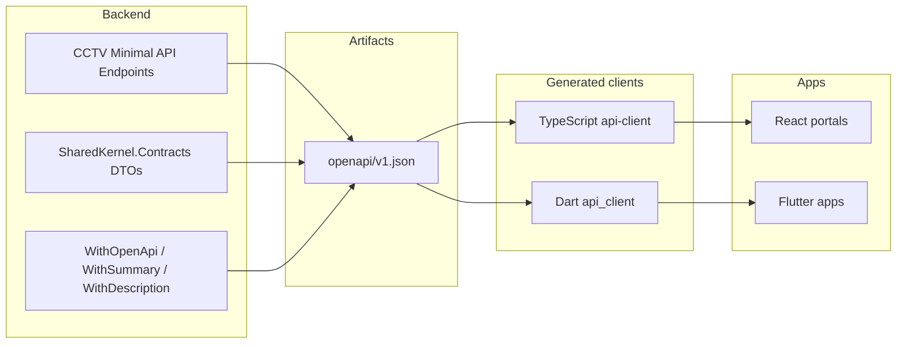

# OpenAPI Roadmap

**Project:** Aarvii CCTV AMC Management System
**Phase:** D0-6 — OpenAPI generation strategy for web and mobile clients
**Platform baseline:** Host OpenAPI + Scalar (dev), ADR-Mobile-0005 SDK generation ([sdk-generation.md](../../mobile/sdk-generation.md))

> **Single source of truth:** .NET Minimal API metadata + SharedKernel.Contracts → OpenAPI document → generated TypeScript and Dart clients. No duplicated DTOs.

---

## 1. Current platform state (REUSE)

| Item | Status |
|------|--------|
| OpenAPI export | Host exposes `/openapi/v1.json` in Development (Scalar UI `/scalar/v1`) |
| JWT auth in OpenAPI | Deferred — manual auth in Scalar ([API composition docs](../../documentation-audit/outdated-docs-report.md)) |
| Dart SDK | `FrontEnd.Mobile/packages/api_client/` via `generate-mobile-sdk.ps1` / `.sh` |
| TypeScript SDK | Optional — `openapi-typescript` or `@hey-api/openapi-ts` → `FrontEnd/packages/api-client/` |
| Contract authority | `Ashraak.SharedKernel.Contracts` (backend) |
| HTTP projection | OpenAPI schema from endpoint metadata |

CCTV adds endpoints to the **same** OpenAPI document — not a separate spec.

---

## 2. Target pipeline (V1 implementation)



---

## 3. Implementation phases

| Phase | Deliverable | Owner |
|-------|-------------|-------|
| **D2-API** | CCTV module endpoints with OpenAPI metadata on every route | Backend |
| **D2-SDK** | Regenerate Dart + TypeScript clients; fix compile breaks | Mobile + Web |
| **D2-CI** | CI drift check — OpenAPI hash or generated file diff fails build | DevOps |
| **D3+** | JWT Bearer security scheme in OpenAPI (platform fix + CCTV inherits) | Platform + CCTV |
| **D3+** | Webhook payload schemas in OpenAPI components (optional) | Platform |

---

## 4. Endpoint documentation standards

Every CCTV endpoint must include:

```csharp
.MapGet("/api/v1/cctv/leads", ...)
.WithName("GetLeads")
.WithTags("CctvCrm.Lead")
.WithSummary("List leads")
.WithDescription("Paginated lead pipeline. Requires leads:read.")
.Produces<PagedResponse<LeadSummaryDto>>(StatusCodes.Status200OK)
.ProducesProblem(StatusCodes.Status401Unauthorized)
.ProducesProblem(StatusCodes.Status403Forbidden);
```

| Requirement | Detail |
|-------------|--------|
| Tags | One tag per module slice (`CctvCrm.Lead`, `CctvCrm.Ticket`, …) |
| OperationId | Stable `GetLeads`, `ConvertLead`, … for client method names |
| DTO references | Use contract types — no anonymous objects |
| Enums | Document allowed values matching CHECK constraints |
| Problem responses | Document 400/403/404/409/422 |

---

## 5. OpenAPI document organization

| Tag group | Endpoints |
|-----------|-----------|
| `Platform.Auth` | Existing — unchanged |
| `Platform.Files` | Existing — unchanged |
| `CctvCrm.Inquiries` | Public inquiries |
| `CctvCrm.Lead` | Lead management |
| `CctvCrm.Customer` | Customers + portal profile |
| `CctvCrm.Site` | Sites + assets |
| `CctvCrm.Amc` | Plans + contracts |
| `CctvCrm.Service` | Schedules + visits |
| `CctvCrm.Ticket` | Tickets |
| `CctvCrm.Engineer` | Engineers |
| `CctvCrm.Invoice` | Invoices |
| `CctvCrm.Reporting` | Reports + dashboards |

Platform and CCTV tags coexist in one `v1` document.

---

## 6. SDK generation commands (REUSE scripts — extend paths)

**Dart (mobile):**

```powershell
# Existing script — regenerates after openapi/v1.json includes CCTV paths
./FrontEnd.Mobile/scripts/generate-mobile-sdk.ps1
```

**TypeScript (web — target):**

```bash
npx openapi-typescript https://localhost:5001/openapi/v1.json -o FrontEnd/packages/api-client/schema.d.ts
```

Or build-time export:

```bash
dotnet run --project BackEnd/src/Host/Ashraak.Api -- export-openapi > openapi/v1.json
```

Exact export command to be finalized in D2 (host may add CLI verb).

---

## 7. Governance rules (from platform SDK policy)

| Rule | Enforcement |
|------|-------------|
| Generated code committed or CI-generated | Team policy in D2 |
| No manual edits in `generated/` | PR review |
| API change = SDK regen in same PR | CI check |
| Contract-first for cross-module | SharedKernel.Contracts before HTTP |
| OpenAPI drift fails CI | Hash compare on `openapi/v1.json` |

---

## 8. Versioning in OpenAPI

| Aspect | Approach |
|--------|----------|
| Document version | `info.version` tracks API release (e.g. `1.0.0`) |
| URL version | `/api/v1/` prefix — breaking changes → new document `v2` |
| Deprecation | `deprecated: true` on operation + sunset header (future) |
| Webhook schemas | `v1.lead.created` component schemas under `webhooks` section (extend platform catalog) |

---

## 9. Testing strategy

| Test type | Approach |
|-----------|----------|
| Contract tests | Snapshot OpenAPI JSON in CI |
| Mobile SDK smoke | Generated client compiles against fixture responses |
| Web typecheck | TypeScript strict against generated schema |
| Breaking change detection | `openapi-diff` in CI on PRs touching `*.Api` |

---

## 10. Classification summary

| Item | Class |
|------|-------|
| OpenAPI host infrastructure | **REUSE** |
| Scalar dev UI | **REUSE** |
| Dart generation scripts | **REUSE** |
| TypeScript generation | **EXTEND** (wire into web CI) |
| CCTV endpoint metadata | **NEW** |
| CCTV DTO schema components | **NEW** (from contracts) |
| JWT security scheme in spec | **EXTEND** (platform debt) |

---

## 11. D0-6 → D0-7 handoff

D0-7 (LLD) will detail per-screen API calls referencing:

- [endpoint-catalog.md](./endpoint-catalog.md) — routes
- [dto-catalog.md](./dto-catalog.md) — shapes
- This document — client generation workflow

No OpenAPI file is generated in D0-6 (design only). Implementation begins D2.

---

Related: [api-architecture.md](./api-architecture.md) · [dto-catalog.md](./dto-catalog.md) · [mobile-api-consumption.md](./mobile-api-consumption.md) · [ADR-Mobile-0005](../../adr/ADR-Mobile-0005-openapi-sdk-generation.md)
