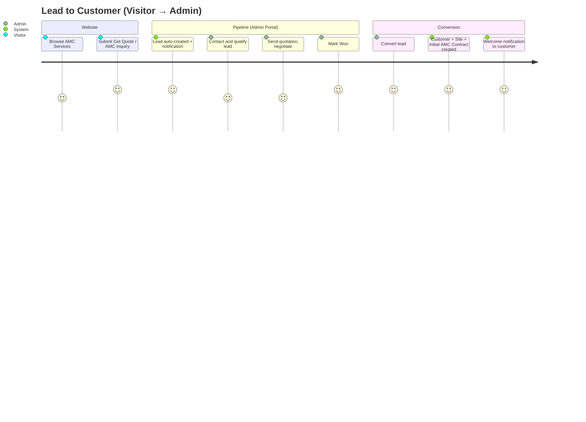
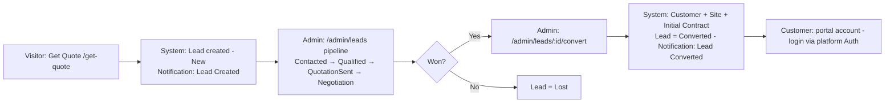
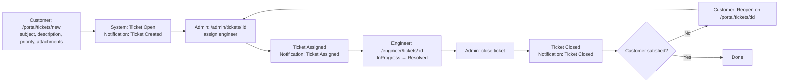
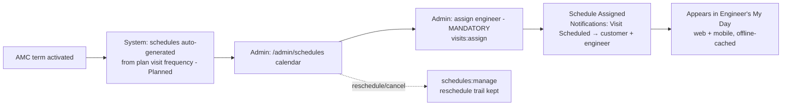
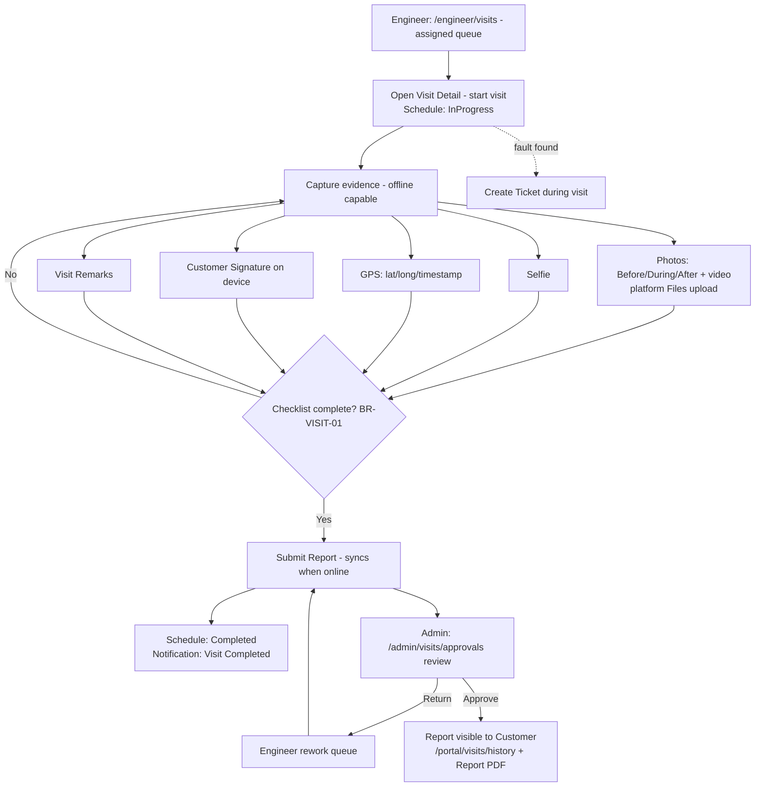
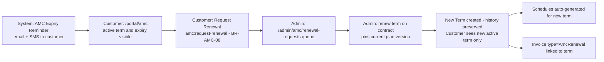
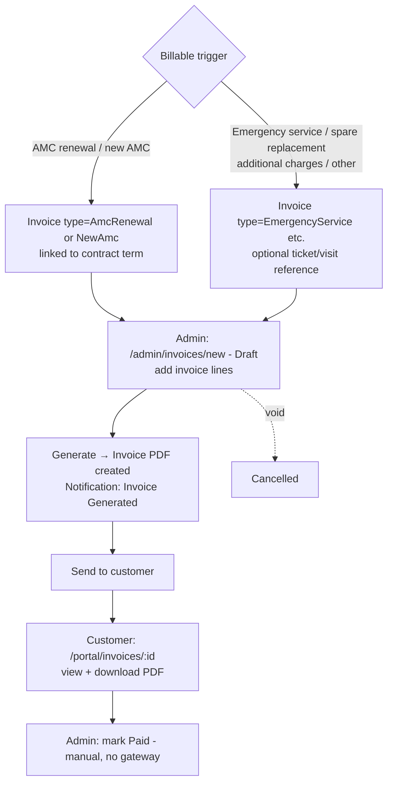

# User Journeys

**Project:** Aarvii CCTV AMC Management System · **Phase:** D0-5
**Source of truth:** [requirements-freeze-v1.md](../requirements-freeze-v1.md) · screens per [screen-inventory.md](./screen-inventory.md), permissions per [rbac-matrix.md](./rbac-matrix.md)

Six end-to-end journeys across actors, screens, and platform capabilities. Statuses are the frozen vocabularies.

---

## 1. Lead → Customer

## 2. Customer → Ticket

Screens: #52 → #31 → #68 → #53. Permissions: `tickets:create` → `tickets:assign` → `tickets:update` → `tickets:close` → `tickets:reopen`.

## 3. Admin → Schedule Visit

## 4. Engineer → Complete Visit

## 5. Customer → Renewal Request

## 6. Admin → Invoice Generation (Option B)

---

## Journey ↔ capability reuse map

| Journey | Platform capabilities reused |
|---------|------------------------------|
| Lead → Customer | Rate-limited anonymous API, Notifications (email+SMS), Auth account provisioning, Audit |
| Customer → Ticket | Auth/RBAC scoping, Files (attachments), Notifications, Audit |
| Admin → Schedule Visit | Outbox events, Notifications, Audit |
| Engineer → Complete Visit | Files (media), mobile offline/sync foundation, Notifications, Audit |
| Customer → Renewal | Notifications (expiry reminder), Audit |
| Admin → Invoice | Files (PDF), Notifications, Audit |

Related: [workflow-overview.md](../workflow-overview.md) (process-level) · [screen-inventory.md](./screen-inventory.md) · [rbac-matrix.md](./rbac-matrix.md)
