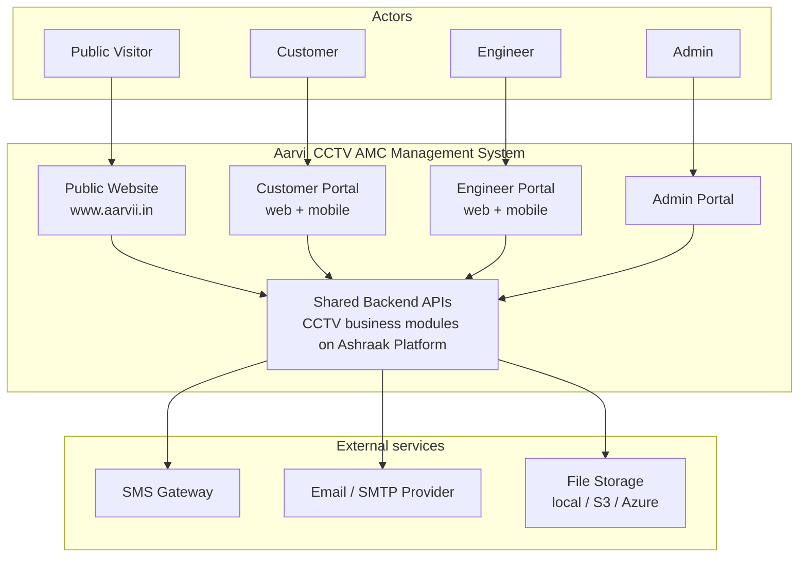
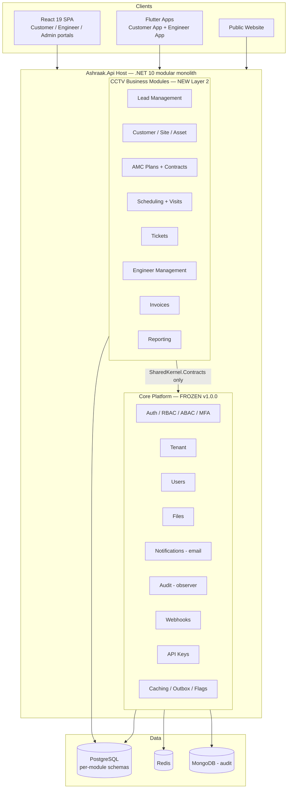

# High-Level Design (HLD)

**Project:** Aarvii CCTV AMC Management System
**Phase:** D0 — Project Foundation Documentation
**Source of truth:** [requirements-freeze-v1.md](./requirements-freeze-v1.md) · Platform baseline: [platform-discovery-report.md](../project-bootstrap/platform-discovery-report.md)

> Design-level document. No database design or ER diagrams here (deferred to D0-4). No code.

---

## 1. System context

The four business applications **share a common backend** (freeze §2). The backend is the frozen **Ashraak Platform V1** plus new **CCTV business modules** (freeze §20 mandates reuse, no duplicate implementation).

## 2. Architecture overview

**Key principle:** CCTV business modules consume Core capabilities **only through published contracts** (`IFileStorage`, `INotificationService`, `IAuditService`, `IWebhookPublisher`, auth/tenant contracts). Core is never modified ([business-module-policy](../governance/business-module-policy.md)).

## 3. Applications (freeze §2)

| Application | Channel | Users | Purpose |
|-------------|---------|-------|---------|
| **Public Website** | Web (www.aarvii.in) | Public Visitor | Showcase, AMC plan info, lead generation (Get Quote, AMC Inquiry), login entry |
| **Customer Portal** | Web + Flutter app | Customer | Dashboard, AMC details, service history, upcoming visits, tickets, invoices, profile, password reset |
| **Engineer Portal** | Web + Flutter app | Engineer | Assigned visits/tickets, visit reporting, photo upload, GPS, selfie, signature, ticket creation |
| **Admin Portal** | Web | Admin | All 11 management areas: leads, customers, sites, assets, AMC plans, contracts, scheduling, tickets, engineers, invoices, reporting |

Detail: [application-architecture.md](./application-architecture.md)

## 4. Modules (freeze §4)

15 approved modules; responsibilities and boundaries in [module-architecture.md](./module-architecture.md):

Public Website · Lead Management · Customer Management · Site Management · Asset Management · AMC Plans · AMC Contracts · Service Scheduling · Visit Management · Ticket Management · Engineer Management · Invoice Management · Reporting · Customer Portal · Engineer Portal

## 5. Integrations

| Integration | Purpose | Freeze ref | Approach |
|-------------|---------|-----------|----------|
| Email provider (SMTP) | Email notifications | §17 | Platform `INotificationService` provider model |
| SMS gateway | SMS notifications and OTPs | §17 | New provider integration consumed by the CCTV notification flows |
| File storage (local/S3/Azure) | Photos, videos, selfies, signatures, PDFs | §12, §19 | Platform `IFileStorage` |
| PDF generation | AMC Contract / Visit Report / Invoice PDFs | §19 | Server-side PDF rendering within CCTV modules |
| Webhooks (outbound) | Event delivery to external systems | §20 (reuse) | Platform webhook catalog + `IWebhookPublisher` |
| API Keys | M2M access where needed | §20 (reuse) | Platform ApiKeys module |

## 6. Technology stack (inherited from platform)

| Layer | Technology |
|-------|------------|
| Backend | .NET 10, ASP.NET Core Minimal APIs, EF Core 9, OpenIddict |
| Web | React 19, TypeScript, Vite 6, TanStack Query, Zustand, Theme Engine (`platform-ui`, CoreUI default) |
| Mobile | Flutter (Android/iOS), Riverpod, go_router, OpenAPI-generated SDK |
| Data | PostgreSQL (per-module schemas), Redis (cache/sessions/rate limits), MongoDB (audit) |
| Observability | Serilog + Seq, OpenTelemetry, correlation IDs, health probes |
| CI/CD | GitHub Actions (ci, docs-validation, mobile, android/ios release) |

## 7. Security

| Concern | Design |
|---------|--------|
| Authentication | Platform Auth (JWT/OAuth2 via OpenIddict); Login OTP & Password Reset OTP events (§17) |
| Authorization | Platform RBAC/ABAC mapped to the 4 actors (§3); engineer restrictions enforced server-side (§15) |
| Data ownership | Customers access only their own contracts, sites, visits, tickets, invoices (§3) |
| Report gating | Visit reports invisible to customers until admin approval (§13) |
| Evidence integrity | GPS lat/long/timestamp stored; mandatory completion checklist enforced by the API, not just the UI (§12) |
| File security | Tenant-scoped storage with access control via platform Files (§20) |
| Audit | Platform Audit observer captures business events (§20) |
| Transport/API | Platform host middleware: rate limiting, correlation, API-key auth where applicable |

## 8. Deployment assumptions

| # | Assumption |
|---|-----------|
| 1 | Single shared backend deployment (modular monolith) serves all four applications (freeze §2). |
| 2 | Public Website and SPA portals are served as web frontends against the same API host; www.aarvii.in fronts the public site. |
| 3 | PostgreSQL, Redis, MongoDB, and Seq run per the platform's Docker-based environment locally; production equivalents are provisioned at deployment. |
| 4 | Mobile apps are distributed via Play Store / App Store using the platform's existing fastlane release pipelines. |
| 5 | SMS and SMTP providers are configured via environment configuration (validated at startup by the platform). |
| 6 | CCTV business modules are feature-flag gateable per platform policy for safe rollout. |

## 9. Design constraints

- **No database design / ERD in D0-1..3** — entity modeling begins in D0-4.
- **Core Platform frozen** — all CCTV functionality lives in business modules (Layer 2 registration).
- **Theme rule** — portal UIs render `platform-ui` primitives; direct theme imports are forbidden.
- **Out-of-scope items** (freeze §21) must not appear in the design.

---

## Related documents

- [application-architecture.md](./application-architecture.md)
- [module-architecture.md](./module-architecture.md)
- [mobile-architecture.md](./mobile-architecture.md)
- [workflow-overview.md](./workflow-overview.md)
